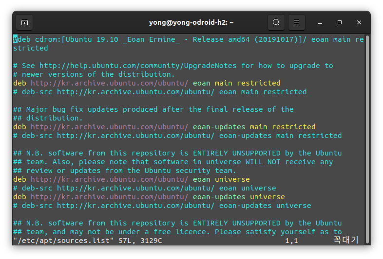

안녕하세요,<br/>
대학생 1인 앱개발자 LR입니다!

저는 현재 PC의 메인 OS로서 Ubuntu 19.10 Eoan을 이용중에 있습니다.<br/>
Ubuntu를 대한민국 로케일로 설치했을 때,<br/>
기본적으로는 **kr.archive.ubuntu.com**이 소프트웨어 서버로 지정되어 있는데요,

어느 서버를 사용하든 사용에 지장은 없으나,<br/>
개인적으로는 이 서버의 속도가 빠른편이 아니기에<br/>
저는 Ubuntu를 재설치하고 가장먼저 서버를 변경해줍니다.

국내에서는 Kakao, KAIST, Neowiz 등에서 현재 Ubuntu 소프트웨어 서버를 운영중에 있는데,<br/>
이중 Kakao에서 운영하는 서버로 변경해보도록 하겠습니다.

소프트웨어 서버를 변경해주기 위해서는<br/>
**/etc/apt/sources.list** 파일을<br/>
"관리자 권한"으로 열어 수정해야합니다.

여기서 저는 vi에디터를 이용하지만,<br/>
gedit, nano 등 더 익숙하신 에디터를 이용해 작업하셔도 무방합니다.

다음 명령어를 통해 파일을 열어줍니다.

```bash
ubuntu@desktop:~$ sudo vi /etc/apt/sources.list
```

<center>

</center>

**/etc/apt** 디렉터리에 위치한 **sources.list** 파일이 열렸습니다.<br/>
내용을 보시면 **kr.archive.ubuntu.com** 서버로 입력되어있습니다.<br/>
이를 하나하나 다 변경하셔도 무방하지만<br/>
저는 그런 노가다를 하고싶지는 않으므로 vi의 치환명령을 이용하겠습니다.

vi를 명령모드로 전환한 뒤 다음 명령을 입력합니다.

```bash
:%s/kr.archive.ubuntu.com/mirror.kakao.com/g
```

**kr.archive.ubuntu.com** 구문을 모두 **mirror.kakao.com**으로 변경해주는 치환명령입니다.

<center>

</center>

치환이 제대로 이루어졌다면 위와 같이 **mirror.kakao.com**으로 변경된 것을 보실 수 있습니다.<br/>
이제 다음 명령을 통해 파일을 저장하고 vi에디터를 종료해줍니다.

```bash
:wq
```

혹시나 오타가 나셨거나 잚못 수정하신 경우에는 vi를 저장하지 않고 강제로 종료하도록 한 뒤<br/>
다시 파일을 열어 작업해주시면 됩니다.<br/>
강제종료 명령은 아래와 같습니다.

```bash
:qa!
```

수정이 완료되고 저장까지 완료되었다면,<br/>
이제 apt 소스 리스트를 갱신해줍니다.

```bash
ubuntu@desktop:~$ sudo apt-get update
```

<center>

</center>

작업 내용을 확인해보시면 **mirror.kakao.com**으로부터 소스를 받아 리스트를 갱신중인 것을 확인하실 수 있습니다.

지금까지,<br/>
LR이었습니다!