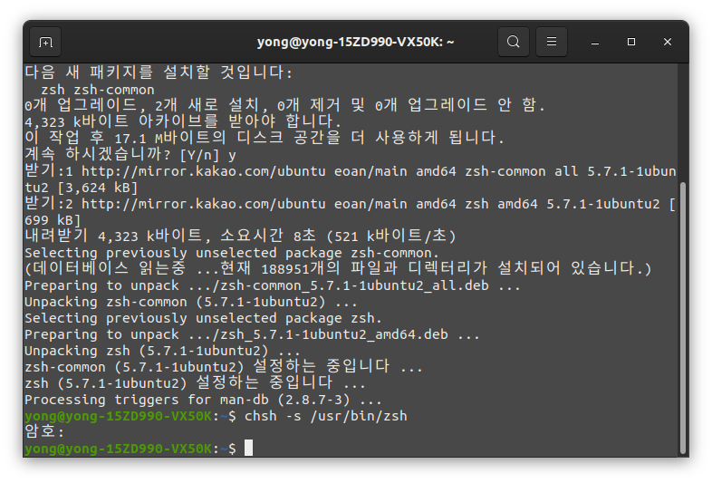

안녕하세요,<br/>
대학생 1인 앱개발자 LR입니다!

많은 분들이 아시다시피, Linux 계열에서는<br/>
GUI보다는 CUI 환경의 터미널을 더 많이 사용하는 경우가 많습니다.

이에 따라서 터미널, 즉 쉘의 역할이 상당히 중요하다고 볼 수 있는데요,

Ubuntu에서는 기본 쉘로써 **bash**를 제공하고 있는데,<br/>
**bash**보다 훨씬 기능과 플러그인이 많고<br/>
커스터마이징이 가능한 **zsh**쉘로 변경해 사용하는 분들도 많이 계십니다.

또한, Unix 계열의 mac OS에서는 10.15 Catalina 업데이트 이후로<br/>
기본 쉘을 **zsh**로 변경하도록 권장하고 있습니다.

그럼 이제, Ubuntu에서 **zsh**를 설치하고,<br/>
**oh my zsh**툴을 이용해 커스터마이징 하는 과정에 대해 알아보겠습니다.

먼저, 현재 설정되어있는 쉘이 어떤 종류인지 확인해봅니다.

```bash
ubuntu@desktop:~$ echo $SHELL
```

<center>

</center>

제가 사용중인 Ubuntu OS에 현재 설정된 쉘은 **bash** 쉘이네요.<br/>
그럼 이제, apt 명령어를 통해 **zsh** 를 설치해줍니다.

```bash
$ sudo apt-get update
$ sudo apt-get install zsh
```

<center>

</center>

**zsh** 의 설치가 완료되었다면,<br/>
다음 명령어를 통해 사용자의 기본 쉘을 **zsh** 로 변경해줍니다.<br/>
변경하는 과정에서 암호가 필요하면 요구하니, 곡 입력해주세요.

```bash
$ chsh -S /usr/bin/zsh
```

<center>

</center>

변경이 완료되었다면, Ubuntu를 재부팅해줍니다.<br/>
재부팅 이후 터미널을 실행해보면, **zsh** 의 첫 세팅화면이 나오게됩니다.

<center>

</center>

이 화면에서 0번 메뉴를 선택하면 기본설정으로 진행되고, **zsh** 로 진입하게됩니다.​


> 메뉴 설명
> + (q) 아무 작업 없이 종료 후 다음 실행시 메뉴 다시 표시
> + (0) 기본 설정으로 진행
> + (1) zsh 메인 메유 진입
> + (2) Ubuntu 기본값으로 설정 후 종료. 직접 설정파일 수정 필요

**zsh** 로 진입되었다면, 이제 다음 명령어를 통해 **oh my zsh** 플러그인을 설치해줍니다.

**oh my zsh** 는 **zsh** 를 쉽고 간편하게 커스터마이징할 수 있도록 돕는<br/>
오픈소스 플러그인입니다.<br/>
**curl** 방식 또는 **wget** 방식으로 설치를 진행할 수 있는데,<br/>
편하신 방법으로 진행하시면됩니다.

```bash
$ sh -c "$(curl -fsSL https://raw.githubusercontent.com/robbyrussell/oh-my-zsh/master/tools/install.sh)"
```
```bash
$ sh -c "$(wget https://raw.githubusercontent.com/robbyrussell/oh-my-zsh/master/tools/install.sh -O -)"
```

간혹 **curl** 명령어가 설치되어있지 않은 Release가 있는데,<br/>
이의 경우에는 **wget** 방식으로 설치하시거나,<br/>
아래 명령어로 **curl** 을 설치하신 뒤 **oh my zsh** 를 설치하시면 됩니다.

```bash
$ sudo apt-get update
$ sudo apt-get install curl
```

<center>

</center>

<center>

</center>

**oh my zsh** 의 설치가 완료되었습니다.

로그인된 사용자의 홈 디렉토리에서 **.zshrc** 파일을 텍스트 에디터로 열어,<br/>
여러가지 항목을 직접 커스텀하실 수 있습니다.

<center>

</center>

저는 테마를 **agnoster** 로 지정해 사용중입니다.<br/>
**git** 디렉토리에서의 브랜치, 커밋 상태 표시 등의 가독성이<br/>
가장 낫다고 생각되어 개인적으로 선호하는 테마입니다.

<center>

</center>

**bash** 보다 훨씬 기능과 플러그인이 많고,<br/>
커스터마이징이 가능한 **zsh** 의 설치에 대해 알아보았습니다.

관련된 문의사항은 댓글로 남겨주시면,<br/>
최대한 아는 선에서 답변드리도록 하겠습니다.

지금까지,<br/>
LR이었습니다!