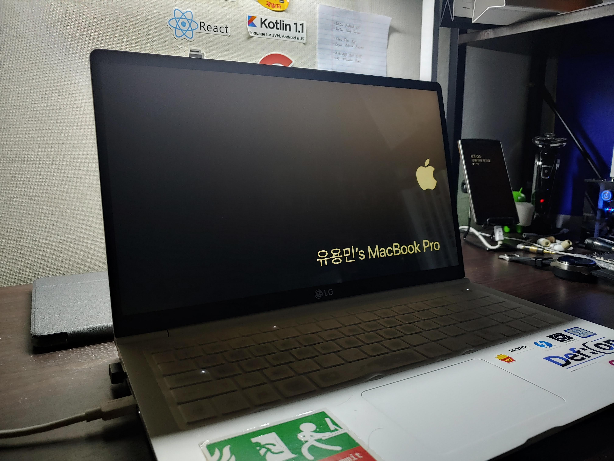
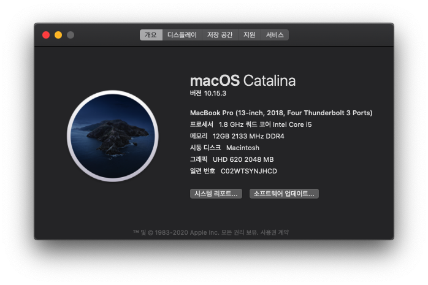
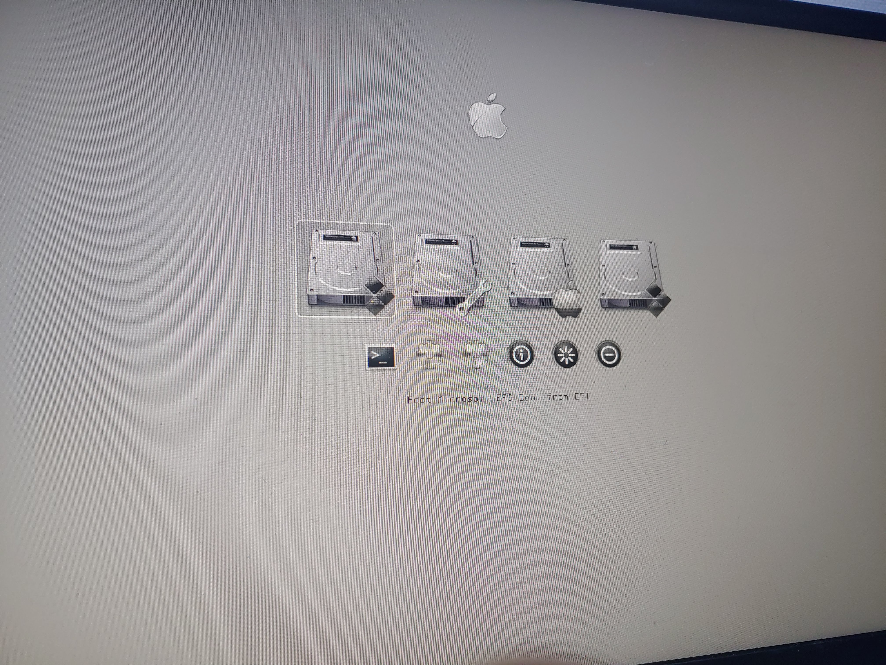

안녕하세요, 
대학생 1인 앱개발자로 활동중인 LR입니다!

저는 현재 LG전자의 2019 그램15 i5모델을 사용중에 있습니다. 
모델명은 **15ZD990-VX50K**로, 프리도스 모델을 구입해 사용하고 있는데요,

최근 제 노트북에 커스텀맥, 즉 해킨토시 작업을 진행해 
어느정도 사용 가능한 정도로 오류 픽스가 되어 자료를 공유해보고자 합니다.

~~가벼운 맥북 15인치~~

x86포럼에서 **Catalina 10.15.3 Build.19D76** gho파일을 이용해 설치했고, 
**Clover** 부트로더는 **r5103**빌드가 적용되어있으며, 
2020년 2월 기준의 최신버전 Kext 파일들로 구성해두었습니다. 
개인 커스텀 사항으로, **Clover** 부트로더에는 **Bootcamp** 테마가 적용되어 있습니다.

## Known Bugs
<ul style="text-align: left;">
    <li>잠자기모드 진입시 높은확률로 재부팅이 이루어집니다.</li>
    <li>별도의 작업 없이 노트북을 덮을 경우 간헐적으로 잠자기가 진입되지 않아 배터리소모와 발열이 발생합니다.</li>
    <li>터치패드가 간헐적으로 동작하지 않습니다. 이 경우, 3번 터치하면 다시 동작합니다.</li>
    <li>디스플레이 밝기를 0%로 설정할 경우, LCD가 꺼져 보이지 않습니다.</li>
    <li>Intel 무선랜 및 블루투스 칩셋에 관한 Kext 문제로, 외장 무선랜카드가 필수입니다.</li>
    <li>부팅 직후나 잠자기에서 깨어난 직후 0.1초가량 그래픽 깨짐현상이 발생한 뒤 정상으로 돌아옵니다.</li>
    <li>Micro SD 슬롯이 동작하지 않습니다. 별도의 USB 어댑터가 필요합니다.</li>
 </ul>

## Download
[EFI 다운로드](https://drive.defcon.or.kr/sharing/VHcyuI9RP)

**DSDT** 수정을 여러번 거치면 남아있는 오류들도 수정이 가능할것 같긴 하지만, 
제 실력으로는 도저히 더이상의 개선이 어렵지 싶습니다. 
지나가던 어느 킹갓분이 계시다면... 
**DSDT** 를 한번 건드려봐주셔도 감사하겠습니다.

저는 현재 아래와 같이 3개의 OS로 트리플부팅을 구현해 
노트북을 사용하고 있습니다.

> mac OS 10.15.3 Catalina 
> Ubuntu 19.10 Eoan 
> Windows 10 1909

조만간 **Clover / Grub / Windows** 부트로더 이 3개를 동시에 
꼬이지 않게 설치하는 방법에 대해서도 포스팅해봐야겠습니다.

지금까지, 
LR이었습니다!