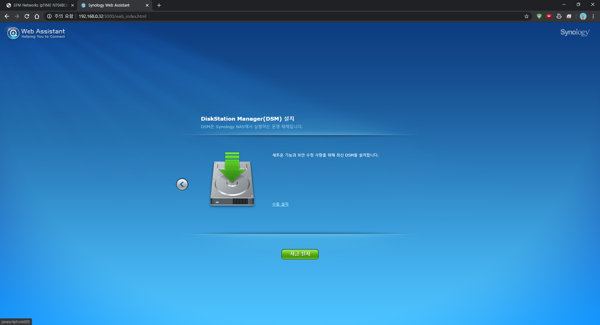

안녕하세요, 
대학생 1인 앱개발자로 홛동중인 
LR입니다!

저는 개인 서버로 하드커널사의 **ODroid H2** 모델을 활용하고 있습니다. 
**ODroid H2**는, **Intel J4105 x64** 프로세서를 기반으로 하는 개발용 PC보드로, 
개인적으로 **12GB RAM**과 **128GB NVMe SSD, 2TB HDD**를 추가로 장착해 
서버로 사용중입니다.

기존에는 **Ubuntu 19.10 Eoan**을 설치한 뒤, 
**Qemu KVM** 가상 클라이언트를 이용해 **XPEnology**를 구축해 
파일저장용 나스 서버로 사용했으나, 
최근 **Jellyfin**이라는 미디어 스트리밍을 접하고 **XPEnology**에 연동하게되면서 
트랜스코딩을 위한 **XPEnology**의 성능이 중요해진 탓에 
가상이 아닌 네이티브로 **XPEnology**를 설치하고자 하게되었습니다.

**XPEnology**에 관련해서 해외포럼에 가입도 하고, 
여러번 시행착오를 겪은 끝에 
제 **ODroid H2**에 **XPEnology**를 네이티브로 설치할 수 있게 되었습니다. 
이번 포스팅에서는 그 설치 과정에 대해 한번 가이드를 작성해보도록 하겠습니다.

## Juns's Mod? synoboot? 1.04? 1.03?

먼저, **XPEnology**를 어떤 기기에서 또는 가상머신에서 부팅하기 위해서는 
전용 부트로더가 필요한데요, 
이는, 해외 **XPEnology** 포럼의 Jun님이 업로드하신 자료를 이용하시면 됩니다.

다만, **ODroid H2**에서는 **XPEnology** 부트로더와 DSM 각각의 버전을 
"심하게" 가리는 편이기에 버전을 잘 확인하신 뒤 파일을 받으셔야합니다. 
**ODroid H2**에서 정상적으로 동작하는 버전의 파일들을 
제가 모두 정리하여 첨부하도록 하겠습니다.

**XPEnology** 포럼의 Modded Bootloader 게시글 원문 링크는 다음과 같습니다.

[XPEnology Forum Synoboot 관련 쓰레드](https://xpenology.com/forum/topic/12952-dsm-62-loader/)

**XPEnology** DSM 6.2 이상의 버전에서 동작하는 부트로더로, 
Synology DS918+, DS3615xs, DS3617xs 3개 모델을 기반으로 
개조된 파일입니다.

DS918+모델 기반의 부트로더 버전은 1.04b 버전, 
DS3615xs  및 DS3617xs를 기반으로 하는 부트로더 버전은 1.03b 버전이 최신버전으로,

1.04b 버전의 부트로더는 **UEFI**와 **BIOS**타입의 부팅을 모두 지원하지만, 
1.03b 버전의 부트로더는 **BIOS**타입의 부팅만을 지원하기 때문에, 
**ODroid H2**에서 사용하기 위해서는 DS918+ 기반의 1.04b 버전 부트로더를 사용하셔야 합니다.

[DS918+ 1.04b 부트로더 다운로드](https://drive.defcon.or.kr/sharing/Q4rUyY8cV)

## 설치준비 : grub 수정과 USB 플래싱

DS918+ 1.04b 부트로더 파일을 다운로드 하셨다면, 파일의 압축을 해제한 뒤 **synoboot.img** 파일을 준비해주세요.

이제, **synoboot.img** 파일을 마운트하여 grub 설정 파일을 수정해주는 작업이 필요합니다. 
이때, **synoboot.img**의 grub EFI 파티션은 
Windows에서는 일반적으로 마운트가 되지 않는 형식으로 포맷되어있어, 
별도의 유틸리티가 필요합니다.

[유틸리티 다운로드](https://drive.defcon.or.kr/sharing/kc52yRV5G)

압축파일 내에는 
**synoboot.img**의 마운트를 위한 **OSFMount**, 
USB장치 정보 확인을 위한 **USBTreeView**, 
USB에 **synoboot.img**를 플래싱하기 위한 **Rufus** 등 
3개의 유틸리티가 포함되어 있습니다.

이제, 작업 과정을 스크린샷과 함꼐 알아보도록 하겠습니다.

먼저, **synoboot.img**를 플래싱할 USB 메모리를 PC에 연결해주세요. 
**XPEnology**를 사용하기 위해서는, 이 USB 메모리가 항상 **ODroid H2**에 연결되어있어야 합니다.

USB 메모리를 PC에 연결했다면, **USBTreeView** 프로그램을 실행하고, 
좌측 장치 목록에서 연결한 USB 메모리를 선택합니다. 
이후, 우측의 정보창에서 Device ID 항목을 참고해 
USB 메모리의 **VID**와 **PID**를 메모해둡니다. 
제가 사용한 USB의 경우는, **VID**가 14CD, **PID**가 121네요.

**VID**와 **PID**를 메모해두셨다면, 프로그램을 닫고 **OSFMount** 프로그램을 실행합니다. 
좌측 하단의 Mount new 버튼을 클릭해주세요.

**Disk Image** 항목에서 조금 전 다운로드받으신 DS918+ 1.04b 부트로더를 지정해준 뒤 
Next 버튼을 클릭합니다.

15MB 크기의 0번 파티션을 선택하고, Next를 클릭합니다.

두번째 항목인 **Read-only drive**의 체크를 "해제"한 후 Next를 클릭합니다.

마운트가 완료되면, 마운트된 **synoboot.img** 내부의 
**/EFI/grub/grub.cfg** 파일을 메모장 또는 기타 텍스트 편집기로 열어줍니다.

중간쯤에 **set vid**, **set pid** 항목이 위치합니다. 
각각의 값을 아까 **USBTreeView** 로 확인한 값으로 변경한 뒤 저장해줍니다. 
이후, **OSFMount** 하단의 Dismount 버튼을 클릭해 **synoboot.img** 를 
PC로부터 마운트 해제해줍니다.

이제, **Rufus** 툴이나 기타 USB 플래싱 도구를 이용해 
**grub.cfg** 의 수정이 완료된 **synoboot.img** 파일을 
USB 메모리에 플래싱해줍니다. 
이때 USB 메모리는, 아까 **USBTreeView** 로 확인했던 그 USB 메모리여야 합니다.

## XPEnology 부팅하고 초기설정 진행하기

이제, 준비과정이 완료되었습니다. 
**synoboot.img** 의 플래싱이 완료된 USB 메모리를 **ODroid H2** 에 연결해준 뒤, **ODroid H2** 의 전원을 켭니다.

​전원을 켜고 조금 시간이 지난 뒤, 
네트워크 공유기의 설정페이지에서 내부네트워크 접속 목록을 확인해보면 
**DiskStation** 이라는 이름의 기기가 보입니다.

만약 보이지 않을 경우, **XPEnology** 가 부팅중이거나, 
기타 문제로 인해 **ODroid H2** 가 부팅되지 않는 경우일 수 있습니다.

저의 경우는, 알 수 없는 어떤 이유로 인해, 
약 50%의 확률로 **ODroid H2** 가 부팅되지 않는 문제가 있는데, 
여러번 재부팅을 반복하다보면 전원이 켜지게됩니다.

만약 재부팅으로도 해결되지 않는 경우, 
**synoboot.img** 의 수정 단계부터 다시한번 진행해보시는 것을 추천드립니다.

내부네트워크 접속 목록에 **DiskStation** 이 보일 경우, 
이제 다음 링크로 접속해 **XPEnology** 의 설정을 진행합니다.

[Synology Web Assistant](find.synology.com)

Synology Web Assistant는 같은 내부네트워크에 존재하는 
**Synology 및 XPEnology** 기기를 검색하고, 
설정할 수 있도록 도와주는 웹페이지입니다.​

정상적으로 기기가 검색되면 다음과 같은 화면이 보이게됩니다.

DS918+ 기기로 인식된 **XPEnology**가 정상적으로 검색되었습니다. 
연결 버튼을 클릭해 다음단계로 진행해줍니다.

이제, **XPEnology**의 OS 패키지를 설치해줍니다. 
현재(2020년 3월 12일) 기준으로, **XPEnology** DSM의 최신버전은 6.2.2 버전이지만, 
**ODroid H2**의 **XPEnology**에서는 호환성 문제로 인해, 
6.2.1버전까지만 사용이 가능합니다. 
지금설치 버튼을 클릭하게 되면, 자동적으로 최신버전을 다운로드해 설치해버리기 때문에, 
수동 설치 버튼을 클릭해 DSM 6.2.1 버전을 강제로 설치해주어야합니다. 
다음 링크에서 **XPEnology** DSM 6.2.1버전의 패키지 pat파일을 받아줍니다.

​ [DSM 6.2.1 DS918+ pat 패키지파일 다운로드](https://drive.defcon.or.kr/sharing/4mrgSzWuA)

수동설치 메뉴를 클릭 후, 찾아보기를 통해 다운로드한 DSM 6.2.1 pat파일을 선택해준 뒤, 지금설치를 클릭합니다.

DSM의 설치가 진행됩니다. 
56%까지는 pat파일을 **ODroid H2**로 업로드하는 과정이 진행되며, 
57%부터는 본격적으로 DSM의 설치가 진행됩니다.

DSM의 설치가 완료되면, 자동으로 **ODroid H2**를 재부팅하며, 10분의 타이머가 설정됩니다. 
이 10분을 모두 기다리셔도 무방하지만, 약 5분이 지난 뒤에 새로고침을 하셔도 무방합니다. 
만약 새로고침 이후, 웹 페이지가 접속되지 않는 오류가 발생한다면, 
조금 뒤 다시 새로고침을 진행해보시고, 
긴 시간이 지난 이후에도 접속되지 않는다면 DSM 설치에 문제가 발생했을 수 있습니다. 
**ODroid H2**의 전원을 끈 뒤, 하드디스크를 다른 PC를 통해 강제로 포맷해주고, 
USB 메모리에 **synoboot.img** 를 다시 설치하신 뒤 작업을 다시 진행해보시기 바랍니다.

정상적으로 DSM이 설치되었다면, 위와 같이 시스템 준비중 메시지가 보이며, 
잠시 뒤에는 초기설정 메뉴가 표시됩니다.

DSM 관리자 계정을 생성해줍니다. 
DSM 관리자는 모든 권한을 갖는 중요한 계정이므로, 보안에 철저히 신경쓰시는 편이 좋습니다.

**XPEnology**는 비공식적으로 Synology OS를 설치하여 사용하는 것이기 떄문에, 
QuickConnect 기능을 사용할 수 없습니다. 
아래에 이 단계 건너뛰기 버튼을 클릭해 설정하지 않고 넘어갑니다.

초기설정이 완료된 DSM의 화면입니다. 
좌측상단의 메뉴를 통해 프로그램을 실행할 수 있습니다. 
우측에는 위젯을 펼쳐두어 시스템의 상태를 편리하게 확인합니다.

제어판의 시스템 정보 항목입니다. 
DS918+ 모델로 인식되도록 정상적으로 설치가 된 것을 확인하실 수 있습니다.

**XPEnology**에서는 DSM 버전에 따라 **synoboot.img** 부트로더가 동작하지 않을 수 있습니다. 
또한, **ODroid H2**의 경우는 DSM 6.2.1보다 높은 버전과는 호환되지 않기 때문에, 
자동업데이트가 진행되지 않도록 제어판에서 비활성화해줍니다.

이처럼, **ODroid H2** 기기에 **XPEnology** 를 가상머신이 아닌 네이티브로 설치하여 
개인 나스 서버로 활용하는 방법에 대해 알아보았습니다.

저는 현재 이 서버를 파일공유는 물론, **Jellyfin** 을 이용한 영화 스트리밍 서버로 활용하고 있습니다. 
추후 기회가 된다면, **Jellyfin** 을 설치해 무료로 영화 스트리밍 서버를 구축하는 방법에 대해서도 
포스팅을 진행해보도록 하겠습니다.

가이드를 따라하는 도중 발생하는 문제점이나, 
이해가 되지 않는 부분에 대해서 
댓글 남겨주시면 아는 선에서 최대한 답변드리도록 하겠습니다.

지금까지, 
LR이었습니다!