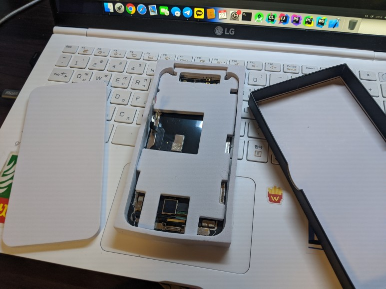
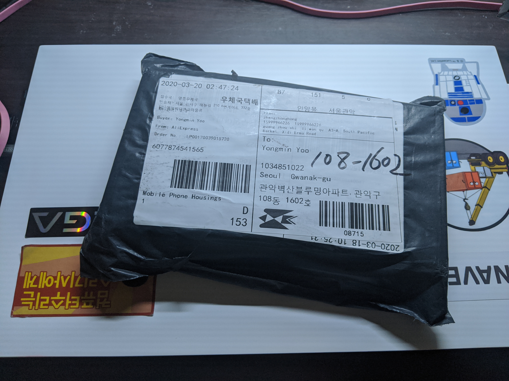
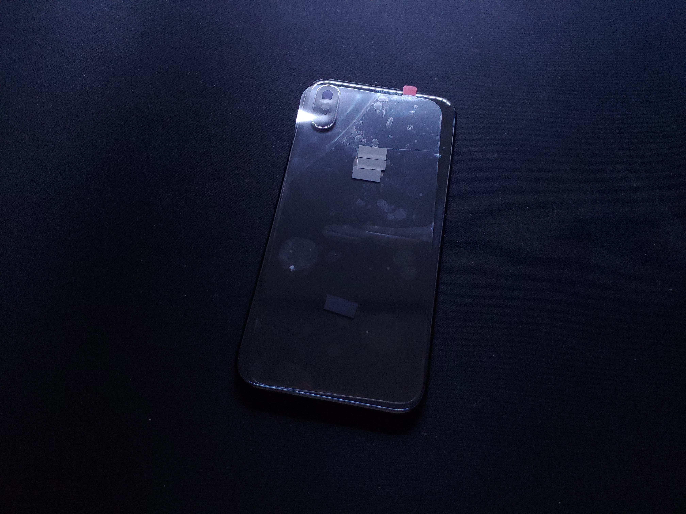
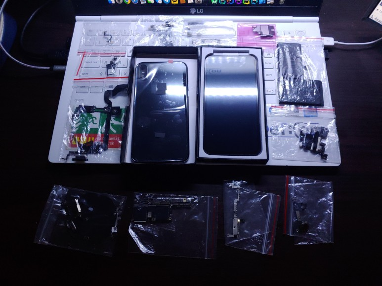
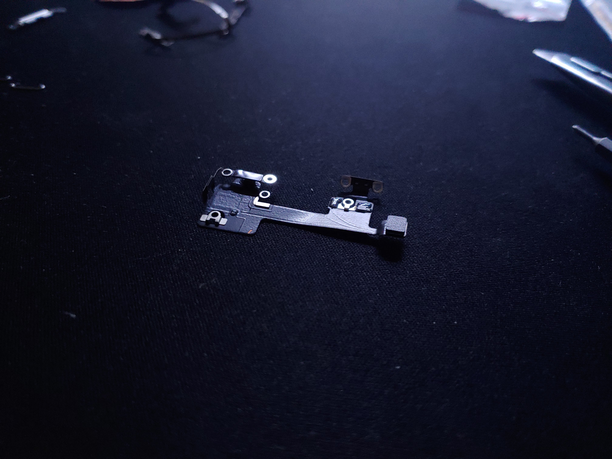
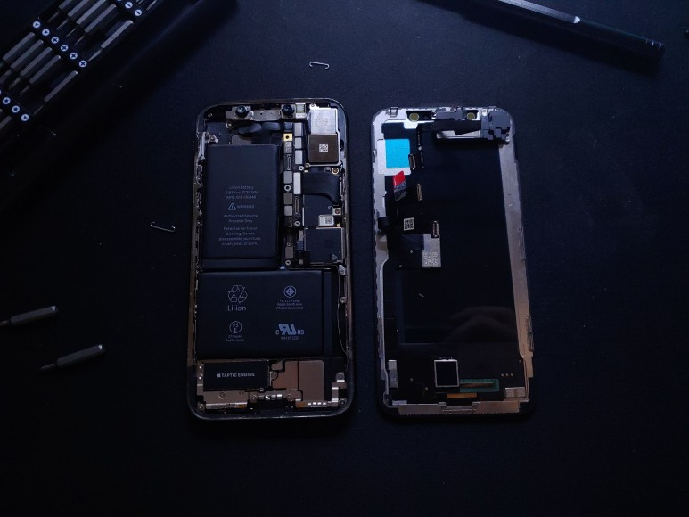
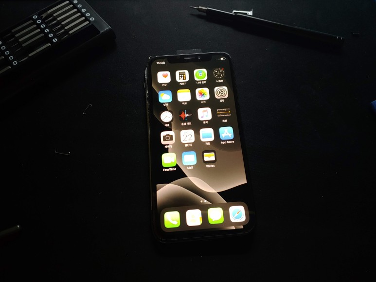
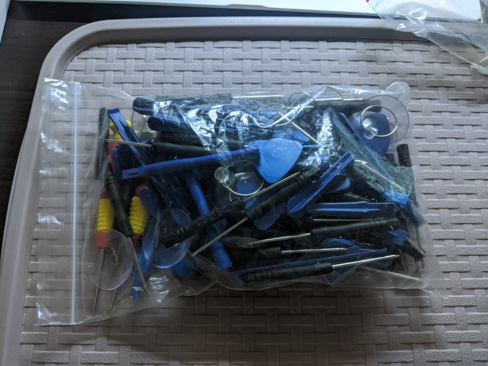

안녕하세요, 
대학생 1인 앱개발자로 활동중인 LR입니다!

지난 9월, 저는 아이폼 6s의 부품을 하나하나 모아 
새 아이폰 6s 하나를 조립하는 프로젝트를 진행했었는데요,

[아이폰6s 조립 프로젝트 보러가기](https://blog.naver.com/yymin1022/221674319053)

이번에는 좀 더 발전하여 아이폰X의 부품을 모아 조립해보았습니다.​

## 부품 준비

이번에도 역시 Aliexpress를 통해 부품을 구하였고, 
어떤 부품이 필요한지, 
금액은 얼마가 들었는지에 대해서는 
글 마지막에서 이야기하도록 하겠습니다.​

기타등등 자잘한 부품들이 우편배송이라 먼저 주문한 뒤, 
하우징과 디스플레이를 마지막으로 주문하였습니다. 
OEM LCD 디스플레이 가격에 만원만 더하면 OLED이길래, 
OLED 부품을 주문하였습니다. 
배송기간은 약 10일. 
최근 Aliexpress 배송이 비등기우편이나 등기소포나 굉장히 빠른 속도를 보여줍니다.

5만원짜리 OLED 디스플레이 부품인데, 
패키징 퀄리티가 상당합니다.

마지막으로 도착한 부품은 하우징 부품입니다. 
통관하면서 지연되고, 
우체국 부평 물류센터에서 또 지연되어 
마지막 부품 하나때문에 조립이 거의 일주일정도.. 늦어졌네요..ㅎㅎ

알리에서 구매한 부품답게 
저작권에 문제가 될 수 있는 사과로고와 iPhone 로고에 
검은 스티커를 붙이고 배송됩니다.

모든 부품이 다 모였습니다. 
좌측 상단부터 오른쪽으로, 그리고 아래로 하나하나 순서대로 살펴보겠습니다. 

<ul style="text-align: left;">
    <li>블루투스 안테나</li>
    <li>Face ID 및 전면카메라 모듈</li>
    <li>WiFi 안테나</li>
    <li>탭틱엔진 모듈</li>
    <li>하단 스피커 모듈</li>
    <li>Nano Sim 슬롯</li>
    <li>하단 라이트닝 커넥터 단자</li>
    <li>후면 하우징 및 사이드 프레임</li>
    <li>OLED 디스플레이</li>
    <li>배터리</li>
    <li>상단 스피커 및 근접, 조도센서 모듈</li>
    <li>무선충전 코일 및 버튼 플렉스케이블</li>
    <li>256GB 메인보드</li>
    <li>하단 브래킷</li>
    <li>하단 마이크 및 스피커 플렉스케이블</li>
</ul>

위와 같은 부품들과 사진에는 없지만 브래킷 및 크기별, 모양별 나사도 구매하였습니다.

이때 주의할 점은, 과거의 Touch ID와 마찬가지로 
Face ID 역시 메인보드와 일련번호가 일치해야만 정상 동작합니다. 

## 조립 과정

이제, 조립 과정과 함께 부품을 하나하나 살펴보겠습니다.

상단 WiFi 안테나 모듈입니다. 
이 부품은 하우징 상단에 가장 먼저 조립되어야 하는 부품으로, 
위치가 틀어질 경우 블루투스 안테나와의 간섭이 일어나거나 
WiFi 수신 감도가 떨어질 수 있습니다​

...하나하나 부품을 살펴보고자 하였으나 귀차니즘과 함께 
조립 난이도의 극악으로 인해 중간 과정이 생략되었습니다.

모든 부품의 장착이 완료되었습니다. 
우측 디스플레이에는 상단 스피커 및 근접, 조도센서 모듈이 부착되었고, 
좌측 하우징에는 배터리와 메인보드 등 기타 부품들을 조립하였습니다.

​Apple은 아이폰7 이후로 별모양, +모양 나사 뿐만 아니라 Y자 나사를 추가로 도입하였습니다. 
덕분에 저는 조립 과정에서 숫자 18을 여러번 외치게 되었고, 심지어는 위치에 따라 나사의 길이도 모두 다르기에, 
상당한 신중함을 보여야했습니다.

ifixit에서 제공하는 수리 가이드를 보며 정확한 나사 위치를 찾아 조립하였는데, 
올바르지 않은 길이의 나사를 사용한다면 부품이 올바르게 고정되지 않거나 
심지어는 부품이 손상되는 문제가 발생할 수 있습니다. 

혹시나마, 따라하실 누군가는... 
미리 나사 길이를 모두 구분해둔 뒤 작업을 시작하시는 것을 추천드립니다.

조립을 완료하고, 아이폰의 상징인 하단 별나사 두개를 조립해주었습니다. 
사진 화이트밸런스가 이상한건 기분탓 
모든 기능이 정상적으로 작동하나, 
사제 디스플레이 부품인 탓에 트루톤 기능만은 
동작하지 않았습니다.

배터리의 경우, 정품 아이폰에서 추출한 배터리를 사용하였고, 
현재 성능 수준은 90% 가량이기에, 추후 기회가 된다면 
사제 새 배터리로 교환할 예정입니다.

...알리익스프레스에서 스마트폰 부품을 구매해보신 분들이라면 익숙할 공구입니다. 
퀄리티가 높은 공구는 아니지만 간단하게 쓰기 좋은 친구들... 
하지만 부품 구매가 반복되면 이렇게 쌓이게됩니다. 
~~골치덩어리~~ 

## 소요 금액

이제, 각 부품들의 대략적인 가격과 함께, 
총 얼마의 금액이 소요되었는지 알아보겠습니다.

<ul style="text-align: left;">
    <li>블루투스 안테나 : 1.66달러</li>
    <li>Face ID 및 전면카메라 모듈 : 메인보드와 함께 구매</li>
    <li>WiFi 안테나 : 2.37달러</li>
    <li>탭틱엔진 모듈 : 2.93달러</li>
    <li>하단 스피커 모듈 : 1.85달러</li>
    <li>Nano Sim 슬롯 : 하우징과 함께 구매</li>
    <li>하단 라이트닝 커넥터 단자 : 2.47달러</li>
    <li>후면 하우징 및 사이드 프레임 : 30.38달러</li>
    <li>OLED 디스플레이 : 53.25달러</li>
    <li>배터리 : 메인보드와 함께 구매</li>
    <li>상단 스피커 및 근접, 조도센서 모듈 : 10.80달러</li>
    <li>무선충전 코일 및 버튼 플렉스케이블 : 4.29달러 + 2.58달러</li>
    <li>256GB 메인보드 : 19만원(중고기기 매장)</li>
    <li>브래킷 및 나사 모음 : 2.95달러</li>
    <li>하단 마이크 및 스피커 플렉스케이블 : 1.99달러</li>
</ul>
​

2020년 3월의 환율을 기준으로, 
약 32만 7천원의 비용이 소요되었습니다. 
아이폰 X 256기가 모델의 중고가가 40만원 후반대인 점을 감안하면, 
가성비있고, ~~특히나 저에게는~~ 흥미로운 프로젝트로 느껴집니다.

이렇게 조립된 아이폰X는 현재 서브기기로 사용중에 있으며, 
생각보다 만족스러운 퀄리티로 조립이 완료되어 
뿌듯한 느낌도 듭니다 ㅎㅎ

저처럼 전자기기 조립 및 분해 과정에 흥미가 있으신 분들께는, 
한번 추천드리고 싶은 프로젝트라 생각됩니다.

지금까지, 
LR이었습니다!