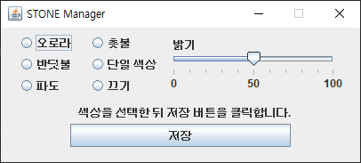
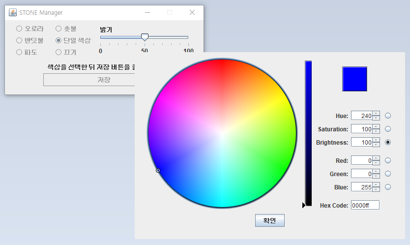
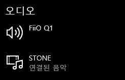
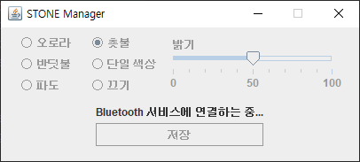
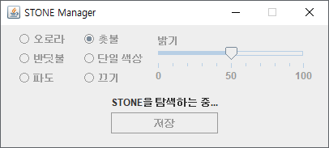
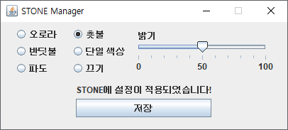
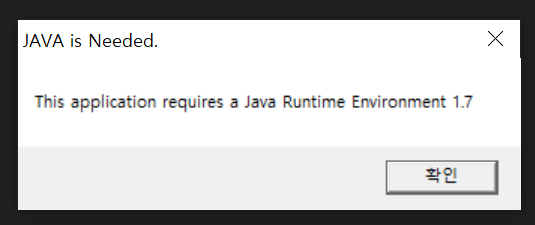

안녕하세요, 
대학생 1인개발자로 활동중인 LR입니다!

오늘은, 오랜만에 제품 리뷰가 아닌 
직접 개발한 프로그램을 배포하는 글을 작성해볼까 합니다.

지난 2016년, Pantech에서는 스마트폰 IM-100을 출시했습니다. 
IM-100의 기본 구성품으로는 특이하게도 
블루투스 스피커 겸 무선충전기 역할을 하는, 
**STONE** 이 함께 제공되었는데요, 

이 **STONE** 만으로도 스피커와 무선충전기, 그리고 무드램프를 겸하는 
좋은 제품이라고 볼 수 있습니다.

다만, 무드램프 기능의 경우, 
Google Play에서 **STONE Manager** 앱을 다운로드 할 수 있는 
안드로이드 스마트폰에서만 기능에 접근할 수 있었습니다.

즉, PC에 **STONE** 을 연결해 활용하는 유저들은 
무드램프 기능을 이용할 수 없었습니다.

그래서 저는 최근 **STONE Manager** 
안드로이드 애플리케이션을 
리버스 엔지니어링을 통해 분석했고, 
**STONE** 과의 통신하는 코드를 찾아 
PC용 프로그램을 개발해 **STONE** 의 무드램프 기능을 
컨트롤할 수 있도록 해보았습니다.

프로그램의 메인화면은 다음과 같습니다. 
기본적인 무드램프 기능만을 구현해두어, 
사용법이 그다지 복잡하지는 않습니다.

좌측에는 **STONE** 무드램프의 색상을 선택하는 **RadioButton** 이, 
우측에는 밝기를 지정하는 **Seekbar** 가 위치합니다.

색상 선택 부분의 경우, 
기존 **STONE Manager** 앱을 통해 선택할 수 있던 
4가지 색상패턴을 고를 수 있게 하였고, 
기존 앱에서 제한적이었던 단일색상 모드는 조금 더 개선해보았습니다.

위처럼, 메뉴에서 단일 색상을 선택할 경우, 
RGB 색상을 선택하는 창이 열리며, 
모든 색상으로 **STONE** 의 무드램프로 점등시킬 수 있습니다. 
다만, RGB LED 특성상 
검은색 등 일부 색의 경우는 **STONE** 에서 올바르게 점등되지 않을 수 있습니다.

색상과 밝기를 지정한 뒤 하단의 저장 버튼을 클릭하면 
**STONE** 에 연결하고 색상을 지정하는 작업을 수행합니다. ​

이때, 저장 버튼을 클릭하기 전, 
이미 **STONE** 이 PC와 연결된 상태여야 합니다. 
즉, **STONE** 에서 PC의 소리가 재생되는 상태에서 
저장 버튼을 클릭해야 올바르게 동작합니다.

윈도우10의 설정 >> 장치 >> Bluetooth 항목에서 
위와 같이 **STONE** 에 "연결된 음악" 문구가 표시된 상태가 
올바른 상태입니다.

**STONE** 에 연결이 되어있다면, 
저장버튼을 클릭했을 때 다음과 같은 과정을 통해 
**STONE** 에 무드램프 기능이 설정됩니다.

### 주의

이 과정에서, 약 30초~60초 정도의 시간이 소요됩니다. 
**PC Java** 의 특성상, **Android** 와 같은 정해진 API가 없어, 
외부 라이브러리를 통해 BT연결을 구현하였습니다. 
**Thread** 를 이용해 구현된 라이브러리 특성상, 
매 연결 때마다 시스템 BT서비스에 연결하고, 
페어링된 기기 목록과 주변기기를 대조한 뒤, 
올바른 기기를 찾아 데이터를 전송하는 과정에서 소요되는 시간입니다.

다양한 방법을 통해 이 문제를 해결해보고자 하였으나, 
별다른 해결방안을 찾지 못하여 
일단은 이상태로 프로젝트를 배포하게 되었습니다.

정상적으로 과정이 완료되었다면, 
설정이 적용되었다는 문구가 표시되며 
**STONE** 의 무드램프가 지정한 색상으로 점등됩니다.

PC에 **Java JRE 또는 JDK** 가 설치되지 않은 경우, 
프로그램을 실행하면 다음과 같은 알림창이 표시됩니다. 
이 경우, 확인버튼을 클릭하면 
웹 브라우저를 통해 **Java** 다운로드로 이동하니, 
해당 웹 페이지에서 **Java** 를 설치한 뒤 프로그램을 다시 실행해주시기 바랍니다.

 

## 다운로드

[STONE Manager 다운로드](https://drive.defcon.or.kr/sharing/waAywcrri)

다운로드는 상단의 링크에서 가능합니다. 
해당 서버는, 제가 운영중인 개인 서버로, 
악성코드나 유해사이트와는 무관합니다.

exe파일 다운로드시, **Chrome** 또는 **WindowsDefender** 에 의해, 
악성코드로 오인될 수 있으나, 
저는 일절 악성코드에 관련된 바 없음을 알려드립니다.

## 버그 리포트

다양한 환경에서 테스트해보지는 못한 프로젝트이기에, 
타 OS, 또는 타 **Bluetooth** 칩셋을 이용한 PC에서는 
올바르게 동작하지 않는 경우가 있을 수 있습니다. 
이 경우, 댓글 또는 이메일, **Github Issue**를 통해 
PC정보와 함께 오류 내용을 제보해주시면 
빠른 시일 내 분석하고, 해결하고자 노력하겠습니다.

## 소스코드 및 공유

[소스코드 보러가기](https://github.com/yymin1022/StoneManager_JAVA)

본 프로젝트의 모든 소스코드는 제 **Github** 를 통해 공개합니다. 
단, 소스코드를 활용하고자 하시는 경우, 
제 원본 **Github** 링크를 남겨주시기 바라며, 
본 포스팅을 공유하는 경우, 
복사가 아닌 포스팅 링크만을 첨부하는 방식으로 
공유해주시기 바랍니다.

위 사항이 어겨질 경우, 저작권에 관련하여 
법적 대응이 가해질 수 있습니다.