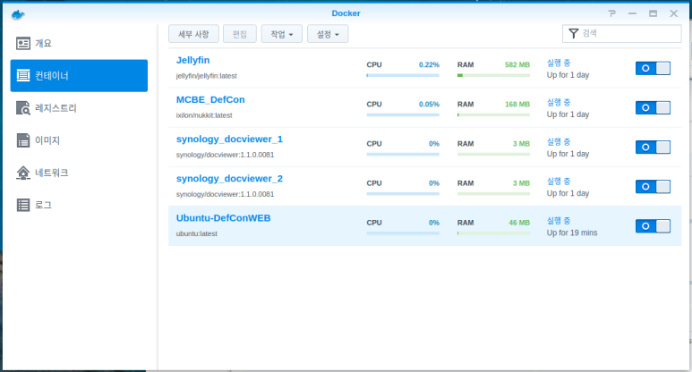
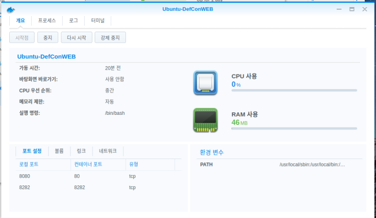
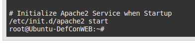

안녕하세요,<br/>
대학생 1인 개발자로 활동중인 LR입니다!​

저는 현재 개인 Nas 서버로<br/>
**XPEnology OS** 를 설치해서,<br/>
**Synology** 인 척 하며 사용하고 있습니다.

여기서 동시에,<br/>
**Docker** 를 이용해 **Ubuntu** 를 구동하며<br/>
**Apache2** 로 구성한 웹 서버도 동시에 실행하고 있는데요,<br/>
**Synology** 에서 기본적으로 제공하는 **Docker** 패키지의 경우,<br/>
GUI 형태로 구현되어 있어<br/>
일반적인 **Linux** 등에서 구동하는 **Docker** 명령과는<br/>
조금 사용법이 다릅니다.

<center>

</center>

**Ubuntu** 에서 특정 서비스에 대해<br/>
부팅시 자동시작을 활성화하기 위해서는<br/>
다음 명령을 실행해주면 됩니다.

```bash
ubuntu@desktop: $ sudo update-rc.d apache2 defaults
```

위 코드를 실행하게 되면<br/>
**defaults**, 즉 **Initialize Run Level**이 3, 5일 경우<br/>
해당 서비스의 **start** 명령이 실행됩니다.

하지만 **Docker** 에서 구동하는 **Ubuntu** 의 경우는,<br/>
별도의 **Run Level** 을 고려하지 않고,<br/>
스냅샷 형태로 구동되기에<br/>
위 방법으로는 자동시작 활성화가 불가합니다.

Stackoverflow 등을 참고하면,<br/>
일반적인 **Docker** 에서 특정 서비스를 자동시작 하기 위해서는<br/>
다음 링크들에서 확인할 수 있는 별도의 조치를 취해주어야 한다고 합니다.

[AskUbuntu.com](https://askubuntu.com/questions/1054664/run-script-when-dockercontainer-starts)​

[Stackoverflow](https://stackoverflow.com/questions/26938684/docker-io-init-d-script-not-working-on-start-container)​

하지만 **Synology** 의 **Docker** 의 경우,<br/>
컨테이너 실행 명령을 별도로 편집할 수가 없기에,<br/>
위 방법도 활용할 수 없습니다.

그래서 저는, 약간의 편법을 이용하여 서비스 자동시작을 구현하였습니다.<br/>
먼저, 제가 서비스를 수동으로 실행할 때 입력하는 명령은 다음과 같습니다.

```bash
ubuntu@desktop: $ sudo service apache2 start
ubuntu@desktop: $ sudo /etc/init.d apache2 start
```

두 명령 중 하나를 실행할 경우, **apache2** 서비스의 스크립트가 실행되며<br/>
서비스가 시작됩니다.

**Docker** 의 **Ubuntu** 가 구동되면,<br/>
기본적으로 실행되는 명령은<br/>
**root** 계정의 **Bash Shell Initialize** 명령입니다.

<center>

</center>

**Linux** 의 특성상, **Bash Shell** 이 **Initialize**  될 경우,<br/>
해당 계정의 홈 폴더에 위치한 **.bashrc** 파일이 실행되며,<br/>
해당 파일 내에 기록한 명령들이 순차적으로 실행됩니다.

그래서 저는 수동으로 서비스를 시작할 때 입력하던 명령을<br/>
**.bashrc** 파일의 맨 하단에 입력해줌으로써,<br/>
**root** 계정의 **Bash Shell** 이 **Initialize** 되는 시점에<br/>
서비스도 함께 시작되도록 해주었습니다.

<center>

</center>

이렇게 해주면, GUI 환경만으로 제공되는<br/>
**Synology** 의 **Docker** 에서도 **Ubuntu** 의 서비스 자동시작 기능을<br/>
활용해 구동시킬 수 있습니다.

편법이긴 하지만<br/>
이것저것 삽질해보던 중 찾아낸<br/>
가장 간단하다고 생각되는 방법인데,<br/>
혹시 더 좋은 방법이 있다면<br/>
댓글로 조언 남겨주시면 감사하겠습니다.

지금까지,<br/>
LR이었습니다!