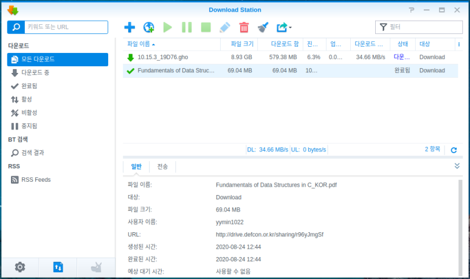
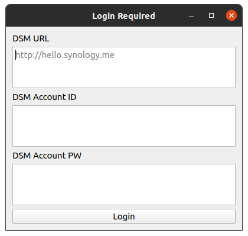
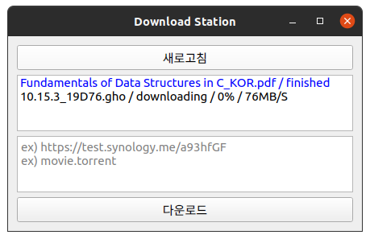
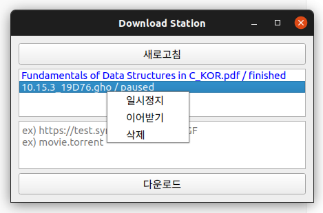
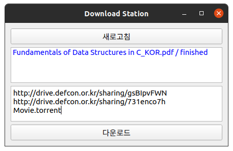

__!! 2020년 9월 2일에 V1.1이 배포되었습니다.__

__본 게시글은 사용법 확인을 위해서만 읽어주시고,__

__다운로드는 새 버전의 포스팅을 이용해주세요 !!__

__[새 버전 포스팅 확인하기](https://dev-lr.com/postview/blog/200902-synology-downloadstation-client-new)__

 
 

안녕하세요, 
대학생 1인 개발자로 활동중인 LR입니다!

오늘 포스팅도 평소 자주 작성하던 리뷰 포스팅이 아닌, 
제가 직접 개발한 프로그램을 공유하는 포스팅이 되었습니다.

저는 현재 **ODroid H2** 개발보드에 
**XPEnology** 운영체제를 설치해 
개인 Nas로 활용하고 있습니다.

[ODroid H2 XPEnology 설치 가이드 포스팅](https://blog-new.defcon.or.kr/postview/blog/200829-odroid-h2-xpenology-guide-new)

**XPEnology** 는 **Synology** 사의 Nas용 운영체제를 
다른 기기에서도 사용할 수 있도록 변조시킨 운영체제입니다.

이 **Synology DSM** 운영체제에서는 
URL이나 토렌트 파일을 이용해 
Nas로 간편하게 파일을 다운로드할 수 있는 
**Download Station** 이라는 기능을 제공합니다.

용량이 큰 파일의 경우, **Download Station** 을 이용해 다운로드 하게되었을 때, 
지속적으로 안정적인 속도로 다운로드 작업을 진행하기 때문에 
오류 없이 빠른 속도로 다운로드를 할 수 있습니다.

하지만 이런 편리한 기능을 제공하는 **Download Station** 이지만, 
매번 DSM에 웹상으로 접속해 이용해야 한다는 점이 불편하게 느껴졌습니다.​

**Android** 와 **iOS** 의 경우, DS Get 또는 기타 서드파티 애플리케이션을 이용해서 
굳이 DSM에 접속하지 않고도 **Download Station** 에 
다운로드 작업을 등록하거나 기존 작업을 제어하는 것이 가능합니다.

다만, **Windows** 는 이러한 클라이언트 프로그램이 거의 존재하지 않기에 
이 기회에 직접 한번 만들어보게 되었습니다.

프로그램을 최초 실행하게 되면, 
위와 같은 로그인 창이 보이게됩니다. 
위에서부터 순차적으로 사용중인 DSM의 주소와 계정을 입력해줍니다. 
이때, DSM의 주소의 경우 **http://hello.synology.me** 와 같이 
http 또는 https로 시작하는 형태로 입력해주셔야 합니다.​

이때 입력하는 계정 정보는 별도의 서버에 저장되지 않고, 
Login 버튼을 클릭하는 순간 프로그램을 실행하신 위치에 설정파일이 생성되며 
해당 파일에 암호화되어 기록됩니다. 
이후 실행시에는 해당 파일을 읽어들여 
지정된 DSM에 로그인하는 용도로만 활용됩니다.

DSM의 주소와 계정 정보를 올바르게 입력했다면, 
Login 버튼을 클릭했을 때 
프로그램의 메인 화면으로 진입하게 됩니다.

맨 위에는 리스트를 새로 불러오기 위한 새로고침 버튼, 
그리고 현재 등록되어있는 작업 리스트가 위치합니다. 
그 아래로는 다운로드 작업을 추가로 등록하기 위한 입력란과 
입력된 작업들을 DSM으로 전송해 다운로드를 시작하는 
버튼이 위치합니다.

**Python** 으로 작성된 프로그램의 특성상, 
반복적으로 리스트의 새로고침을 구현하는 것이 사실상 불가능 하였기에, 
부득이하게 수동 새로고침 형태로 버튼을 추가하게 되었습니다. 
다만, 다운로드 작업을 추가하거나 기존 작업을 제어하는 경우 
자동적으로 새로고침을 하도록 해두었기에, 
큰 불편함은 없으리라 생각됩니다.

상단 리스트에서 작업을 클릭할 경우, 
해당 작업을 제어할 수 있는 메뉴가 표시됩니다.

일시정지 또는 이어받기를 클릭할 경우, 
진행중인 작업을 일시적으로 정지시키거나 
일시정지 상태인 작업을 이어서 진행하도록 합니다.

삭제 버튼을 클릭할 경우, 진행중인 작업은 취소되며 
목록에서 해당 작업이 삭제됩니다.

다운로드 작업을 추가하고자 할 경우, 
해당 파일의 URL 또는 
토렌트 파일명을 입력해줍니다. 
이때, 토렌트 파일의 경우 프로그램을 실행한 위치에 저장해 두어야 합니다.

이처럼, 한 줄당 하나의 다운로드 작업을 입력해 
한번에 여러 작업을 등록하는 것이 가능합니다. ​

## 다운로드

[DownloadStation Client 다운로드](https://drive.defcon.or.kr/sharing/2R5QJGiRg)

다운로드는 위 링크에서 가능하며, 
**Windows** 용 exe 파일과 **Linux** 용 바이너리 파일을 
모두 배포합니다. 
사용중인 운영체제에 맞는 프로그램을 받아 이용하시면 되겠습니다.

## 소스코드 및 공유

[소스코드 보러가기](https://github.com/yymin1022/Synology_DownloadStation_Client)

본 프로젝트의 모든 소스코드는 제 **Github** 를 통해 공개합니다. 
단, 소스코드를 활용하고자 하시는 경우, 
제 원본 **Github** 링크를 남겨주시기 바라며, 
혹시나, 본 프로그램을 공유하고자 하실 경우, 
새로운 글을 작성하거나 파일을 직접 첨부하지 마시고, 
본 포스팅의 링크를 첨부해주시면 감사하겠습니다.

규모가 큰 그런 프로그램은 아니지만, 
**Synology** 의 **DownloadStation** 에서 제공하는 중심적인 기능들은 
대부분 지원하기 때문에, 어느정도 불편함을 해소할 수 있는 
그런 프로그램이라고 생각합니다.

많은 사용자를 바라고 개발한 프로그램이라기보다는 
제가 편하게 이용하고자 개발하기 시작한 프로그램이다 보니 
개발하고 나서의 뿌듯함이 배가 되는 듯 싶습니다.

지금까지, 
LR이었습니다!