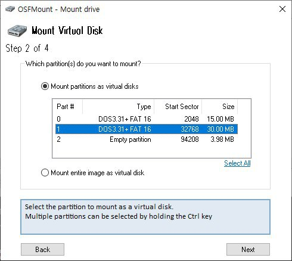
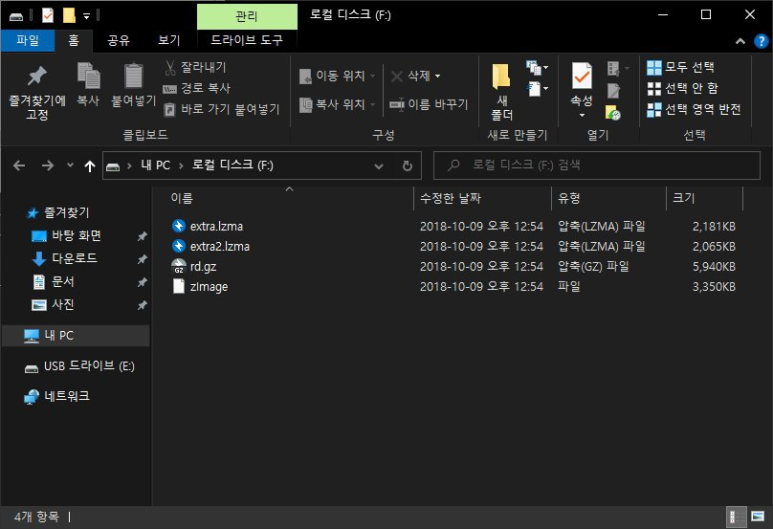
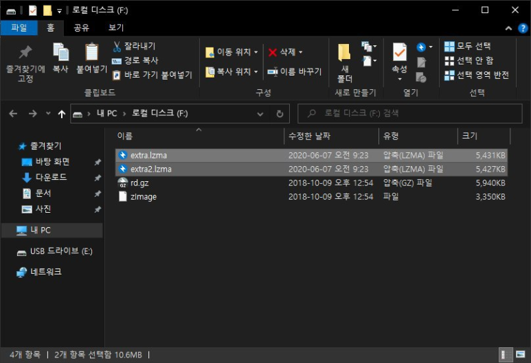
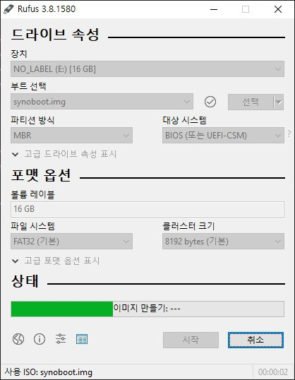
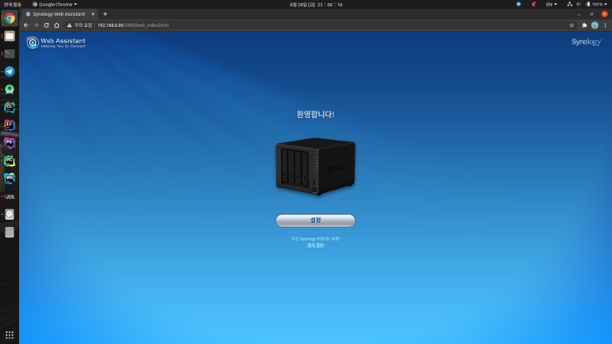
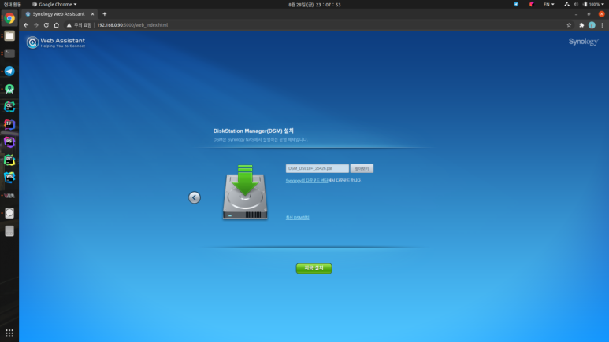
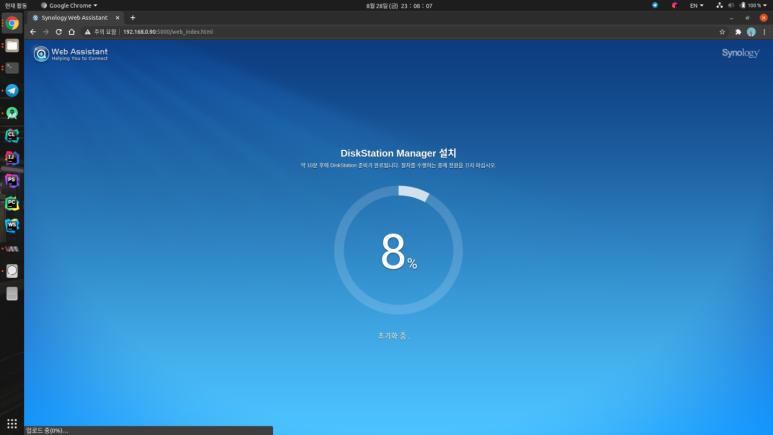
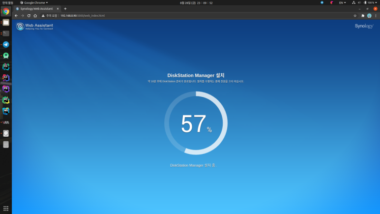
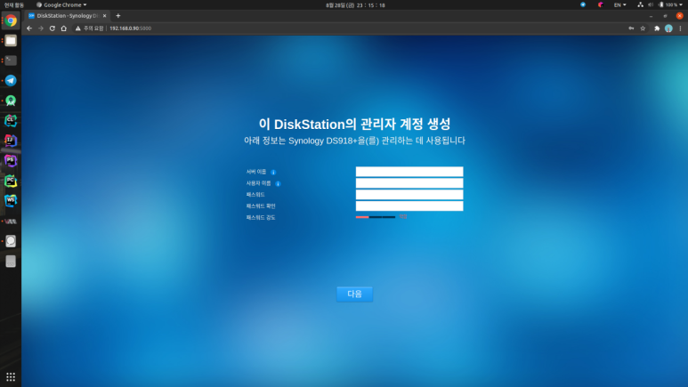

​안녕하세요, 
대학생 1인 개발자로 활동중인 LR입니다!

저는 현재 하드커널의 **ODroid H2** 를 이용해 
자작나스를 구축해 사용중에 있는데요,

Synology 사의 DSM OS를 개조한 
**XPEnology** 를 설치해서 이용하고 있습니다.​

다만, 드라이버 문제로 최신버전을 설치할 수는 없었고, 
작년에 출시된 버전인 6.2.1 버전을 설치해 사용중이고, 
관련 가이드도 지난 3월에 작성했었습니다.

그런데, 얼마전 **XPEnology** 의 포럼을 뒤지던 중, 
지난 4월에 추가 드라이버 패치가 출시된 것을 확인했고, 
이것을 이용하면 **ODroid H2** 에서도 DSM의 최신버전을 
설치해 이용할 수 있다는 점을 알아냈습니다.

그래서 오늘 포스팅에서는, **synoboot** 부트로더에 추가 드라이버를 패치해 
**ODroid H2** 에서 DSM의 최신버전을 사용하는 방법에 대해 작성해보고자 합니다. ​

먼저, 기본적인 작업은 지난 3월 작성했던 6.2.1버전의 설치 과정과 동일합니다. 

[지난 게시글 보러가기](https://dev-lr.com/postview/blog/200311-odroid-h2-xpenology-guide)

이전 포스팅을 참고하셔서, 
USB의 PID와 VID값을 **grub.cfg** 에 입력하는 작업까지만 진행한 뒤, 
**Rufus** 를 이용한 USB에 굽기 전 아래 과정을 먼저 진행해주셔야 합니다.​

다음 링크에 접속하셔서, **synoboot** 1.04b 버전 용 추가드라이버 패키지를 다운로드 해줍니다.

[Synoboot 드라이버 패치 다운로드](https://xpenology.com/forum/topic/28321-driver-extension-jun-103b104b-for-dsm623-for-918-3615xs-3617xs/?tab=comments#comment-141934)

DS918+ 부트로더 용 0.13.3버전 드라이버를 다운로드 해주시면 됩니다.​

다운로드한 압축파일 내에는 2개의 파일이 위치하는데, 
일단 이 압축파일을 풀어둡니다.

grub.cfg를 편집하기 위해 OSF Mount를 이용한 것과 마찬가지로, 
이번에도 **synoboot** 파일을 **OSF Mount** 를 이용해 마운트 해줍니다.

이때 주의할 것은, 이전 작업에서는 15MB의 0번 파티션을 마운트 했지만, 
이번에는 30MB 크기의 1번 파티션을 마운트 해주셔야 합니다.

이후, 마운트된 폴더를 열어보면 
아래 사진과 같이 몇개의 파일이 존재합니다. 
이 중 두 파일을 조금 전 다운로드한 압축파일 내에 있던 파일로 
교체해주면 작업은 끝납니다.

변경 전 파일은 각각 약 2MB의 크기이고, 변경이 완료된 이후의 파일은 각각 5MB의 크기입니다.​

정상적으로 파일이 변경되었다면, **OSF Mount** 에서 Dismount 를 클릭해 마운트를 해제해줍니다.

이후 과정은 이전 가이드와 동일합니다.

**Rufus** 를 이용해 USB에 **synoboot.img** 를 플래싱해준 뒤, 
**ODroid H2** 에 장착하고 부팅해줍니다.

**ODroid H2** 의 유선랜 포트에 
정상적으로 랜선이 연결되었다면, 
약 5분 이내에 부팅이 완료됩니다.

[Synology Web Assistant](find.synology.com)

위 링크에 접속하면, 같은 내부망에 위치하는 Synology 또는 **XPEnology**  기기를 자동으로 검색해줍니다.

이와 같이 DS918+ 기기가 정상적으로 검색되었다면, 
설정을 클릭해 DSM 운영체제를 설치해줍니다.

지난 가이드에서는 이 과정에서 수동설치를 통해 6.2.1 버전의 펌웨어 파일을 업로드 해주었지만, 
이번 과정에서는 자동으로 시놀로지 서버에서 최신버전을 다운로드하도록 해도 무방합니다. 
저는 시놀로지 아카이브 서버에서 6.2.3 최신버전의 펌웨어 파일을 다운로드해 수동설치 해주었습니다.

[DSM 6.2.3-Update3 다운로드](https://archive.synology.com/download/Os/DSM/6.2.3-25426-3)

저처럼 수동으로 펌웨어 설치를 진행하고자 하시는 경우, 
위 링크에서 DS918+ 모델의 pat파일을 다운로드 해주시면 됩니다.

0%~56%까지는 시스템에 장착된 하드디스크를 초기화하고, 
지정된 펌웨어 파일을 저장하는 과정이 수행되며, 
57%부터는 저장된 펌웨어 파일을 시스템에 설치하는 과정이 진행됩니다.

정상적으로 설치가 완료되었다면, 10분 타이머가 실행되는데, 
약 5분 뒤 새로고침 했을 때 아래와 같은 로그인 페이지가 나타난다면 
성공적으로 설치된 것입니다.

만약, 10분 타이머 이후에 한참이 지난 뒤에도 
위 화면이 표시되지 않고 서버오류가 발생한다면, 
드라이버 패치 과정에서 문제가 있을 가능성이 높습니다.

**XPEnology**  운영체제가 나스로서는 
굉장히 만족스러운 운영체제이지만, 
구버전인 6.2.1 버전만을 사용해야 한다는 것이 아쉬웠습니다.

하지만, 추가적인 드라이버 패치를 통해 최신버전을 이용할 수 있게 되어, 
더더욱 만족스러운 **ODroid H2** 자작나스가 되었습니다.

혹시, 설치 과정에서 문제가 발생하거나 문의사항이 있으시면, 
댓글로 남겨주시기 바랍니다.

지금까지, 
LR이었습니다!