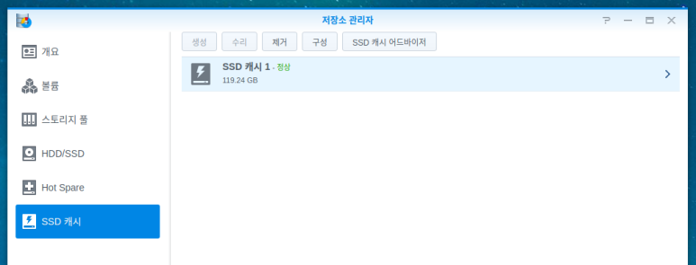
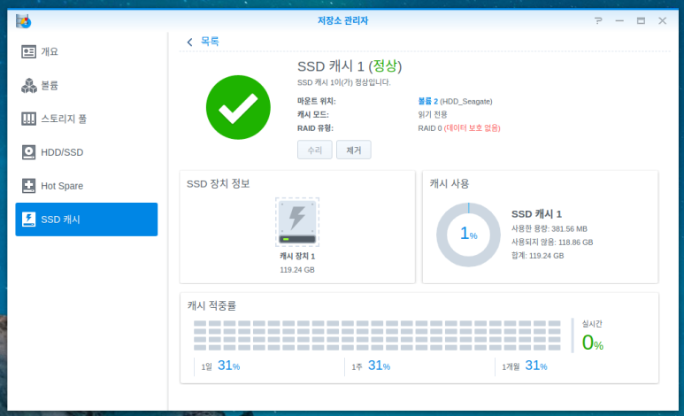

안녕하세요,<br/>
대학생 1인 개발자로 활동중인 LR입니다!

오늘은, **XPEnology** 에서 NVMe SSD를 이용한<br/>
캐시 기능의 활성화 방법에 대해 작성해보고자 합니다.

Synology NAS에서는 기본적으로 NVMe SSD를 이용한<br/>
저장소 캐시 기능을 지원해, 읽기와 쓰기 속도를 향상시킬 수 있습니다.

하지만, **XPEnology** 에서는 드라이버와 라이브러리 문제로 인해서 사용이 불가했는데요,

해외 **XPEnology** 포럼에서 **XPEnology** 에서의 NVMe SSD 캐시 기능을<br/>
활성화 할 수 있는 패치파일이 제작되어, 한번 이를 적용해보았습니다.

먼저, 관련된 원본 포럼 게시글은 다음과 같습니다.

[XPEnology Forum 게시글](https://xpenology.com/forum/topic/13342-nvme-cache-support)

<center>

</center>

<center>

</center>

해당 게시글에서 받아야 하는 파일은<br/>
91번 쓰레드의 sh 스크립트 파일과<br/>
127번 쓰레드의 라이브러리 패치 파일을 각각 받아주시면 됩니다.

두 파일을 다운로드하신 뒤, 시놀로지 내에 업로드 해주시면 되는데요,<br/>
저는 볼륨1에 위치한 Download라는 공유폴더에 업로드 해주었습니다.

<center>

</center>

이후, 제어판에서 ssh 기능을 활성화해준 뒤<br/>
**터미널**이나 **putty** 등을 활용해 **XPEnology** 에<br/>
ssh로 로그인 해줍니다.<br/>
이때 **root 권한** 이 있는 admin 그룹의 계정으로 로그인해주셔야<br/>
정상적으로 시스템에 패치를 진행할 수 있습니다.

ssh에 정상적으로 접속되었다면,<br/>
파일을 저장한 위치로 이동합니다.<br/>
저는 볼륨1의 Download 공유폴더에 파일을 저장 해두었으므로,<br/>
**/volume1/Download** 에 파일이 위치합니다.<br/>
파일이 저장된 올바른 위치로 **cd** 해줍니다.

<center>

</center>

해당 디렉터리로 이동해 **ls -al**을 실행했을 때<br/>
sh 스크립트 파일과 라이브러리 파일이 정상적으로 보인다면<br/>
준비가 완료된 것입니다.

이제, **sudo** 권한으로 sh파일을 실행해줍니다.

<center>

</center>

비밀번호를 올바르게 입력하고나면,<br/>
다시 명령어 입력을 대기하는 상태로 돌아옵니다.<br/>
이제, 라이브러리 파일을 복사해주어야 합니다.<br/>
다음 명령어를 통해 라이브러리 파일을<br/>
**/usr/lib64** 디렉터리로 복사해줍니다.

```bash
admin@Synology:/volume1/Download $ cp libsynonvme.so.1 /usr/lib64/libsynonvme.so.1
```

<center>

</center>

복사를 완료했다면, **XPEnology** 를 재부팅 해줍니다.

<center>

</center>

정상적으로 적용되었다면, 저장소 관리자의 SSD 캐시 메뉴에서 생성 버튼이 활성화됩니다.​

생성 버튼을 클릭하고, 지시에 따라 작업을 진행해줍니다.

<center>

</center>

SSD가 여러개라면, 읽기와 쓰기에 각각 할당해줄 수 있지만,<br/>
제가 사용중인 **ODroid H2** 에는 NVMe 슬롯이 하나뿐이기에,<br/>
읽기 전용으로만 생성해보겠습니다.

<center>

</center>

캐시로 활용할 SSD와 어떤 볼륨에 활용할지 지정해줍니다.<br/>
볼륨 1에는 자주 사용하지 않는 파일을,<br/>
볼륨 2에는 자주 사용하는 파일들을 저장하고 있으므로,<br/>
볼륨 2에 SSD 캐시를 마운트해보겠습니다.

<center>

</center>

캐시로 사용할 파티션 크기를 지정하고,<br/>
SSD가 포맷된다는 경고문을 확인하고 나면<br/>
캐시로 SSD를 할당하는 작업이 수행됩니다.

<center>

</center>

<center>

</center>

과정이 정상적으로 수행되었다면,<br/>
이처럼 SSD 캐시에 대한 정보를 확인해볼 수 있습니다.

비록 정품 Synology NAS를 사용하는 것은 아니지만,<br/>
**XPEnology** 만으로도 각종 패치를 통해 대부분의 거의 모든 기능을<br/>
활용해볼 수 있는 것 같습니다.

혹시 작업 과정에서 문제가 있거나,<br/>
질문사항이 있으신 분들은 댓글 남겨주세요.

지금까지,<br/>
LR이었습니다!