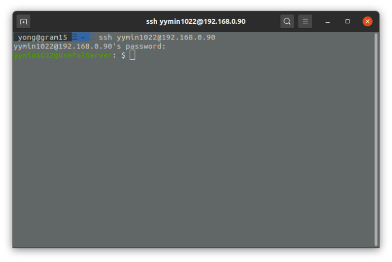
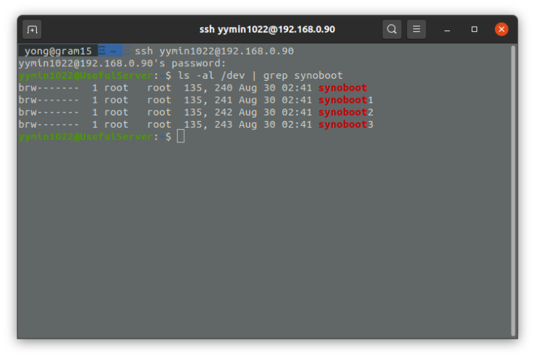
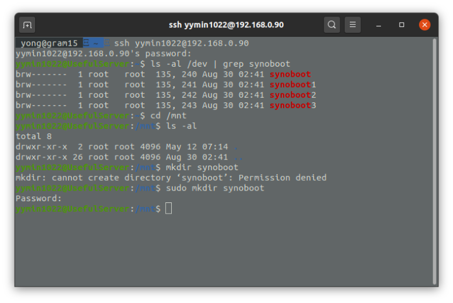
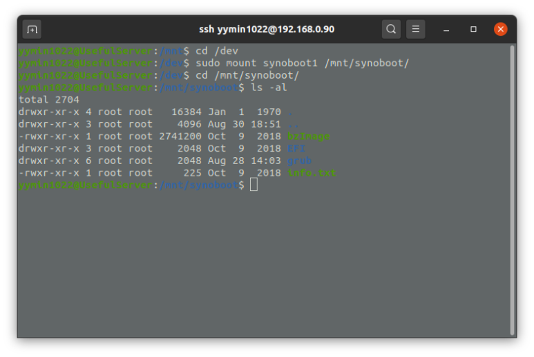

안녕하세요,<br/>
대학생 1인 개발자로 활동중인 LR입니다!

저는 현재 **XPEnology** 를 오드로이드 H2에 설치해 활용하고 있는데요,<br/>
**XPEnology** 의 특성상 시리얼넘버, 맥주소 등<br/>
일부 속성값을 변경해주기 위해서는<br/>
**synoboot** 부트로더 내의 **grub.cfg** 파일을 수정해주어여야 합니다.

하지만, USB로 장착되어있는 부트로더를 분리해<br/>
다른 PC에 연결하고,<br/>
장치를 마운트해 내용을 수정하는 이 과정이<br/>
상당히 귀찮고 번거롭게 느껴집니다.

이번 포스팅에서는,<br/>
USB의 분리 없이 **XPEnology** 에서<br/>
곧바로 부트로더를 마운트해 **grub.cfg** 파일을 수정하는 방법에 대해<br/>
알아보겠습니다.

먼저, ssh를 통해 **XPEnology** 에<br/>
**root** 권한으로 로그인 해줍니다.

<center>

</center>

**/dev** 디렉터리에 마운트된 목록에서<br/>
**synoboot** 항목이 존재하는지 확인해줍니다.

<center>

</center>

위와 같이 **synoboot** 장치 1개와,<br/>
해당 장치 내부의 3개 파티션이 인식됩니다.

이중, **grub.cfg** 설정파일이 위치한 파티션은 **synoboot1** 파티션입니다.<br/>
**/mnt** 에 임의의 디렉터리를 하나 생성하고,<br/>
이 디렉터리에 마운트 해보겠습니다.

```bash
admin@Synology: ~$ cd /mnt
admin@Synology: /mnt$ sudo mkdir synoboot
```

<center>

</center>

**/mnt** 에 **synoboot** 라는 이름의 디렉터리를 생성해주었습니다.<br/>
이 과정에서는 **root** 권한이 필요하므로, **sudo** 를 사용합니다.

이제, **synoboot1** 파티션을 방금 만든 디렉터리에 마운트해줍니다.<br/>

```bash
admin@Synology: ~$ cd /dev
admin@Synology: /dev$ sudo mount synoboot1 /mnt/synoboot
```

<center>

</center>

정상적으로 마운트가 되었다면,<br/>
**/mnt/synoboot** 디렉터리에서 **ls -al** 명령을 실행했을 때<br/>
내부의 파일들이 보이게 됩니다.<br/>
여기서, **grub** 디렉터리 내의 **grub.cfg** 파일을 **vi** 에디터를 이용해 수정해준 뒤,<br/>
다음 명령어로 마운트를 해제해주고 재부팅하면 작업이 완료됩니다.

```bash
admin@Synology: ~$ sudo umount /dev/synoboot1
```

혹시 작업 과정에서 문의사항이 있으신 분들께서는<br/>
댓글로 남겨주시면 답변드리도록 하겠습니다.

지금까지,<br/>
LR이었습니다!