안녕하세요, 
대학생 1인 개발자로 활동중인 LR입니다!

최근 **XPEnology OS** 를 설치하고 세팅하는 과정에 대해서 
여러가지 포스팅을 작성하고 있는데요, 
오늘 포스팅도 역시 **XPEnology OS** 를 커스텀하는 작업에 대한 내용입니다. 

**XPEnology** 는 **Synology** 의 DSM을 일종의 변조 과정을 통해서 
정품 **Synology** 가 아닌 기기에서 DSM을 사용하는 OS입니다.

이렇다보니, 정품 시리얼 넘버가 필요한 일부 기능들이 제한되는데요, 
오늘 포스팅에서는 가상DSM의 정품 시리얼을 이용해 
**XPEnology** 에서 정품 **Synology** 기능을 사용하는 방법에 대해 
이야기해보도록 하겠습니다.

작업 이전, 제 **XPEnology** 의 시리얼 넘버는 
**XPEnology** 에서 기본으로 지정된 시리얼 넘버입니다.

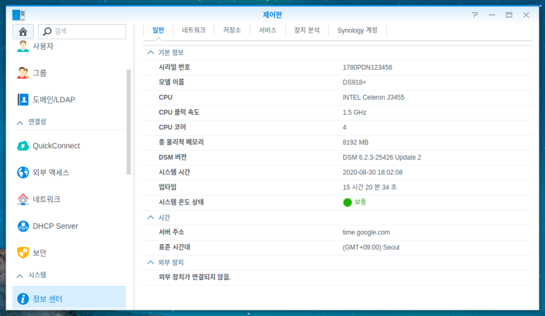

이 시리얼 넘버는 정품 **Synology** 제품에 존재하지 않는 
시리얼 넘버이기 때문에, 
Video Station에서 트랜스코딩이 작동하지 않고, 
Quickconnect 등 몇몇 편의기능을 사용할 수 없습니다.

이제, 시리얼 넘버를 수정하는 작업을 진행해보겠습니다.

먼저, **Virtual Machine Manager** (이하 VMM)을 이용해, 
가상 DSM을 생성해주어야 합니다.

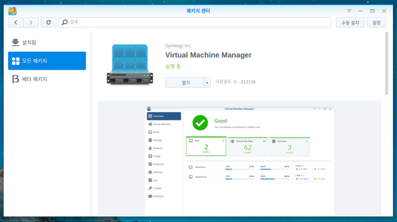

패키지 센터에서 **VMM** 을 설치 
하고, 실행해줍니다.

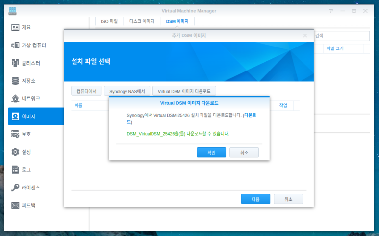

**VMM** 의 좌측 메뉴에서 이미지 메뉴로 이동하고, 
DSM 이미지 탭에서 추가를 클릭해줍니다. 
이후, **Virtual DSM** 이미지 다운로드를 클릭하면 
위와 같이 현재 시점의 최신버전 DSM 이미지 파일이 확인됩니다.

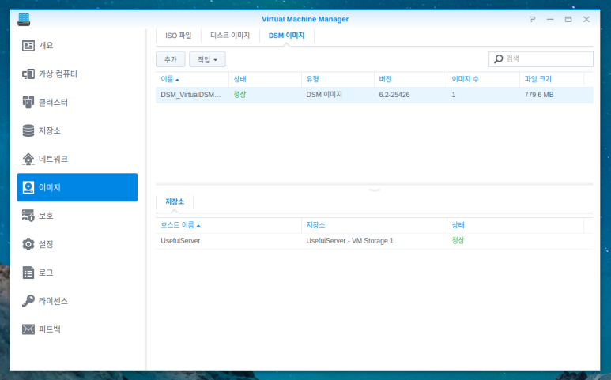

다운로드는 약 2분가량이 소요되며, 다운로드가 완료되면 
위와 같이 정상이라는 텍스트가 표시됩니다.

이제, 이 이미지를 이용해 가상 DSM을 등록해줍니다.

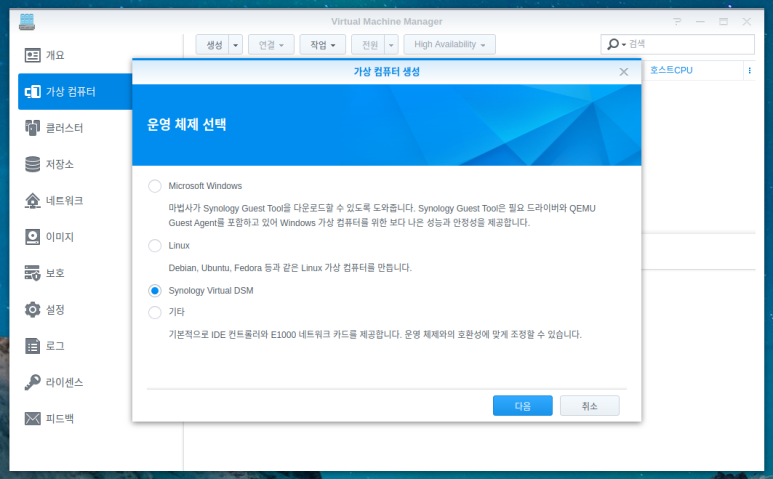

**VMM** 의 좌측 메뉴에서 가상컴퓨터 메뉴로 이동해, 
생성 버튼을 클릭해줍니다. 
운영체제로는 **Synology Virtual DSM** 을 선택하고 
다음 단계로 이동합니다.

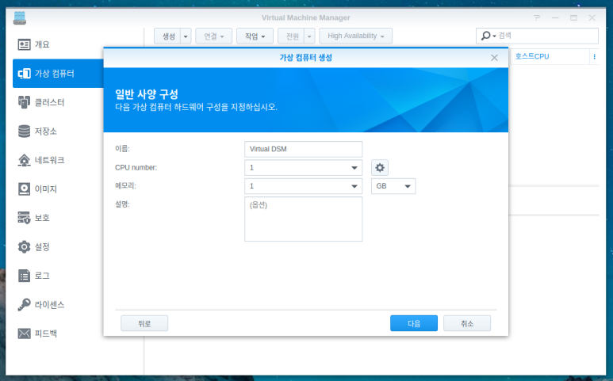

가상 DSM의 성능을 지정하는 단계입니다. 
이 가이드에서는 단순히 시리얼 넘버를 발급받는 작업만 하면 끝이므로 
성능을 최저로 해서 다음 단계로 이동합니다.

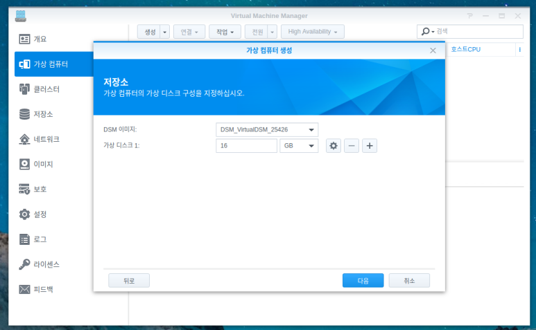

마찬가지로 저장소 크기 역시 작게 설정해주고 
다음 단계로 넘어갑니다.

네트워크 설정과 사용자 권한을 적절히 설정해주면 
가상 DSM의 생성이 완료됩니다.

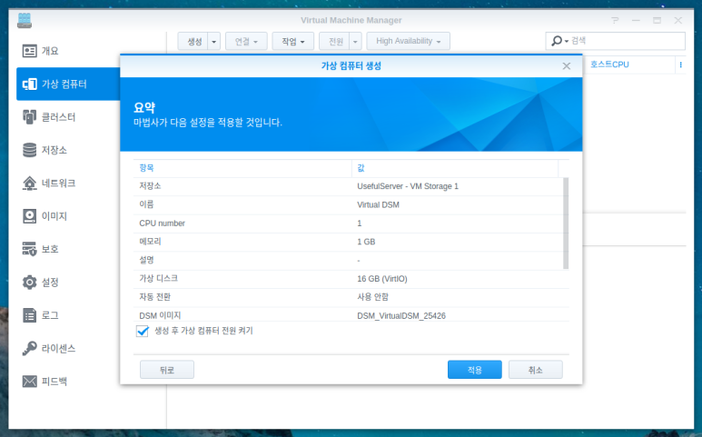

생성된 가상 DSM의 전원을 켜주면 
라이센스를 묻는 창이 나타납니다.

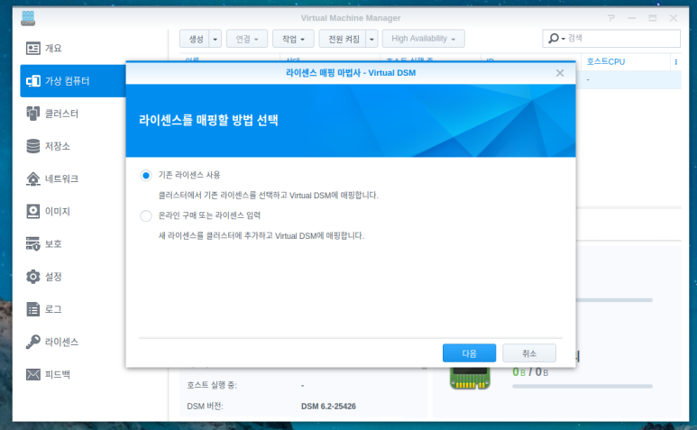

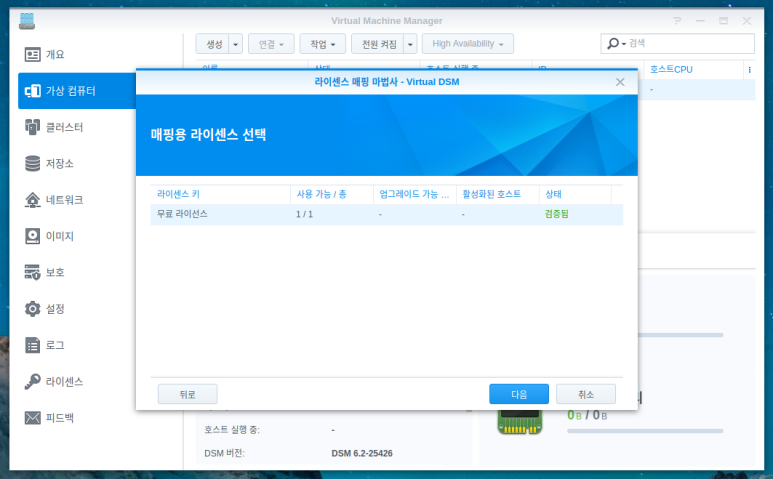

**VMM** 에서는 기본적으로 1대의 가상 DSM 라이센스를 
발급해주므로, 이를 선택해줍니다.

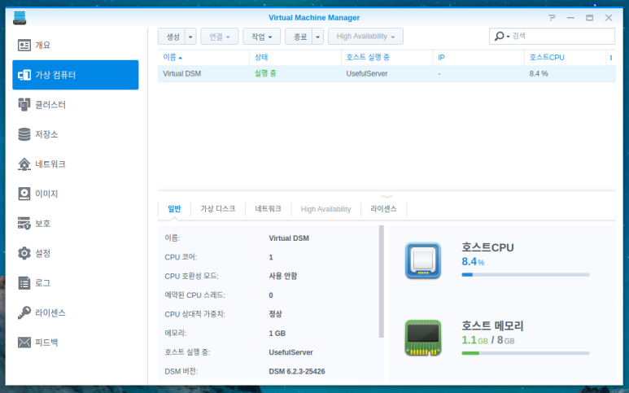

가상 DSM의 생성 및 등록이 완료되었습니다. 
약 5분가량 기다리시면 아래 사진과 같이 가상 DSM의 IP가 보이게 됩니다.

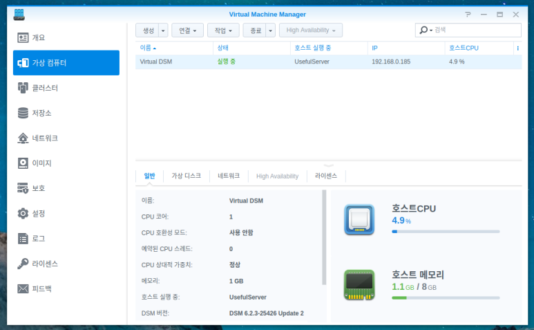

표시된 내부IP로 접속해주면 이전에 **XPEnology** 를 설치했을때와 같이 
초기 설정 화면이 보입니다.

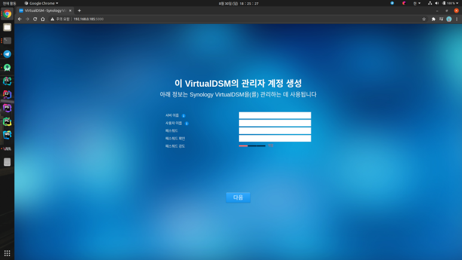

초기 설정 과정은 이전에 진행했던 경험이 있으니, 
자세히 다루지 않고 넘어가겠습니다.

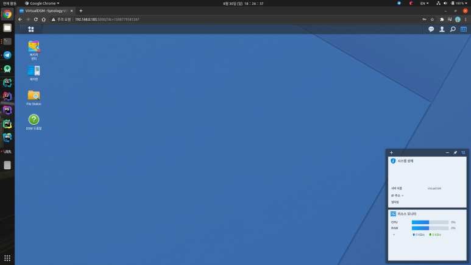

가상 DSM의 메인화면으로 진입되었다면, 
제어판의 정보센터로 이동해 시리얼 넘버를 확인합니다.

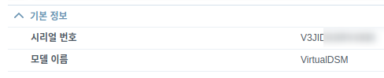

가상 DSM의 시리얼 넘버는 위와 같이 V로 시작하는 형태입니다. 
모델명은 기존의 **DS918+** 등과는 달리, 
**VirtualDSM** 라는 가상의 모델명으로 표시됩니다.

이제, 이 가상 DSM의 역할은 끝났습니다. 
전원을 꺼줍니다. 
단, 이 가상 DSM을 삭제하시면 
이 시리얼 넘버의 유효성도 함께 삭제되기 때문에, 
이 작업의 과정이 무의미해집니다.

이제, 기존 **XPEnology** 의 **grub.cfg** 파일을 수정해 
가상 DSM의 시리얼넘버를 입력해줍니다.

[XPEnology 내부에서 synoboot 마운트하기 포스팅](https://dev-lr.com/postview/blog/200830-xpenology-synoboot-mount)

부트로더가 설치된 USB를 분리해 PC에서 
마운트한 뒤 작업해도 무방하지만, 
저는 귀찮으므로 이전에 올린 포스팅을 참고해 
**XPEnology** 상에서 직접 마운트해 수정해보도록 하겠습니다.

부트로더를 마운트하고, **synoboot/grub/grub.cfg** 파일을 **root** 권한으로 열어줍니다. 
__* 꼭 sudo 로 열어주셔야, 파일 수정이 가능합니다 *__

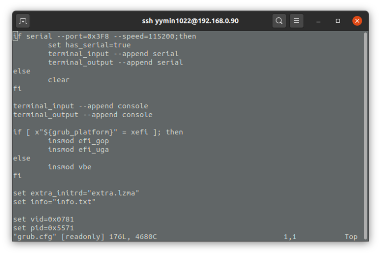

기본으로 구성된 **grub.cfg** 파일을 기준으로 
24번째 줄의 **set sn** 값을 미리 확인한 가상 DSM의 시리얼 넘버로 수정해줍니다.

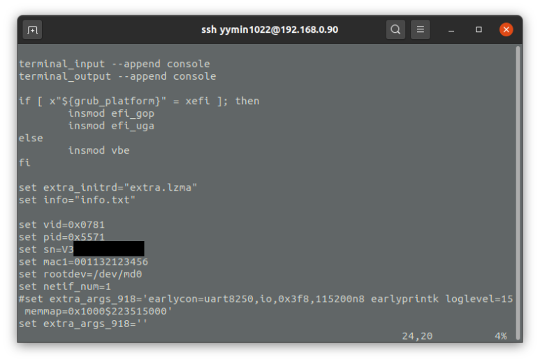

파일 수정이 완료되었다면, 
저장해준 뒤 **synoboot** 의 마운트를 해제하고 재부팅 해줍니다.

재부팅 이후 제어판을 열고 
정보센터를 확인해보면

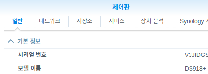

위와 같이 시리얼 번호가 가상 DSM의 것으로 변경된 것을 확인할 수 있습니다.​

이렇게 되면, 비디오 스테이션의 HW 트랜스코딩과 
Active Backup 등의 정품인증 과정을 넘어갈 수 있지만 
모델명이 일치하지 않기 때문에 **Synology** 계정 로그인이 필요한 
모바일알림 등의 기능은 여전히 사용이 불가합니다.

모델명 변경을 시도해보았지만 이는 부트로더, 커널, 시스템 모두를 
수정해야하는 고난도의 작업이다보니 사실상 불가능한 작업으로 보입니다.

시리얼넘버 변경 만으로도 충분히 가치있는 작업이라고 생각합니다. 
다만 주의하셔야 할 점은, 
이번 과정에서 생성한 가상 DSM의 전원을 켜거나 삭제할 경우, 
중복 시리얼로 시놀로지 측에서 밴을 당하거나 
유효하지 않은 시리얼넘버로 간주되어 정품으로서의 기능이 사라지게 됩니다.​

이 경우, 가상 DSM을 다시 생성해 새 시리얼넘버를 발급받으면 해결되므로 
큰 문제가 되지는 않으나, 활용에 참고하시기 바랍니다.

혹시 진행 과정에 문제가 있거나 
질문사항이 있으신 분들은 댓글로 남겨주시면 
아는 선에서 답변드리도록 하겠습니다.

지금까지, 
LR이었습니다!