안녕하세요, 
대학생 1인 개발자로 활동중인 LR입니다!

저는 현재 개인 나스에 Synology의 DSM OS를 개조한 
**XPEnology OS** 를 설치해 사용하고 있는데요,

이 나스에 **Jellyfin** 서비스를 설치해 
나스에 저장한 영화 등의 미디어파일을 
온라인상에서 스트리밍할 수 있는 서비스를 구축해두었습니다.

쉽게말해, 넷플릭스나 유튜브와 같은 동영상 재생 플랫폼을 
내가 가진 서버에 내가 가진 미디어 파일로 구성해서 
활용하는 것입니다.

**Jellyfin** 은 오픈소스를 기반으로 하는 스트리밍 서비스로, 
Docker 등을 이용해서 간단하게 설치하고 세팅해주면 
곧바로 웹을 통해 미디어 파일을 재생할 수 있도록 
간편하게 개발되어 있습니다.

오늘 포스팅에서는 이 **Jellyfin** 을 Synology에 
설치하는 과정에 대해서 알아보도록 하겠습니다.

먼저, Synology 패키지센터를 통해 
**Docker** 프로그램을 설치해줍니다.

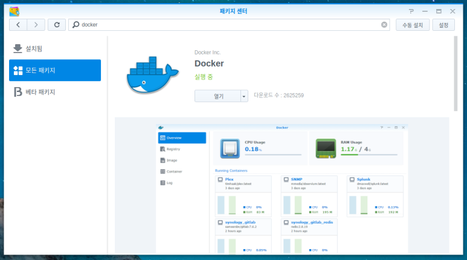

**Docker** 의 설치가 완료되었다면, 
**Docker** 를 실행해줍니다.

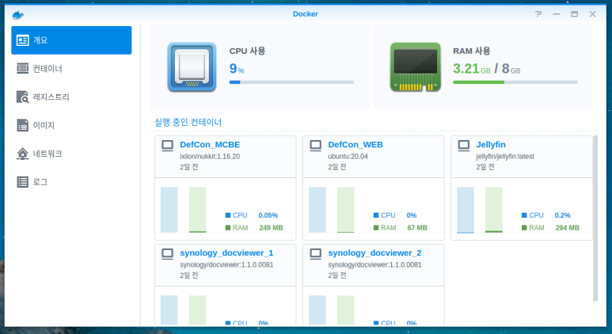

**Docker** 의 메인화면입니다. 
현재 실행중인 컨테이너 목록과 각각의 리소스 사용률을 확인할 수 있습니다.

저는 이미 **Jellyfin** 서비스를 구축한 상태이지만, 
설명을 위해 추가로 하나 더 실행해보도록 하겠습니다.

좌측 메뉴 중, 레지스트리 메뉴로 이동합니다. 
상단의 검색창을 이용해 **Jellyfin** 을 검색해준 뒤, 
가장 상단에 표시되는 jellyfin/jellyfin을 더블클릭해 선택해줍니다

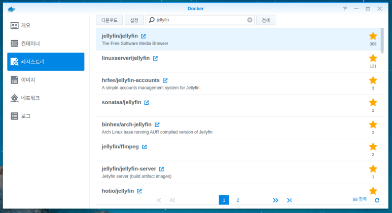

 

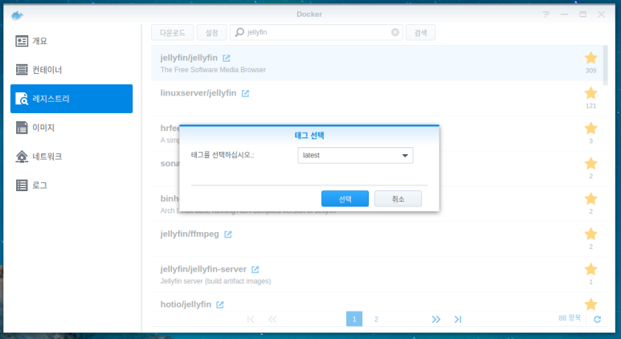

이후 **latest** 를 선택해 최신버전의 **Jellyfin** 이미지를 다운로드 해줍니다​

이제, 좌측 메뉴 중 이미지 메뉴로 이동해보면 다운로드가 완료된 **Jellyfin** 이미지가 목록에 나타납니다.

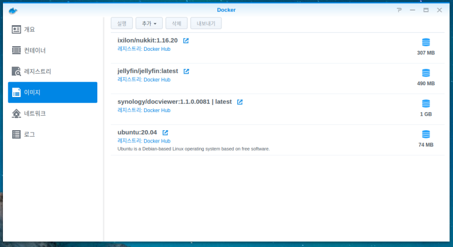

목록에 **jellyfin/jellyfin:latest** 항목이 존재하고, 
우측의 디스크 아이콘이 깜빡이지 않는다면 
다운로드가 완료된 것입니다.

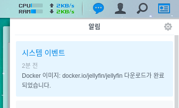

또한 다운로드가 완료되면 우측 상단의 알림센터에 
다운로드가 완료되었다는 알림이 표시됩니다.

**Jellyfin** 이미지의 다운로드가 완료되었다면 
**Jellyfin** 항목을 선택하고 상단의 실행 버튼을 클릭합니다.

이제 **Jellyfin** 서비스를 구축하는 세부설정 작업이 시작됩니다.

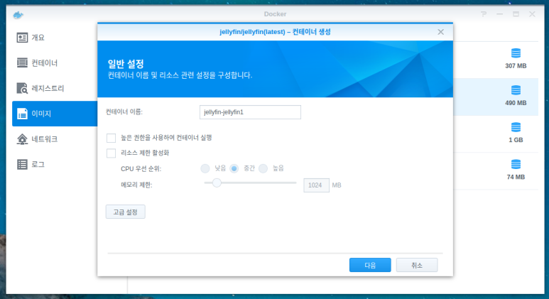

컨테이너 이름의 경우, 중요하지 않으므로 적절히 입력해줍니다. 
이후, 하단의 고급 설정을 클릭합니다.

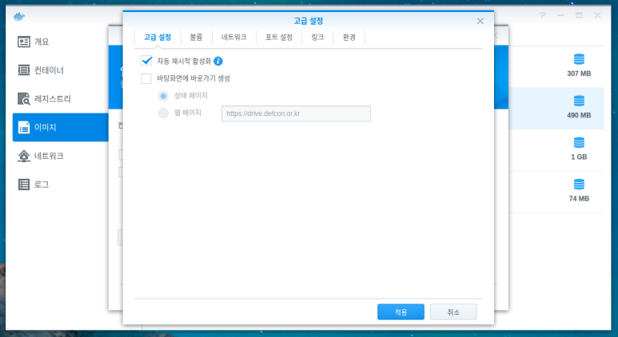

첫번째 탭에는 중요한 설정이 있지는 않습니다. 
다만, Synology 나스가 켜진 이후 
자동으로 **Jellyfin** 서비스가 시작되도록 하기 위해 
상단의 자동 재시작 활성화를 체크해줍니다.

두번째 볼륨 탭에서는 **Jellyfin** 의 설정 값이 저장될 위치와 
재생할 미디어가 저장된 위치의 경로를 지정해 주어야 합니다.

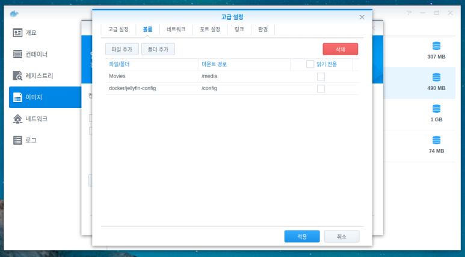

상단 버튼의 폴더 추가를 눌러, 설정을 저장할 폴더를 선택한 뒤, 마운트 경로에는 **/config** 를, 
미디어가 저장된 폴더를 선택한 뒤, 마운트 경로에 **/media** 를 
입력해줍니다. 
저는 **docker/jellyfin-config** 폴더에 설정값을 저장하며, 
재생할 영화 등의 미디어는 **Movies** 에 저장해 두었기에, 
위 사진과 같이 설정해주었습니다.​

이때 주의할 점은, 두 항목 모두 우측의 읽기전용을 체크하지 말아야합니다.

세번째 네트워크 탭은 별도로 설정할 내용이 없습니다. 
네번째 탭인 포트 설정 탭으로 이동합니다.

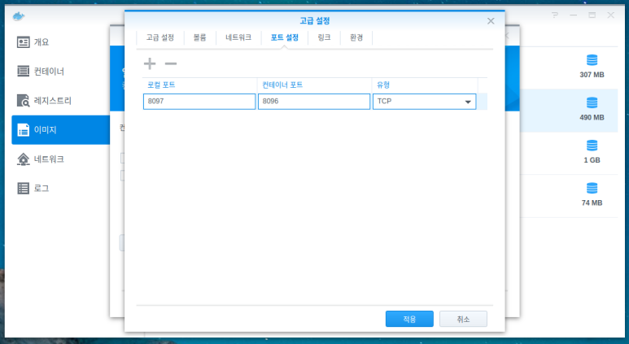

인터넷 브라우저를 이용해 **Jellyfin** 에 접속하기 위해 포트번호를 정해주어야 합니다. 
컨테이너 포트는 기본적으로 **8096** 이 적혀있는데, 이는 건들지 마시고 
왼쪽의 로컬 포트를 입력해줍니다. 
일반적으로는 로컬 포트에도 **8096** 을 입력하지만 
저는 이전에 구축한 서비스에서 **8096** 을 사용중이므로 
**8097** 번을 입력해주었습니다. 
원하시는 숫자를 입력해주되, 이 로컬 포트 숫자를 꼭 기억하고 계셔야 합니다.

포트 설정까지 마쳤다면 
하단의 적용 버튼을 클릭합니다.

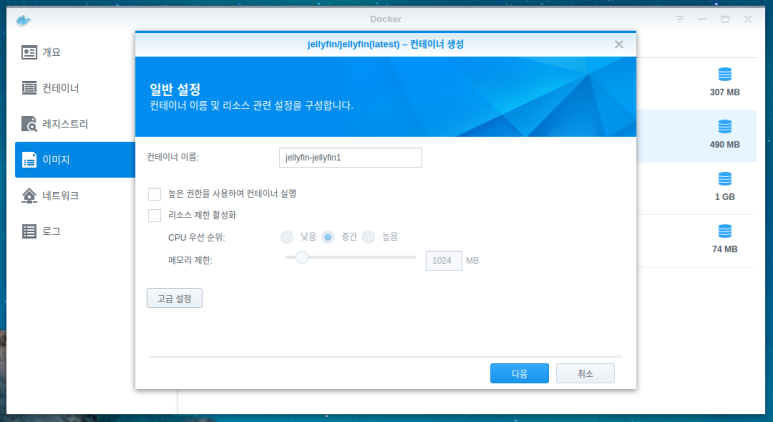

다시 이 화면으로 돌아왔다면, 
다음을 클릭해줍니다.

**Jellyfin** 서비스를 이용하기 위한 기본적인 구성이 완료되었습니다. 
적용 버튼을 눌러 창을 닫아준 뒤, 
좌측 메뉴 중 컨테이너로 이동합니다.

목록에 방금 추가한 **jellyfin-jellyfin1** 항목이 추가되었습니다. 
첫 단계에서 다른 이름을 입력하셨다면, 그 이름이 표시됩니다.

이제, 웹 브라우저를 통해 **Jellyfin** 페이지에 접속해서 
계정 생성, 라이브러리 추가 등의 작업을 해주면 됩니다.

경우에 따라 다르겠지만, 조금 전 설정에서 포트로 지정해주었던 포트넘버를 
공유기의 설정 페이지에서 포트포워딩 해주시거나 
Synology NAS를 DMZ로 오픈해주어야 접속이 가능합니다.

이 과정은 모두 아시리라 생각하고 
자세한 설명을 생략하도록 하겠습니다.

웹 브라우저에서 도메인 또는 Synology NAS의 IP주소를 입력하고, 
뒤에 포트넘버를 붙여 입력해줍니다. 
예를들어, 제 Synology의 내부망 IP주소는 **192.168.0.90** 이고 
설정에서 지정한 **Jellyfin** 의 포트는 **8097** 이므로, 
**192.168.0.90:8097** 
을 입력해줍니다.

정상적으로 구성되었다면, 
다음 스크린샷과 같이 **Jellyfin** 의 설정 페이지로 접속됩니다.

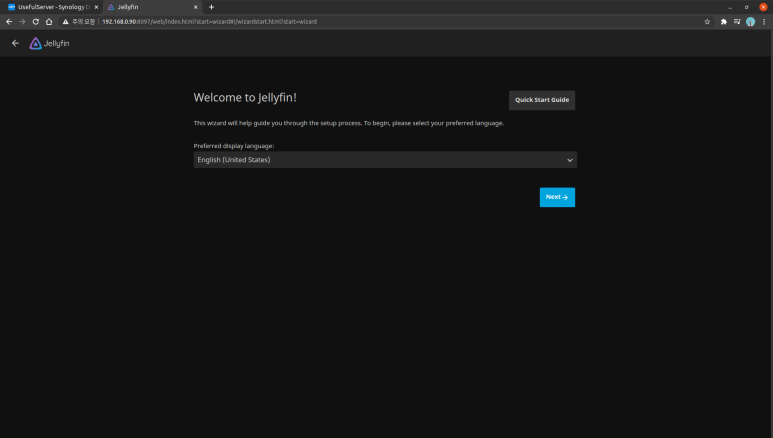

언어를 지정해주고, **Next** 를 클릭합니다. 
한국어를 지원하긴 하지만 대부분은 영어로 표시되어 큰 의미는 없습니다.

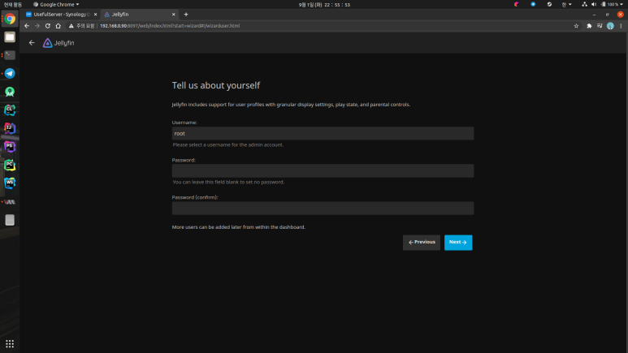

**Jellyfin** 에 접속해 미디어를 재생하기 위한 계정을 생성합니다. 
ID와 비밀번호를 적절히 입력하고 **Next** 를 클릭합니다.

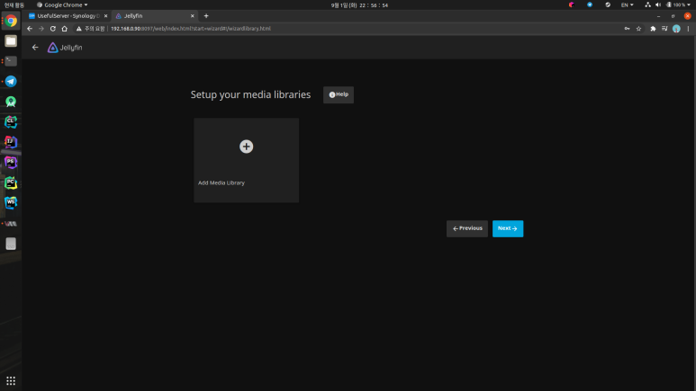

이제, 거의 막바지에 다다랐네요. 
미디어를 라이브러리에 추가해주는 과정입니다. 
**Add Media Library** 를 선택합니다.

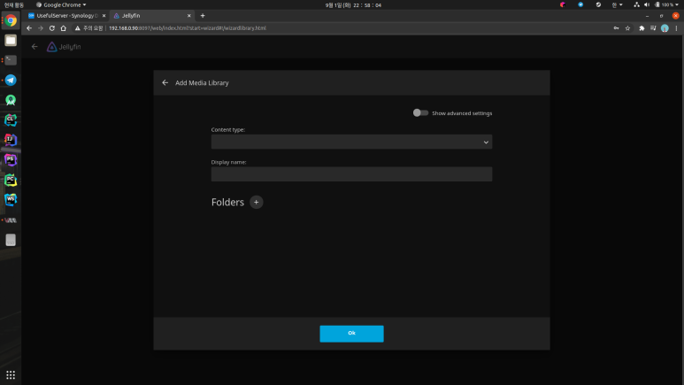

**Content Type** 은 미디어의 종류를 고르는 항목인데, 
Movie, Music 등등이 있습니다. 
재생할 미디어의 종류에 따라 적절히 지정해줍니다.

**Display Name** 은 라이브러리의 이름입니다. 
역시 적절하게 이름을 입력해줍니다.

**Folders** 를 클릭하고, 조금 전 설정에서 **/media** 에 미디어 폴더를 지정했으므로 
다음 사진과 같이 **media** 를 선택해줍니다.

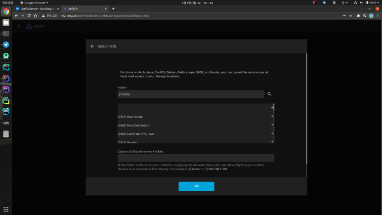

**media** 를 선택하면 목록에 **media** 폴더 내부에 있는 미디어 목록이 표시됩니다.

정상적으로 보인다면, 하단의 OK를 눌러줍니다. 
**Add Library** 를 눌러 표시했던 창으로 돌아와보면, 
하단에 몇몇 추가 설정이 생겨 있습니다.

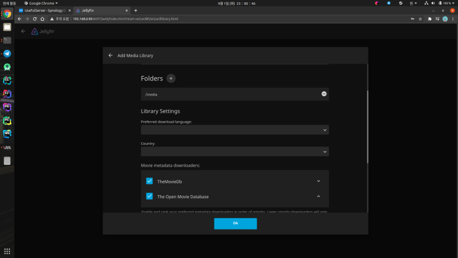

미디어에 존재하는 영화 파일에 대한 정보를 자동으로 검색해 표시하는 
기능에 대한 설정입니다. 
**Preferred Download Language** 와 **Country** 를 알맞게 설정해줍니다. 
하단에 세부적인 설정이 있지만 
기본 설정만으로도 사용하는데 문제가 없으므로 
OK를 눌러 창을 닫아줍니다.

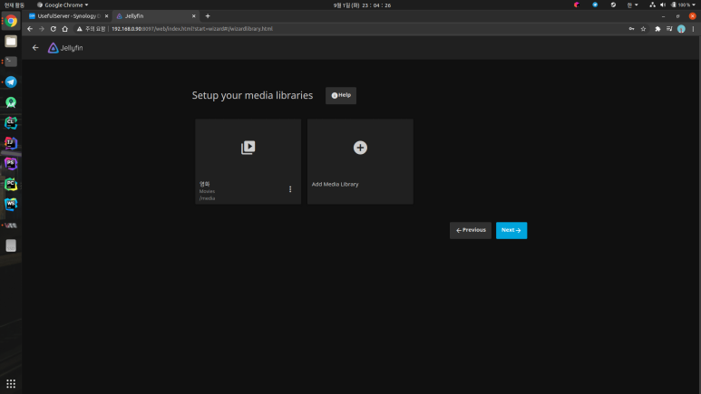

방금 추가한 라이브러리가 정상적으로 표시된다면, 
**Next** 를 눌러 다음 단계로 이동합니다.

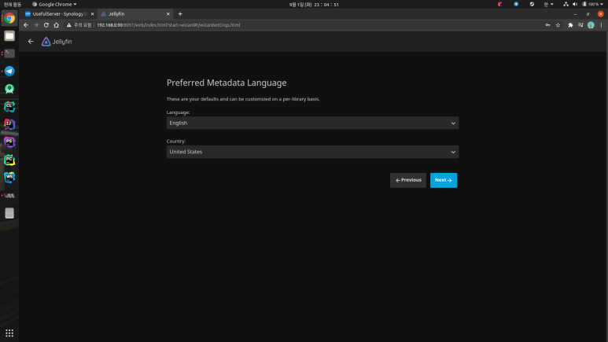

영화의 정보를 표시하기 위한 언어를 설정합니다. 
마찬가지로 원하는 언어와 국가를 적절히 설정합니다.

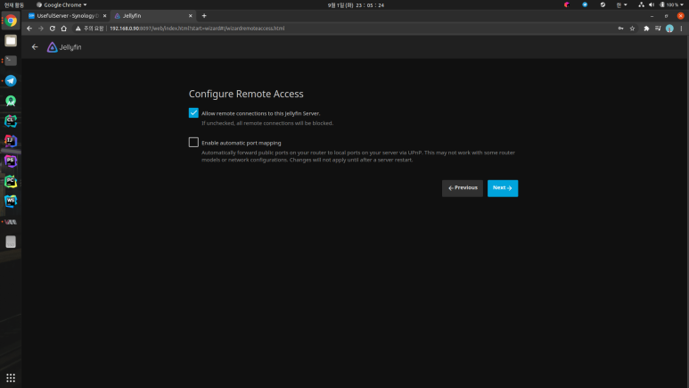

다음 설정은 외부에서 **Jellyfin** 에 접속하기 위한 설정인데, 
기본값으로 두고 **Next** 를 클릭합니다.

설정이 완료되었다는 페이지에서 **Finish** 를 클릭하면 
로그인 화면으로 이동합니다. 
설정 과정에서 입력한 ID와 비밀번호로 로그인합니다.

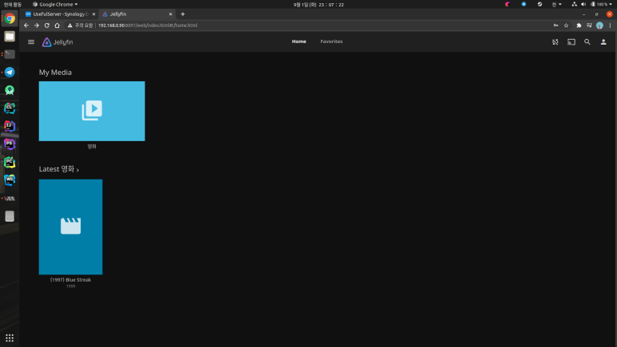

정상적으로 로그인이 되었다면, **Jellyfin** 의 메인으로 진입되며, 
미디어 폴더에 들어있는 영화들이 표시됩니다.

폴더에 존재하는 영화가 많으면, 첫 실행시 검색 과정이 조금 걸릴 수 있습니다. 
또한, 폴더에 새 영화가 추가된 경우에도 **Jellyfin** 이 인식하고 
정보를 표시하는데 조금 시간이 걸릴 수 있으니, 
영화가 표시되지 않는다면 시간이 지난 뒤 다시 접속해보면 됩니다.

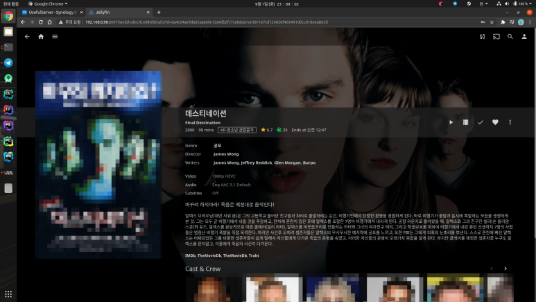

라이브러리에 들어가 영화를 클릭해보면 
위와 같이 영화에 대한 줄거리 소개와 평점, 배우 등 
각종 영화 정보가 표시됩니다.

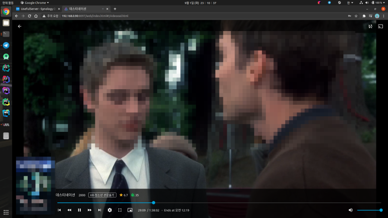

해당 영화를 재생한 플레이어 화면입니다. 
(저작권 보호를 위해 일부 요소는 모자이크 처리하였습니다.)

오늘 포스팅에서 설명한 내용 외에도 
각종 설정을 통해 커스터마이징을 할 수 있지만, 
이정도 설정만으로도 개인 스트리밍 서비스를 구축하는데 
전혀 불편한 점이 없기에, 꼭 필요한 설정 위주로만 설명을 진행했습니다.

**Jellyfin** 앱을 설치하면 
스마트폰이나 태블릿에서도 동일하게 
스트리밍 서비스를 이용할 수 있습니다.

[Android용 Jellyfin 다운로드 (GooglePlay)](https://play.google.com/store/apps/details?id=org.jellyfin.mobile)

[iOS/iPadOS용 Jellyfin 다운로드 (AppStore)](https://apps.apple.com/kr/app/jellyfin-mobile/id1480192618)​

혹시 설치 과정에서 문의사항이 있거나 
문제가 있는 경우는 댓글로 남겨주시면 답변드리도록 하겠습니다.

지금까지, 
LR이었습니다!