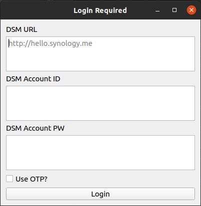
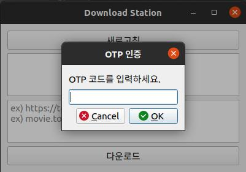

안녕하세요, 
대학생 1인 개발자로 활동중인 LR입니다!

지난 8월, Synology의 Download Station을 
PC에서 간단히 이용할 수 있는 클라이언트 프로그램을 
개발해 배포했었는데요,

미처 생각치 못한 문제가 있어 
해당 부분을 패치하고 업데이트를 진행하게 되었습니다!

지난 버전 배포글에서 사용법 등을 자세히 설명했던 만큼 
오늘 포스팅에서는 간략한 변경점만 언급하도록 하겠습니다. 
자세한 내용은 이전 배포글을 참고해주세요.

[이전 버전 포스팅 보러가기](https://dev-lr.com/postview/blog/200824-synology-downloadstation-client)

지난 버전의 경우, OTP 관련한 예외사항을 처리하지 않아, 
OTP를 이용중이신 유저분들은 서버오류 다이얼로그만이 
지속적으로 발생하는 문제가 있었습니다.

이번 버전에서는 OTP 로그인에 대응하여 
최초 로그인시 OTP 사용 여부를 묻고, 
이 경우 로그인시 OTP 인증코드를 입력하는 다이얼로그가 
먼저 표시되도록 하였습니다.

OTP를 이용중이신 유저분들은, 기존 로그인 다이얼로그에서 
하단의 체크박스만을 체크한 뒤 로그인 해주시면 됩니다.

OTP 사용이 활성화된 경우, 
매 세션 로그인시마다 OTP코드 입력창이 표시됩니다. ​

OTP 사용을 해제하고자 하시는 경우에는 
account.uum 파일을 삭제하시고 
새로 로그인 정보를 작성해주시면 됩니다.

__!! 이전 버전에서 새로 업그레이드 하시는 경우, __
__기존에 생성된 account.uum 파일을 삭제하신 뒤 __
__새 버전을 사용해주시기 바랍니다 !!__

다운로드는 아래 링크에서 진행하실 수 있습니다. 
Ver 1.1 디렉터리 내의 파일을 받아주시면 됩니다.

__!! 일부 브라우저에서 파일 다운로드 시 __
__손상된 파일이 다운로드되는 문제가 있습니다. __
__이 경우, 폴더 전체를 다운받으신 뒤 __
__압축 해제하여 이용해주시면 감사하겠습니다. !!__

[DownloadStation Client 다운로드](https://drive.defcon.or.kr/sharing/4A4MQvFbS)

지난 배포 버전에서 OTP 관련 의견 제시해주신 
클리앙의 쿠니s님께 감사의 말씀을 전하며 
오늘 배포 포스팅을 마무리하도록 하겠습니다.

지금까지, 
LR이었습니다!