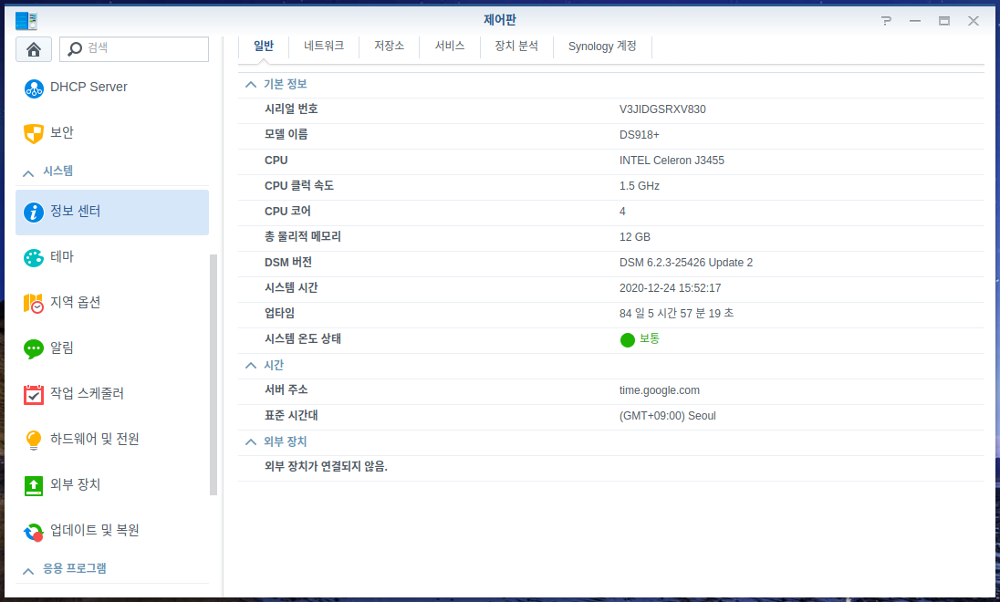

안녕하세요!<br/>
대학생 1인 개발자로 활동중인 LR입니다!

저는 현재 ODroid H2에 **XPEnology** 를 설치해<br/>
개인 나스로 활용하고 있는데요,

**XPEnology** 의 특성상<br/>
**Synology** 정품 기기인 **DS918+** 의 펌웨어를 활용하기 때문에<br/>
DSM 내 제어판의 정보센터에서는 실제 장비의 CPU 정보가 아닌<br/>
**DS918+** 모델의 CPU 정보가 표시됩니다.

국내 포럼인 2CPU의 FOXBI님이 제작하신 스크립트를 이용하면<br/>
이 CPU정보를 실제 장비에 장착된 CPU의 정보로 변경할 수 있는데요,<br/>
오늘 포스팅에서는 그 과정에 대해 한번 알아보도록 하겠습니다.

<center>

</center>

먼저, 작업 이전의 정보센터 화면입니다.<br/>
CPU 이름에는 **DS918+** 의 CPU인 **J3455** 가,<br/>
CPU 클럭 속도와 코어 정보 역시 **J3455** 의 값이 표시되고 있습니다.

이제, 스크립트를 다운로드하고 실행해서<br/>
정보센터의 CPU 정보를 실 CPU 정보로 변경하는 작업을 진행해보겠습니다.

먼저, 아래 링크에 접속하여 첨부된 **ch_cpuinfo.tar** 파일을 다운로드해줍니다.

[XPEnology Forum CPU Info Change 쓰레드](https://xpenology.com/forum/topic/13030-dsm-5x6x-cpu-name-cores-infomation-change-tool?_fromLogin=1)

다운로드한 tar 파일을 NAS 내 적절한 위치에 압축풀어줍니다.<br/>
저는 접근이 편하도록 **Download** 공유폴더에 압축을 풀어주었습니다.

<center>

</center>

이제, 제어판에서 ssh 접속을 활성화해준 뒤,<br/>
**Linux의 Terminal** 이나 **Windows의 PuTTY** 를 이용해 **XPEnology** 에 접속합니다.

<center>

</center>

접속이 완료되었다면, 다음 명령어를 통해 **root** 로 로그인한 뒤,<br/>
**ch_cpuinfo** 파일이 위치한 디렉터리로 이동합니다.

```bash
yymin1022@UsefulServer:~$ sudo su -
root@UserfulServer : ~#
```

<center>

</center>

이제, 다음 명령어를 통해 스크립트를 실행해줍니다.

```bash
root@UsefulServer:/volume1/Download# ./ch_cpuinfo
```

<center>

</center>

<br/>

<center>

</center>

스크립트를 실행하면, 첫번째 사진과 같은 메뉴가 보여집니다.<br/>
**1** 을 눌러주면 두번째 사진과 같은 메뉴로 이동합니다.<br/>
간편하게 자동으로 CPU 정보가 입력되도록 **y** 를 입력하면<br/>
눈 깜짝할 사이에 작업이 완료됩니다.

이후, DSM을 로그아웃한 뒤 다시 로그인 해보면<br/>
정보센터의 CPU 이름과 클럭 속도, 코어 정보가<br/>
실제 나스에 장착된 CPU로 변경된 것을 확인할 수 있습니다.

<center>

</center>

이렇게 매우 간단한 방법으로 정보센터 내 CPU 정보를<br/>
실제 CPU 정보로 변경하는 작업을 진행해 보았습니다.

작업을 위한 스크립트를 작성해주신 2CPU 포럼의 FOXBI님께<br/>
감사의 말씀을 전하며<br/>
오늘 포스팅은 이만 마치도록 하겠습니다.

관련해서 질문사항이 있는 경우<br/>
댓글로 남겨주시면 아는 선에서<br/>
답변드리도록 하겠습니다.

지금까지<br/>
LR이었습니다!