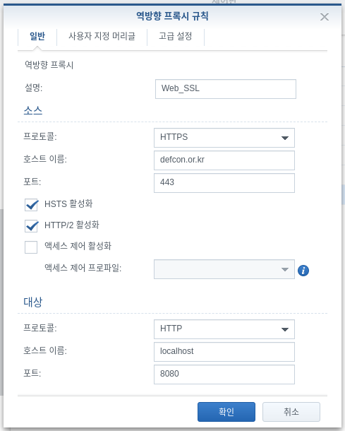
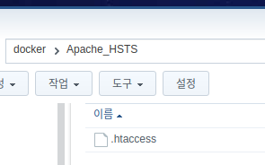
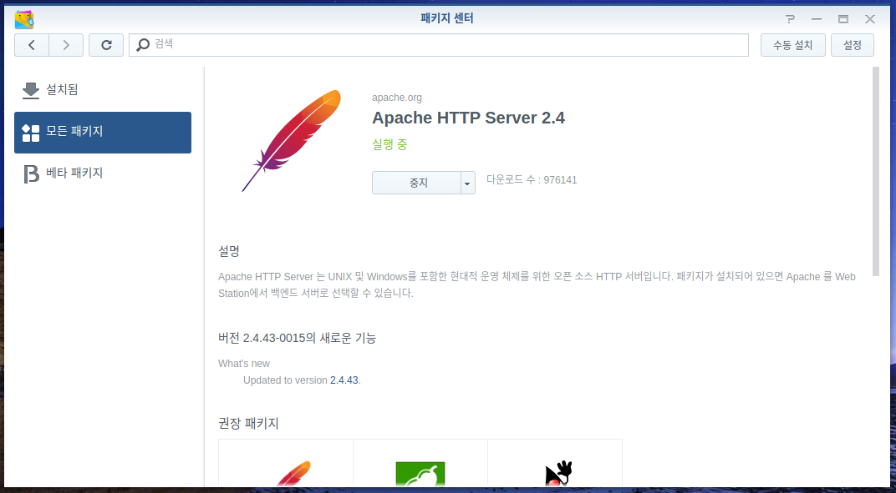
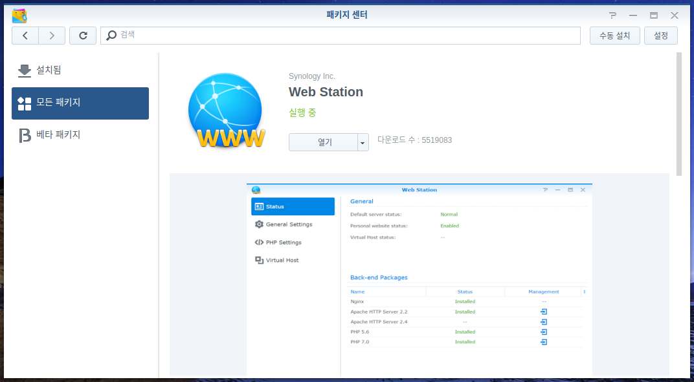
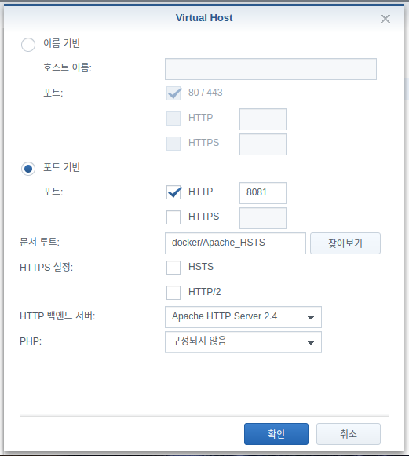
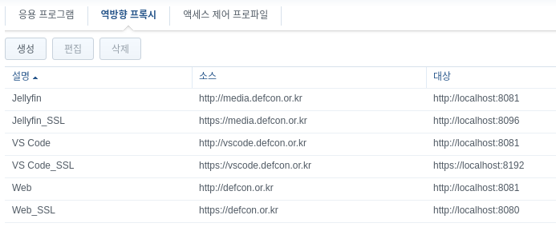

안녕하세요! 
대학생 1인 개발자로 활동중인 LR입니다!

저는 현재 **ODroid H2** 에 **XPEnology** 를 설치해 
개인 NAS로 활용하고 있습니다.

단순 파일 저장 목적 뿐만 아니라 
제가 소속한 팀의 웹 페이지 호스팅, 
미디어 스트리밍, VSCode 등 
각종 서비스들을 함께 구축해두고 
DSM의 기본 기능인 역방향 프록시를 이용해 
도메인과 연결하여 사용하고 있습니다.

그런데, **Synology** 역방향 프록시에는 
고질적인 버그가 하나 있습니다.

위와 같이 외부에서 들어오는 접속을 **https** 로 설정한 뒤 
**HSTS** 를 적용한 상태이더라도 
**http** 를 이용해서 도메인에 접속할 경우 
**HSTS** 가 올바르게 작동하지 않아, 
도메인이 서버로 연결되지 않는 문제가 발생합니다. 

그래서 임시로 **http** 접속을 따로 역방향 프록시에 지정해주어 
연결은 되도록 해두었으나, 이렇게 할 경우 
**https** 가 적용되지 않은 일반 프로토콜로 연결되어 
보안성이 사라지는 단점이 있습니다.

이 문제를 해결하고자 구글링을 하던 도중, 
해외 포럼에서 관련 해결 팁을 찾게되어 
한번 글로 정리해보고자 합니다.

간략하게 설명하자면 **Apache** 를 이용해 
**.htaccess** 규칙을 작성해주어 **http** 를 **https** 로 리디렉션하게 한 뒤 
역방향프록시를 이 **Apache** 호스트에 연결시키는 방식입니다.

먼저, 다음 코드를 복사해 **.htaccess** 파일을 생성해준 뒤 
NAS의 적절한 위치에 저장해줍니다.

**
RewriteEngine on
RewriteCond %{HTTPS} off
RewriteRule (.*) https://%{HTTP_HOST}%{REQUEST_URI}
**

저는 docker 공유폴더의 Apache_HSTS 디렉토리를 생성하고 
그 안에 **.htaccess** 파일을 위치시켰습니다.

​

다음으로 **Synology** 패키지 센터에서 
**Apache 2.4** 와 **Web Station** 을 설치해줍니다.

 

설치가 완료되었다면 **Web Station** 을 실행하고, 
좌측 메뉴 중 가상호스트 항목으로 이동해 
생성을 클릭해줍니다.

위와 같이 설정을 해준 뒤 확인을 클릭합니다. 
이때, HTTP 포트번호는 임의의 번호로 지정하셔도 무방하나, 
어떤 번호로 지정하셨는지는 꼭 기억해주셔야합니다. 
문서 루트의 경우는, **.htaccess** 가 저장된 디렉토리를 선택해주시면 됩니다.

저장이 완료되었다면, 이제 역방향 프록시를 설정해줍니다. 
제어판의 응용 프로그램 포털 메뉴에서 역방향 프록시 탭으로 이동합니다. 
이제 역방향 프록시를 설정할 서비스를 각각 추가해 설정해주시면 됩니다.

저는 3개의 서비스를 역방향 프록시로 연결해 사용하고 있습니다. 
각 항목의 **http**와 **https** 각각을 모두 역방향 프록시로 연결해주어야 하는데,

위 사진과 같이 **http** 의 경우는 아까 **Web Station** 에서 설정했던 8081번 포트로, 
**https** 의 경우에는 곧바로 해당하는 서비스의 포트로 이동하게 설정해주면 
**http** 로 접속할 경우 **Apache** 의 **.htaccess** 규칙을 참고해 
**https** 를 이용한 도메인으로 자동 리디렉션됩니다.

이처럼, **Synology** 의 역방향 프록시의 **HSTS** 가 
올바르게 작동하지 않는 문제를 해결하는 방법에 대해 알아보았습니다.

저는 처음에 **XPEnology** 에서만 발생하는 보안 관련 문제로 생각했는데, 
기성품 **Synology** 를 사용하고 있는 지인에게서도 같은 문제가 발생한다고 해서 
구글링을 해보니 이미 해외 포럼에서는 유명한 문제점이었습니다.

하지만 언제나와 같이 어떻게든 문제를 해결할 방법은 존재했고, 
그 방법을 한번 소개해보았습니다.

혹시 진행 과정에서 문제가 발생하거나 
잘 되지 않을 경우 댓글로 남겨주시면 
아는 선에서 답변드리도록 하겠습니다.

지금까지, 
LR이었습니다!
