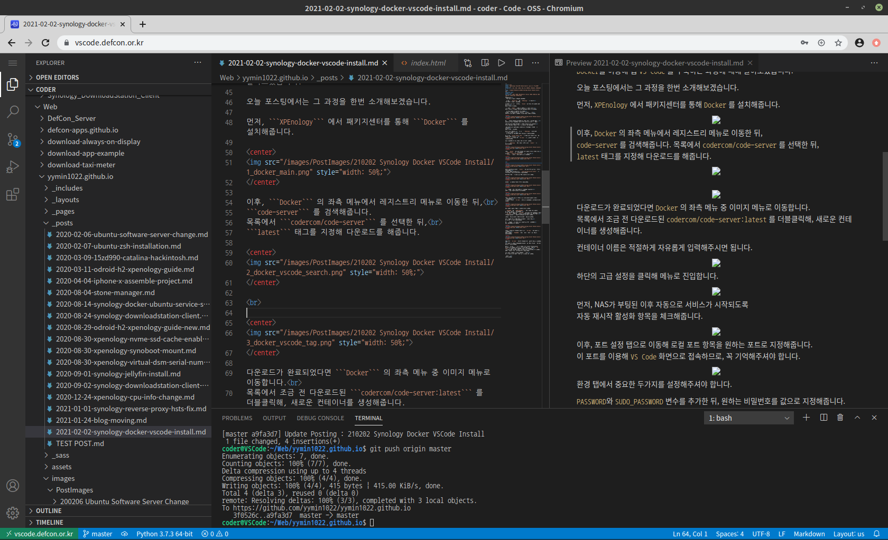
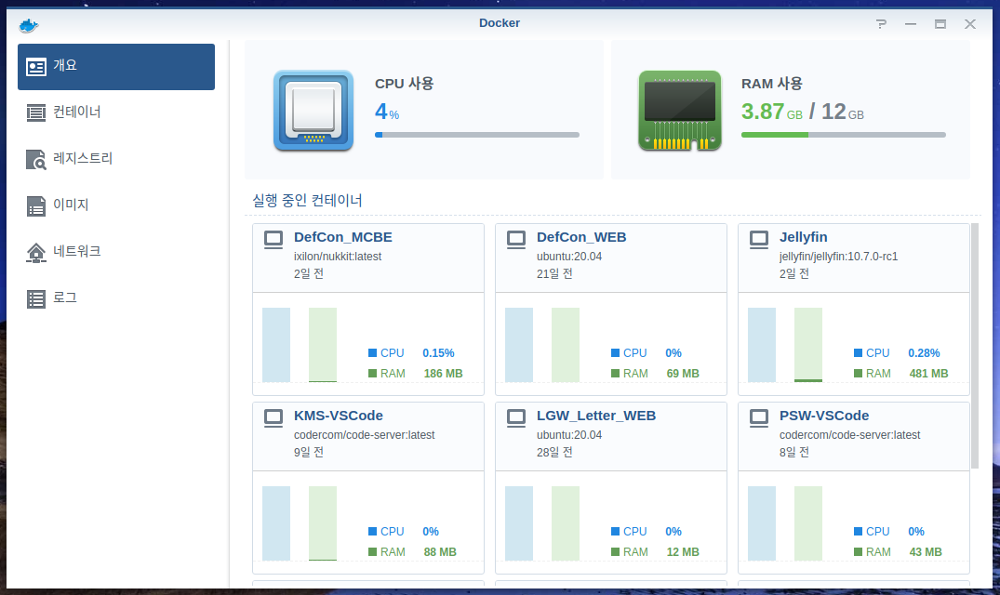
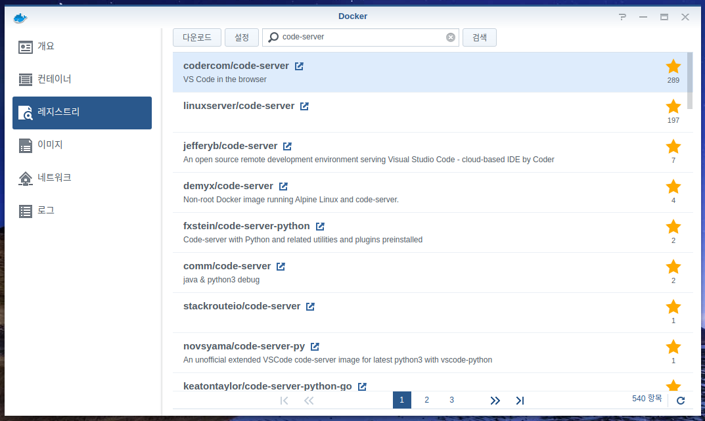
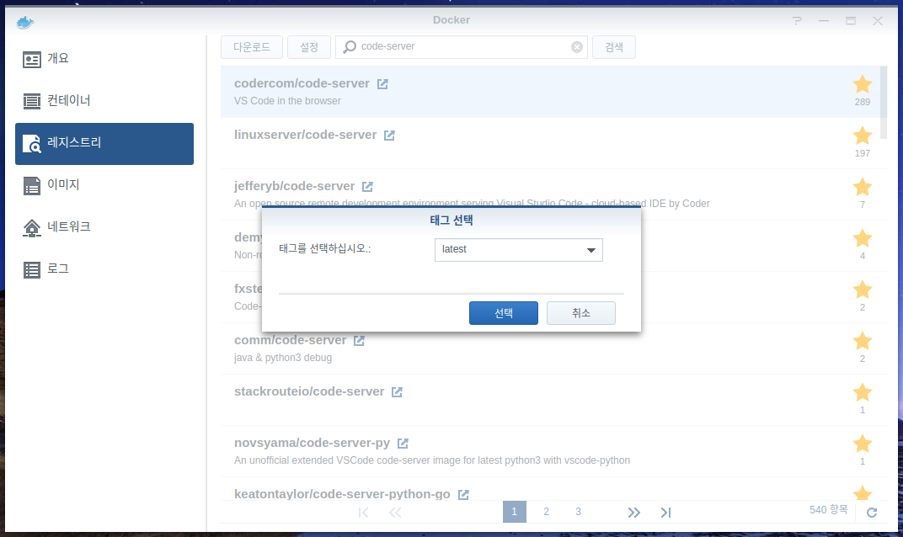
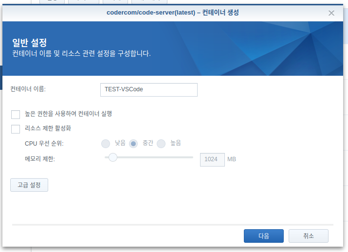
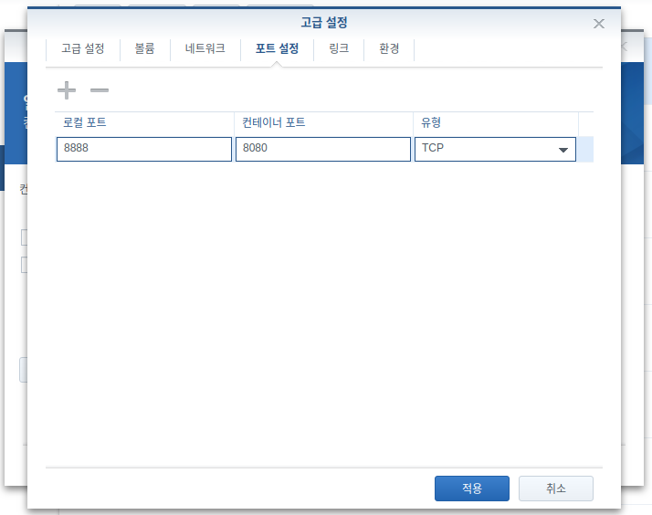
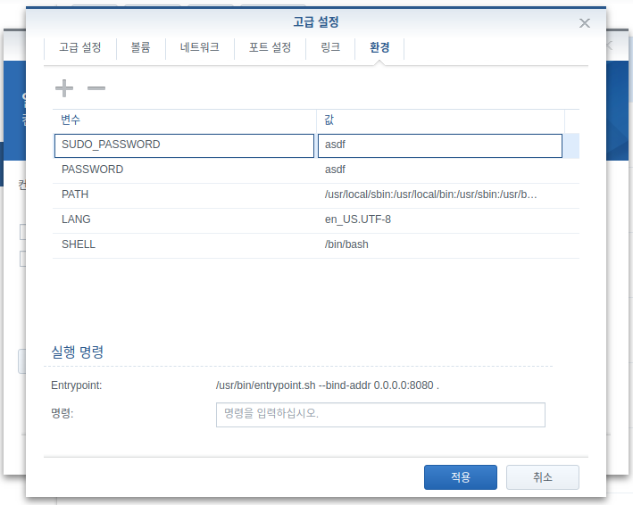
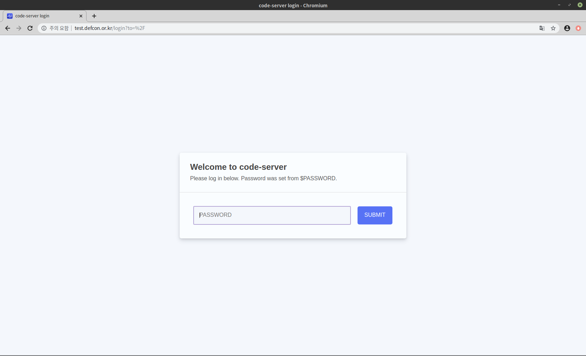
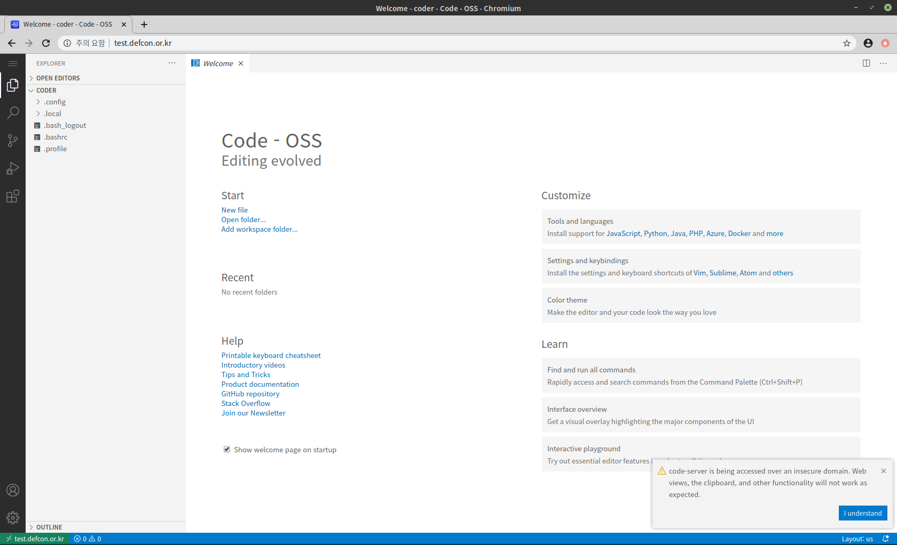

안녕하세요! 
대학생 1인 개발자로 활동중인 LR입니다!

저는 현재 **ODroid H2** 에 **XPEnology** 를 설치해 
개인 NAS로 활용하고 있습니다.

평소에는 주로 파일 저장이나, **Docker**을 이용한 웹 호스팅 등의 목적으로 
NAS를 이용해 왔는데요,

지난 10월 **ROKAF** 공군으로 현역 입대를 하게 되면서 
NAS를 이용해서 무언가를 하는것의 중요성을 깨닫게 되었습니다.

저는 보통 자기개발시간이나 휴식시간에 
사이버 지식 정보방(이하 사지방)이라고 불리는 부대 내 
인터넷이 사용 가능한 공간에서 코딩을 하며 시간을 보냅니다.

군부대 특성상 별도의 프로그램을 자유롭게 설치할 수 없을 뿐더러, 
네트워크를 통한 접속에도 포트 제한이 있는 등 제약이 많은데요,

집에 설치해둔 NAS에 웹(80번 및 443번 포트)을 통해 접속하면 
제약된 환경에서 그나마 이것저것 사용해볼 수 있습니다.

물론 네트워크는 집에 가입된 네트워크를 이용하므로 보안에 관한 문제도 
딱히 발생하지 않습니다.

단순한 문서 뷰어나 파일 관리 등은 **XPEnology** 의 웹 DSM 만으로도 충분하지만, 
저는 코딩을 하고싶었기에 이런저런 자료를 찾아보았습니다.

그러던 중 **Visual Studio Code** 를 웹을 통해 접속해 사용할 수 있다는 것을 알게되었고, 
**Docker**를 이용해 웹 **VS Code** 를 구축하는 과정에 대해 알아보았습니다.

오늘 포스팅에서는 그 과정을 한번 소개해보겠습니다.

먼저, **XPEnology** 에서 패키지센터를 통해 **Docker** 를 설치해줍니다.

이후, **Docker** 의 좌측 메뉴에서 레지스트리 메뉴로 이동한 뒤, 
**code-server** 를 검색해줍니다.
목록에서 **codercom/code-server** 를 선택한 뒤, 
**latest** 태그를 지정해 다운로드를 해줍니다.

 

다운로드가 완료되었다면 **Docker** 의 좌측 메뉴 중 이미지 메뉴로 이동합니다. 
목록에서 조금 전 다운로드된 **codercom/code-server:latest** 를 더블클릭해, 새로운 컨테이너를 생성해줍니다.

컨테이너 이름은 적절하게 자유롭게 입력해주시면 됩니다.

하단의 고급 설정을 클릭해 메뉴로 진입합니다.

먼저, NAS가 부팅된 이후 자동으로 서비스가 시작되도록 
자동 재시작 활성화 항목을 체크해줍니다.

이후, 포트 설정 탭으로 이동해 로컬 포트 항목을 원하는 포트로 지정해줍니다. 
이 포트를 이용해 **VS Code** 화면으로 접속하므로, 꼭 기억해주셔야 합니다.

환경 탭에서 중요한 두가지를 설정해주셔야 합니다.

**PASSWORD**와 **SUDO_PASSWORD** 변수를 추가한 뒤, 원하는 비밀번호를 값으로 지정해줍니다. 
이 비밀번호는 웹을 통해 **VS Code** 에 접속한 뒤 로그인하는 과정과 
**VS Code** 내에서의 관리자권한 이용에 필요한 비밀번호이므로, 
보안성도 중요하지만 본인이 꼭 기억을 해주셔야 합니다.

여기까지 완료되었다면, 기본적인 설정은 완료되었습니다.

이제, NAS의 IP주소 뒤에 조금 전 설정해준 포트를 붙여 
웹 브라우저를 통해 접속해봅니다.

군부대 특성상 저는 포트를 통한 접속이 자유롭지 못하기에 
따로 역방향프록시를 설정해두었습니다.

이렇게 로그인창이 보인다면 정상적으로 **VS Code** 에 접속이 된 것입니다. 
설정 과정에서 **PASSWORD** 환경 변수로 지정해준 비밀번호를 입력해줍니다.

위와 같이 **VS Code** 화면이 보인다면 모든 작업이 완료된 것입니다. 
이제 각종 플러그인과 익스텐션을 설치하고 자유롭게 코딩을 할 수 있는 환경이 구축되었습니다.

실제로 저는 현재 부대 내 사지방에서 이를 이용해 코딩을 진행하고 있으며, 본 포스팅이 업로드된 이 블로그 역시 입대 이후 이 **VS Code**를 이용해 직접 제작하기 시작한 블로그입니다. 
앞으로도 이런저런 프로젝트를 여럿 진행해보고자 하는데, 이 과정에서 매우 유용하게 활용할 수 있을것이라 예상됩니다.

혹시 작업 과정에서 문제가 생기거나 할 경우, 
댓글로 남겨주시면 아는 선에서 답변드리도록 하겠습니다.

지금까지, 
LR이었습니다!