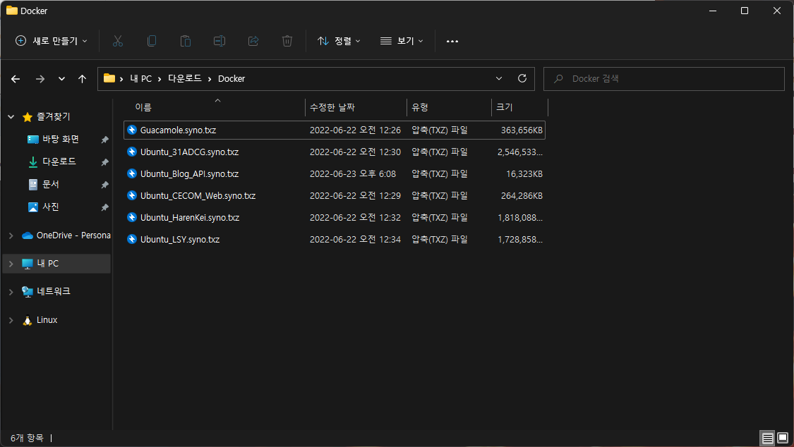

안녕하세요!<br/>
대학생 1인 개발자로 활동중인 LR입니다!

2020년 말에 시작했던 공군에서의 군복무를 마치고,<br/>
오랜만의 포스팅으로 찾아뵙게 되었습니다.

저는 현재 **ODroid H2** 에 **XPEnology** 를 설치해<br/>
개인 NAS로 활용하고 있습니다.

평소에는 주로 파일 저장이나, **Docker**을 이용한 웹 호스팅 등의 목적으로<br/>
NAS를 이용해 왔는데요,

전역을 맞아 전반적인 NAS의 점검과 더불어 HDD를 증설하고 DSM 버전도 업데이트할 겸 NAS를 초기화하게 되었습니다.

이 과정에서 기존에 웹 호스팅 등등을 목적으로 사용하던 **Docker** 컨테이너들을<br/>
백업하고 복원하는 과정을 거치게 되었습니다.

**XPEnology** 뿐만 아니라, **Synology**의 기본 **Docker** 에서도 컨테이너를<br/>
백업하고 복원하는 기능을 기본적으로 제공합니다.

저 역시 이 기능을 이용해서 아래 스크린샷과 같이 몇몇 보존이 중요한 컨테이너를 백업하였는데요,

<center>

</center>

이후, 제 NAS에 **XPEnology DSM** 을 재설치하고 설정을 마무리한 뒤,<br/>
**Docker** 컨테이너를 복원하고자 하였습니다.

**그런데 이게 웬걸, 복원이 되지 않고 아래와 같이 오류가 발생하는겁니다.**

<center>

</center>

제가 운용중인 **Docker** 컨테이너들 중에는 제가 사용하고 호스팅하는 컨테이너도 있지만,<br/>
함께 팀으로 개발하는 지인들이 사용하고 있는 컨테이너도 있었기 때문에,<br/>
만약 컨테이너가 복원되지 않을 경우에 제가 직접 다시 하나하나 설정을 할 수도 없는 상황이었습니다.

그래서 저는 열심히 구글링을 거쳤고,<br/>
Synology의 **Docker** 에서 제공하는 내보내기 / 가져오기 기능이<br/>
**Docker** 자체의 Export / Import 기능을 활용한 점이라는 것을 알게 되었습니다.

실제로 Synology 에서 내보내기 한 **Docker** 컨테이너 백업본 파일의 형식은 ```.txz```의 압축 형식이었고,<br/>
이 파일의 압축을 해제해보면 제가 백업한 컨테이너의 루트 파일 시스템이 나오는 구조였습니다.

그래서 ssh를 통해 NAS에 접속하고, CLI 형태로 **Docker**를 이용해 복원을 시도해보았지만,<br/>
~~실행명령도 건드려보고, 직접 파일시스템 열어서 스크립트도 수정해보는 등~~<br/>
~~정말 긴 여러가지 시도가 약 20시간 가량 있었지만 생략하고~~<br/>
결론적으로는 이해할 수 없는 오류로 복원이 불가했습니다.<br/>

<center>

</center>

그렇게 거의 하루에 가까운 시간을 **Docker** 복원에만 쏟아붓다가,<br/>
혹시나 하는 마음에 ```Synology Docker Import Error``` 라는 내용으로 구글링을 해보았습니다.<br/>
어떻게 보면 가장 기본적인 구글링조차도 아직 해보지 않은 상태였다는 것이 웃기긴 합니다.

그리고 저는 큰 충격을 받았습니다.

<center>

</center>

저와 동일한 문제를 겪는 글이 Synology 공식 포럼에 올라와있었고,<br/>
그에 대한 해결법이 답변에 작성되어 있었습니다.

**바로 대문자를 없애라는 것** 이었습니다.

<center>

</center>

곧바로 실행해 옮겨보았습니다.<br/>
백업한 컨테이너 파일의 이름을 모두 소문자로 변경한 뒤,<br/>
다시 복원을 시도하였습니다.

<center>

</center>

그랬더니 정말 아무일도 없었다는 듯이 복원이 되는겁니다.<br/>
고작 대소문자 이슈 하나때문에 저는 무려 20시간이 넘는 시간을 허비한 것입니다.

아 추가로, 1GB 이상의 규모가 큰 컨테이너를 복원하는 경우,<br/>
아래와 같은 경고창이 발생하기도 합니다.

<center>

</center>

하지만 경고창을 무시하고 그대로 두면<br/>
나중에 확인했을 때 정상적으로 복원이 완료되어있는 모습을 보실 수 있습니다.

혹시라도 저와 비슷한 문제로 힘드신 분들이 계실까 하여..<br/>
오랜만에 포스팅을 작성하게 되었습니다.

**Docker** 혹은 NAS에 관련해서 궁금한 점이 있는 분들은<br/>
댓글 남겨주시면 아는선에서 답변 드리도록 하겠습니다.

지금까지,<br/>
LR이었습니다!