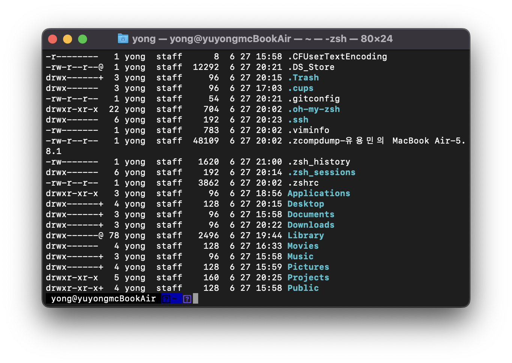
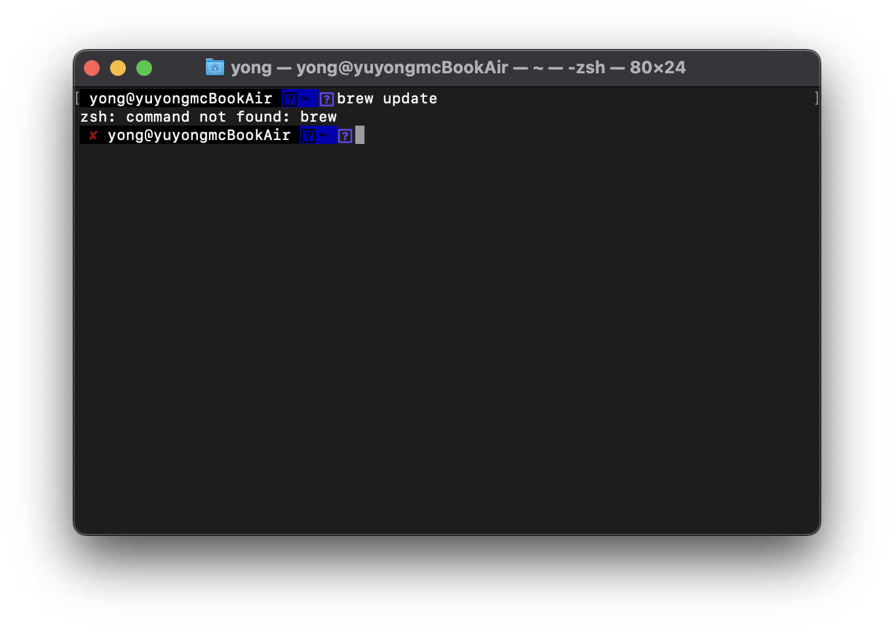
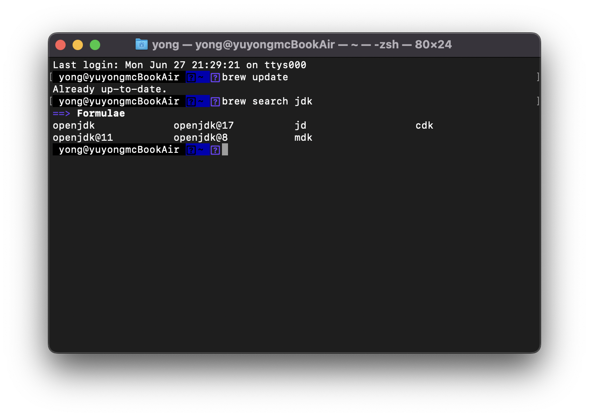

안녕하세요!<br/>
대학생 1인 개발자로 활동중인 LR입니다!

mac OS 10.15 Catalina 이후로는 기본 터미널 쉘이 기존의 ```bash```에서 ```zsh```로 변경되어 제공되고 있습니다.<br/>
기존의 ```bash```에 비해서 다양한 커스터마이징이 지원될 뿐만 아니라, 플러그인도 지원하기 때문에<br/>
훨씬 편리하고 개개인에 맞는 환경을 설정하기에 적합한데요.

<center>

</center>

이번에 우연히 M1 칩셋이 탑재된 맥북 에어를 사용해보게 되어, 개발환경을 설정하던 중,<br/>
패키지 매니저인 ```brew```와 ```zsh``` 사이에서 간단히 해결되지만 당황스러운 오류가 발생하여,<br/>
그 해결방법에 대한 포스팅을 작성하게 되었습니다.

먼저, 평소에 ```brew```를 설치했던 방식대로 공식 홈페이지에서 스크립트 URL을 복사해 터미널을 통해 설치하였습니다.

설치가 완료된 이후, 가장 기본적인 ```brew``` 커맨드 중 하나인 패키지 리스트를 업데이트하는 아래 커맨드를 실행하였습니다.
```
yong@macBookAir:~$ brew update
```
그랬더니, 정상적으로 실행되지 않고 다음과 같은 커맨드를 찾을 수 없다는 오류가 발생하는 것입니다.

<center>

</center>

하지만 다행히, 간단한 구글링을 통해, 곧바로 문제의 원인을 파악하고 해결할 수 있었습니다.
원인은 ```brew```의 설치 과정에서 ```zsh```가 아닌 ```bash``` 쉘을 통해 설치 스크립트가 실행되는데,<br/>
이 과정에서 ```brew```가 설치된 경로가 ```bash```의 PATH 환경변수에만 등록이 되면서,<br/>
```zsh```에서 ```brew```를 호출하게 되면 경로를 찾지 못하는 것이 원인이었습니다.
```
yong@macBookAir:~$ vi ~/.zshrc
```
위 커맨드를 통해 ```zsh```의 기본 설정파일인 ```.zshrc``` 파일을 열고 아래의 한줄만을 추가해주면 간단히 문제는 해결됩니다.
```
export PATH=$PATH:/opt/homebrew/bin
```
이후 터미널을 재실행해주면 정상적으로 ```brew``` 커맨드가 실행되는 것을 확인하실 수 있습니다.

<center>

</center>

어떻게보면 간단한 오류 같기도 하지만,<br/>
나중에 또다시 겪게 되면 다시 찾아보기 위해서,<br/>
그리고 저와 같은 오류를 겪는 다른 분들을 위해서 포스팅에 기록하게 되었습니다.

여담이지만, 아래 포스팅을 참고하시어 ```Oh My ZSH``` 플러그인을 설치하시면,<br/>
더욱 간단하고 자유롭게 쉘 커스터마이징을 할 수 있으니 한번 도전해보시면 좋을 것 같습니다.
```Ubuntu```를 기준으로 작성된 포스팅이지만, 터미널에서 실행하는 명령어는 동일하니,<br/>
포스팅 중간 부분의 ```Oh My ZSH``` 설치 부분을 참고하시기 바랍니다.

[Oh-My-ZSH 설치하고 zsh 커스텀하기](https://dev-lr.com/postview/blog/00002)

추가로 관련해서 궁금한 점 있으시면, 댓글로 남겨주시기 바랍니다.

지금까지,<br/>
LR이었습니다!