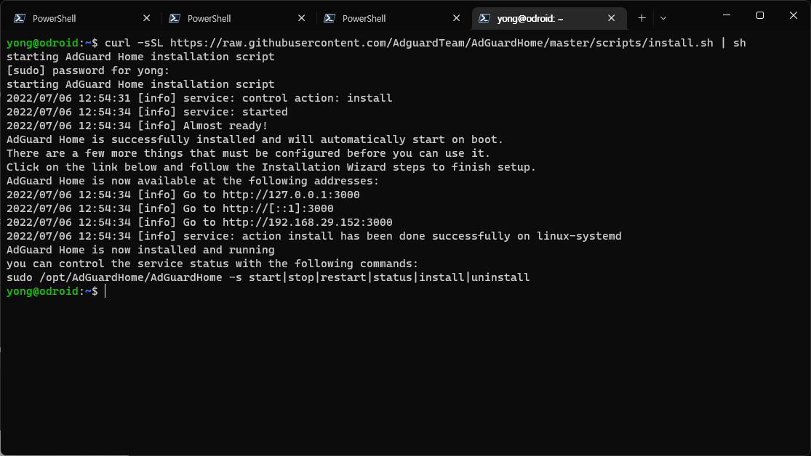
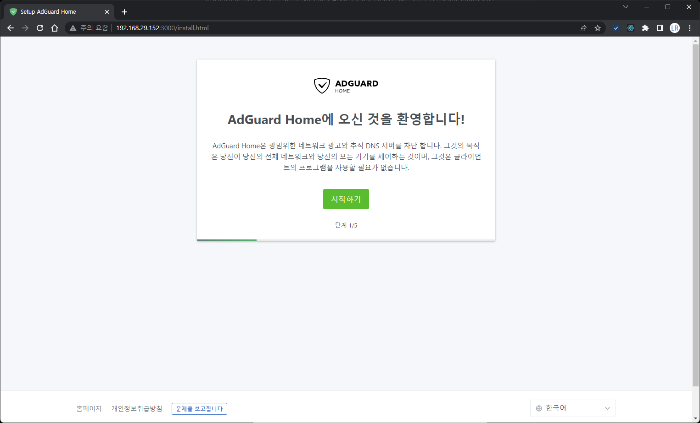
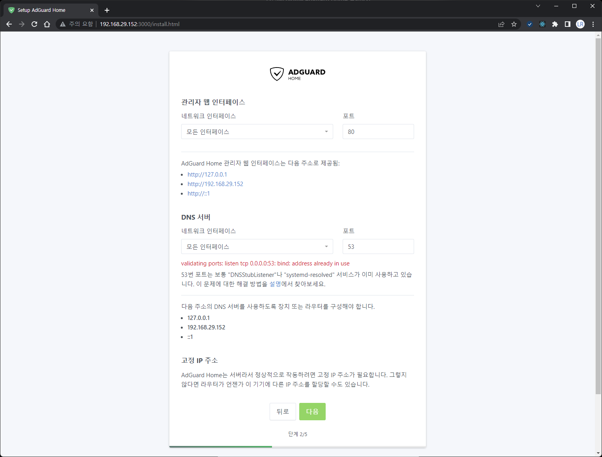
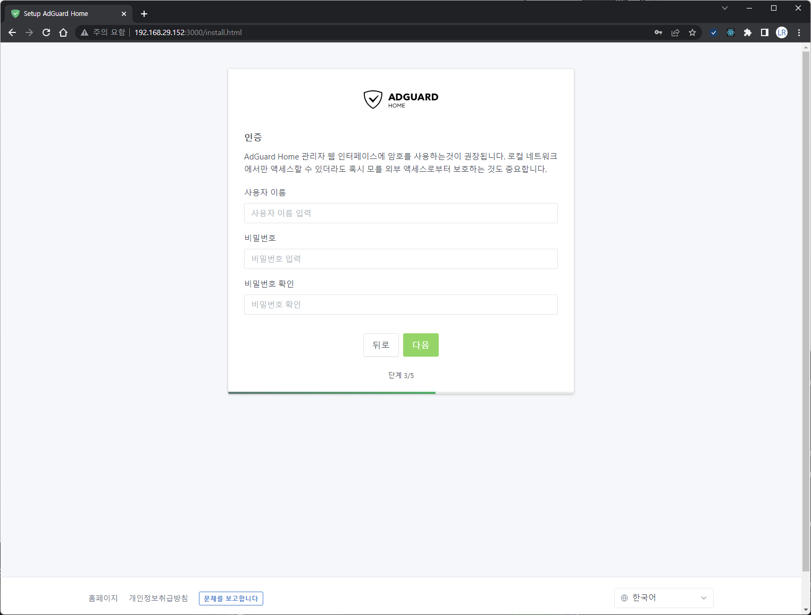
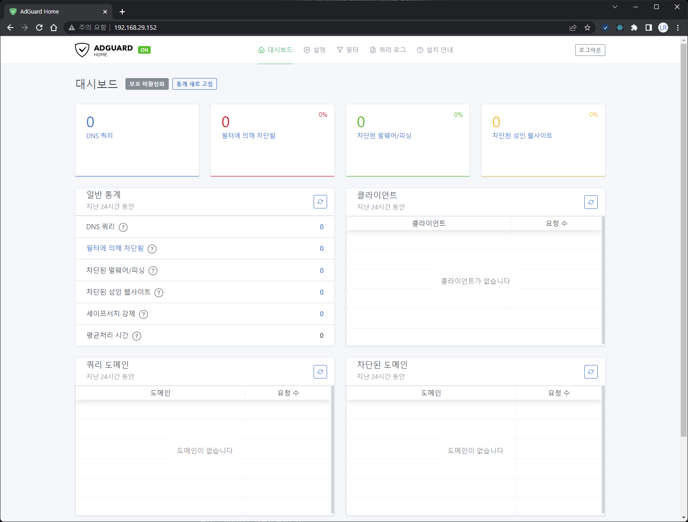

안녕하세요!<br/>
대학생 1인 개발자로 활동중인 LR입니다!

최근 웹서핑을 하다보면, 사이트의 주체에 관계업이,<br/>
다양한 광고 요소들이 많은 점을 느낄 수 있습니다.

사용자의 행위를 방해하지 않으면서 얌전한 광고도 있는 반면,<br/>
일부 사이트의 경우에는 정상적인 웹사이트 이용이 불가할 정도로<br/>
심한 광고를 띄우는 사이트도 있는데요,

이번에 홈 네트워크에 직접 **Adguard Home**을 구축해 DNS 설정으로<br/>
광고 차단하는 방식을 적용하게 되어,<br/>
그 과정에 대해서 한번 소개해보고자 합니다.

DNS 서버라고는 하지만, 대단한 성능이나 기능을 필요로 하는 것은 아니기에,<br/>
라즈베리파이 정도의 성능이면 충분한 기능을 할 수 있습니다.

저는 집에 **Hardkernel** 사의 **ODroid XU4** 모이 남게되어,<br/>
이를 이용해 **Adguard Home**을 구축해 보았습니다.

설치 방법은 간단합니다.<br/>
구축할 장비의 터미널에 접속한 뒤,<br/>
아래 명령어를 실행해주기만 하면 됩니다.

```bash
curl -sSL https://raw.githubusercontent.com/AdguardTeam/AdGuardHome/master/scripts/install.sh | sh
```

그러면 아래의 사진과 같이 자동으로 패키지를 다운로드하고 설치하는 작업이 수행됩니다.<br/>
이 과정에서 sudo 패스워드를 입력해주는 과정이 필요하니, 참고하시기 바랍니다.

<center>

</center>

위와 같이 설치가 완료되었다는 메시지가 뜨고 나면,<br/>
터미널에서 명령으로 실행하는 작업은 모두 끝나게 됩니다.

이제, 장비의 내부네트워크 IP로 3000포트를 통해서 웹 접속을 하면 아래와 같은 화면이 뜨게됩니다.

<center>

</center>

시작하기 버튼을 눌러 다음 단계로 이동합니다.

<center>

</center>

DNS 설정을 적용할 네트워크 인터페이스를 선택하는 화면입니다.<br/>
저는 eth0 인터페이스에 적용하도록 설정을 조정하였습니다.<br/>
이 과정은 본인의 네트워크 상황에 따라 적절히 설정하시면 됩니다.

<center>

</center>

네트워크 인터페이스 관련 설정을 마치고 나면,<br/>
관리자 계정을 설정하는 화면이 보이게됩니다.<br/>
마찬가지로, 적절하게 계정 설정을 해주면 설정이 마무리됩니다.

이제, 3000번 포트로 접속했던 이 화면은 초기설정을 위한 페이지였기에,<br/>
필요가 없어졌습니다.<br/>
앞으로는 이 화면이 아닌 아래 스크린샷과 같이 웹콘솔에서 광고 차단 DNS 설정 등을 다루게 됩니다.

<center>

</center>

이 웹 콘솔에 접속하기 위해서는, 마찬가지로 장비의 IP에 웹 접속을 하는 것은 동일하지만,
기본 443번 포트를 이용하기 때문 별도의 포트번호 없이 https로 접속하시면 됩니다.

상단 메뉴 중 필터 메뉴에서 DNS에 적용할 광고 필터 목록을 지정할 수 있습니다.<br/>
기본으로 제공되는 애드가드 필터를 이용해도 좋고,<br/>
추가적으로 커스텀 필터를 적용해도 좋습니다.

이후에는, 각 가정의 공유기, 라우터, 혹은 단일 PC 등에 DNS 설정을 수동으로 변경하고,<br/>
방금 설정한 장비의 IP를 DNS 서버로 지정해주시면<br/>
웹서핑을 할 때 광고가 자동으로 필터링되어 뜨지 않는 것을 보실 수 있습니다.

단순히 광고가 뜨지 않는 것 분만 아니라, 불필요한 트래픽을 제한해<br/>
인터넷 속도가 개선되는 등의 부가적인 장점도 있기에,<br/>
간단한 절차를 통해서 다들 구축해보시면 좋을 서비스인 것 같습니다.

혹시, 관련해서 문의사항이나 궁금한 점이 있으시면 댓글로 남겨주시기 바랍니다.

지금까지,<br/>
LR이었습니다!