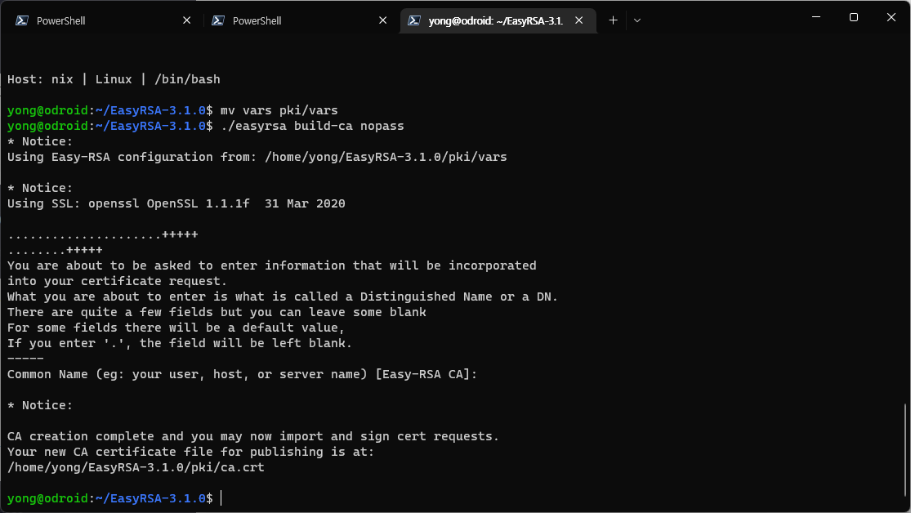
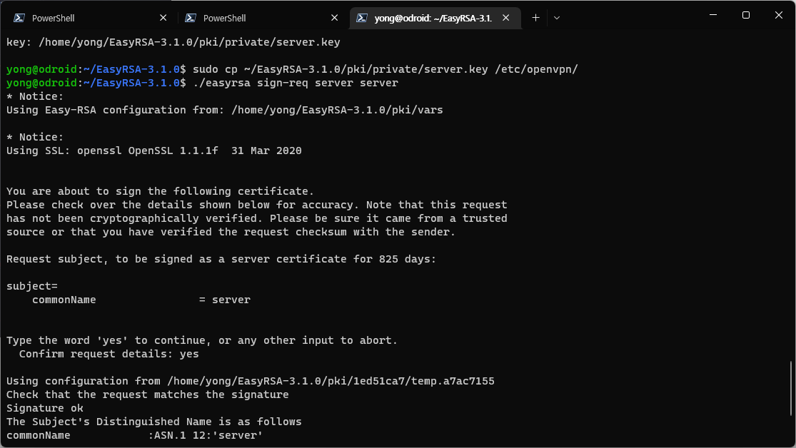

안녕하세요!<br/>
대학생 1인 개발자로 활동중인 LR입니다!

저는 현재 홈네트워크에 개인적으로 사용중인 NAS와<br/>
지금 이 블로그를 포함한 각종 서비스를 호스팅중인 서버,<br/>
그리고 지난번 포스팅에서 다루었던 **Adguard Home**을 구동중인 DNS 서버 등등<br/>
다양한 장비를 구축하고 활용중에 있습니다.

[AdGuard 구축 포스팅](https://dev-lr.com/postview/blog/00025)

이렇게 많은 장비들을 홈 네트워크 내에서 관리하다 보면,<br/>
간혹 외부에서의 접근이 필요한 경우도 생기게 되는데요,

처음에는 포트 자체를 외부로 연결하거나<br/>
제가 보유한 도메인의 CNAME을 이용해서 외부접속이 가능하게 했었지만,<br/>
장비의 수가 많아지고 갈수록 보안에 대한 신경을 하나하나 쓰다보니,<br/>
좀 더 보안 측면에서 안전한 방법을 찾게 되었습니다.

그래서 계획한 방법은 직접 **OpenVPN** 서버를 구축하고,<br/>
이를 통해 홈네트워크의 내부망에 접근할 수 있도록 하는 방법이었습니다.

오늘은 이와같이 **OpenVPN** 서버를 직접 구축하고 외부에서 접근하는 방법에 대해<br/>
포스팅해보도록 하겠습니다.

먼저, **OpenVPN** 패키지를 설치해줍니다.

```bash
yong@odroid:~$ sudo apt update && sudo apt install openvpn
```

<center>

</center>

OpenVPN을 사용하기 위해서는, RSA 인증서로 인증된 사용자 등록이 필요합니다.<br/>
이 과정을 위해 RSA 인증서를 발급하고 관리하기 위한 EasyRSA 패키지를 설치해주겠습니다.

EasyRSA는 **OpenVPN**의 공식 Github를 통해 다운로드할 수 있고,<br/>
2022년 7월 기준 최신버전은 3.1.0 버전입니다.

아래 커맨드를 통해 적절한 경로에 다운로드하고 압축을 해제해줍니다.
저는 사용자의 홈 폴더에서 작업을 하겠습니다.

```bash
yong@odroid:~$ cd ~/
yong@odroid:~$ wget https://github.com/OpenVPN/easy-rsa/releases/download/v3.1.0/EasyRSA-3.1.0.tgz
yong@odroid:~$ tar -xzvf EasyRSA-3.1.0.tgz
yong@odroid:~$ cd EasyRSA-3.1.0
```

<center>

</center>

기본적으로 EasyRSA에서 제공되는 기본 환경 파일을 복사해 사용자화 해줍니다.
저는 VIM 에디터를 이용해 열어 수정하겠습니다.

```bash
yong@odroid:~/EasyRSA-3.1.0$ cp vars.example vars
yong@odroid:~/EasyRSA-3.1.0$ vi vars 
```

아래 스크린샷과 같이 지역과 이메일, 소속 등 기본적인 항목의 주석을 해제하고,<br/>
자신의 정보를 입력한 뒤 저장해줍니다.

<center>

</center>

설정파일 수정이 완료되었다면, 아래 커맨드를 이용해 PKI 인증서 발급 절차를 시작합니다.

```bash
yong@odroid:~/EasyRSA-3.1.0$ ./easyrsa init-pki
yong@odroid:~/EasyRSA-3.1.0$ mv vars pki/vars
```

<center>

</center>

이번에는 **OpenVPN** 서버에 적용할 SSL CA 인증서를 발급합니다.
앞으로의 과정들에서, 이름 입력이나 Yes 등의 진행 여부를 묻는 질문이 여러 번 나오게 되는데,<br/>
Yes 혹은 기본 설정대로 입력 후 진행하시면 됩니다.

```bash
yong@odroid:~/EasyRSA-3.1.0$ ./easyrsa build-ca nopass
```

<center>

</center>

다음으로, 서버의 인증 과정에서 사용할 RSA 인증키를 발급합니다.<br/>
마찬가지로, 기본 설정대로 입력 후 진행하시면 됩니다.

```bash
yong@odroid:~/EasyRSA-3.1.0$ ./easyrsa gen-req server nopass
```

<center>

</center>

생성된 서버의 RSA 인증키를 **OpenVPN** 디렉토리로 이동시켜줍니다.

```bash
yong@odroid:~/EasyRSA-3.1.0$ sudo cp ~/EasyRSA-3.1.0/pki/private/server.key /etc/openvpn/
```

이제, 인증키의 사이닝 과정을 진행합니다.

```bash
yong@odroid:~/EasyRSA-3.1.0$ ./easyrsa sign-req server server
```

<center>

</center>

사이닝이 완료된 crt파일 2개를 **OpenVPN** 디렉토리로 복사합니다.

```bash
yong@odroid:~/EasyRSA-3.1.0$ sudo cp ~/EasyRSA-3.1.0/pki/issued/server.crt /etc/openvpn/
yong@odroid:~/EasyRSA-3.1.0$ sudo cp ~/EasyRSA-3.1.0/pki/ca.crt /etc/openvpn/
```

이번에는 인증과정에서 검증하기 위한 2048비트 암호화 키를 생성하겠습니다.

```bash
yong@odroid:~/EasyRSA-3.1.0$ ./easyrsa gen-dh
```

<center>

</center>

이 과정은 길면 약 3분정도까지도 걸리는 작업이기 때문에, 감안하고 진행하시면 됩니다.<br/>
저는 2분이 조금 더 걸리는 시간이 소요되었습니다.

<center>

</center>

생성된 암호화 키 파일을 마찬가지로 **OpenVPN** 디렉토리로 복사해줍니다.

```bash
yong@odroid:~/EasyRSA-3.1.0$ sudo cp ~/EasyRSA-3.1.0/pki/dh.pem /etc/openvpn/
```

이제, 클라이언트 관련 파일을 생성하고 모아두기 위한 폴더를 생성합니다.
저는 **/home/yong/ovpn-configs** 폴더를 사용하였습니다.

```bash
yong@odroid:~/EasyRSA-3.1.0$ mkdir -p ~/ovpn-configs/keys
yong@odroid:~/EasyRSA-3.1.0$ chmod -R 700 ~/ovpn-configs/
```

지금부터는 클라이언트 관련 인증키와 파일을 생성하는 과정입니다.

먼저, 사용자의 인증을 위한 키를 생성합니다.<br/>
저는 yymin1022 라는 사용자로 지정하여 생성해보겠습니다.

```bash
yong@odroid:~/EasyRSA-3.1.0$ ./easyrsa gen-req yymin1022 nopass
```

<center>

</center>

방금 전 생성한 인증키를 사이닝해줍니다.

```bash
yong@odroid:~/EasyRSA-3.1.0$ ./easyrsa sign-req client yymin1022
```

<center>

</center>

이제, 서버와 클라이언트의 인증키에 관련된 기본 설정이 완료되었습니다.<br/>
지금부터는 **OpenVPN**의 설정 과정을 진행하겠습니다.

**/etc/openvpn** 디렉토리에 위치한 **server.conf** 파일을 수정하겠습니다.

port 옆의 숫자를 **OpenVPN** 서비스를 이용할 포트로 수정합니다.<br/>
저는 24680번 포트를 이용하겠습니다.

<center>

</center>

기본으로 지정되어있는 dh2048.pem 라인을 주석처리한 뒤,<br/>
위 과정에서 생성하고 복사해준 dh.pem으로 다시 지정해줍니다.

<center>

</center>

**push** 라인 맨 앞의 ;를 삭제해줍니다.

<center>

</center>

마찬가지로 **push** 라인 맨 앞의 ;를 삭제해줍니다.<br/>
각 라인의 DNS 주소를 적절히 수정해줍니다.<br/>
저는 SKT의 기본 DNS 주소를 입력해주었습니다.

<center>

</center>

기본으로 입력되어 있는 **tls-auth** 아래 라인에 **key-direction 0** 구문을 추가해줍니다.

<center>

</center>

기본으로 입력되어 있는 **cipher** 아래 라인에 **auth SHA256** 구문을 추가해줍니다.

<center>

</center>

**user nobody**와 **group nogroup** 두 라인 각각의 맨앞에 있는 ;를 삭제해줍니다.

<center>

</center>

OpenVPN은 기본적으로 UDP 프로토콜로 통신을 하도록 설정되어 있습니다.<br/>
이를 TCP 프로토콜로 변경해주는 과정입니다.<br/>
tcp 라인 앞의 ;를 삭제한 뒤, udp 라인 앞에 ;를 추가해줍니다.

<center>

</center>

**explicit-exit-notify** 구문의 값은 기본적으로 1로 지정되어 있습니다.<br/>
이는 UDP 프로코콜에 적용되는 옵션이므로, 0으로 변경해줍니다.

<center>

</center>

IPv4 관련 포워딩 설정을 위해 **/etc/sysctl.conf** 파일을 열어,<br/>
아래 캡쳐와 같이 구문을 수정해줍니다.

<center>

</center>

이후, 아래 커맨드를 통해 설정을 적용합니다.

```bash
yong@odroid:~$ sudo sysctl -p
```

이제, 서버 설정이 완료되었습니다.<br/>
아래 커맨드로 **OpenVPN** 서비스가 자동으로 시작되도록 설정하고,<br/>
서비스를 실행합니다.

```bash
yong@odroid:~$ sudo systemctl enable openvpn@server
yong@odroid:~$ sudo systemctl start openvpn@server
```

이번에는, **OpenVPN** 서버에 접속하기 위한 클라이언트를 설정해보겠습니다.

먼저, 설정을 위한 디렉토리를 생성하고 파일을 복사해줍니다.

```bash
yong@odroid:~$ mkdir -p ~/ovpn-configs/files
yong@odroid:~$ sudo cp ~/ovpn-configs/keys/ta.key ~/ovpn-configs/files/
yong@odroid:~$ sudo chmod 644 ~/ovpn-configs/files/ta.key
yong@odroid:~$ cp /usr/share/doc/openvpn/examples/sample-config-files/client.conf ~/ovpn-configs/base.conf
```

이제, **~/ovpn-configs/base.conf** 파일을 열어 수정해줍니다.

먼저, 서버 접속 주소에 관한 부분입니다.
**my-server-1 1194** 부분에, 서버의 도메인 혹은 IP주소 등,<br/>
외부에서 접속할 수 있는 정보와 포트를 입력해줍니다.<br/>
포트의 경우, 조금 전 **OpenVPN** 서버 설정 과정에서 지정한 포트를 입력해주시면 됩니다.

<center>

</center>

조금 전 서버 설정 과정에서 UDP가 아닌 TCP 프로토콜로 사용ㅎ하도록 설정하였기 때문에,<br/>
TCP 구문 앞의 ;를 삭제하고, UDP 구문 앞에 추가해줍니다.

<center>

</center>

서버 설정과 마찬가지로 user과 group 각각 구문 앞의 ;를 삭제해줍니다.

<center>

</center>

**ca**, **cert**, **key** 각 구문의 맨 앞에 #을 추가해 주석처리해줍니다.

<center>

</center>

**cipher** 구문 하단에 **auth SHA256** 구문과 **key-direction 1** 구문을 추가해줍니다.

<center>

</center>

마지막으로, 파일의 맨 하단에 아래와 같은 3개 구문을 주석처리가 된 채로 입력해줍니다.

<center>

</center>

자, 이제 복잡한 과정은 정말로 완료되었습니다.<br/>
이제, **OpenVPN** 서버에 접속하기 위한 사용자를 등록하는 과정입니다.

**~/ovpn-configs** 디렉토리 내에 sh 스크립트 파일을 생성해줍니다.<br/>
저는 **add_user.sh** 라는 이름으로 생성하겠습니다.

이후, 파일 내에 아래 구문을 모두 추가해줍니다.

```bash
#!/bin/bash
# First argument: Client identifier
KEY_DIR=~/ovpn-configs/keys
OUTPUT_DIR=~/ovpn-configs/files
BASE_CONFIG=~/ovpn-configs/base.conf

cat ${BASE_CONFIG} \
  <(echo -e '<ca>') \
  ${KEY_DIR}/ca.crt \ 
  <(echo -e '</ca>\n<cert>') \ 
  ${KEY_DIR}/${1}.crt \ 
  <(echo -e '</cert>\n<key>') \ 
  ${KEY_DIR}/${1}.key \ 
  <(echo -e '</key>\n<tls-auth>') \ 
  ${KEY_DIR}/ta.key \ 
  <(echo -e '</tls-auth>') \ 
  > ${OUTPUT_DIR}/${1}.ovpn
```

이제, **~/ovpn-configs** 디렉토리로 이동하여, 아래 명령어와 같이 사용자를 추가해줍니다.

```bash
yong@odroid:~$ cd ~/ovpn-configs
yong@odroid:~/ovpn-configs$ sudo ./add_user.sh yymin1022
```

이후, **~/ovpn-configs/files** 디렉토리를 확인해보시면 사용자명.ovpn 파일이 생성된 것을 확인하실 수 있습니다.

이 파일을 스마트폰 혹은 노트북에 복사하여 **OpenVPN** 클라이언트 설정을 하시면 됩니다.

일부 서버 장비의 경우, IP Table 혹은 방화벽으로 인해 올바르게 동작하지 않을 수 있습니다.<br/>
방화벽의 경우에는 사용중인 방화벽 소프트웨어에 따라 게이트웨이 설정을 진행해주시면 되고,<br/>
저는 IP Table 관련 이슈가 있었기에, 아래 구문을 통해 설정을 추가적으로 해주었습니다.

```bash
yong@odroid:~$ sudo iptables -t nat -A POSTROUTING -s 10.8.0.0/8 -o eth0 -j MASQUERADE
```

설정 과정이 꽤나 복잡했던 것 같습니다.

꼭 이 방법이 아니더라도, 다양한 방법이 있겠지만,<br/>
저는 여러 블로그와 가이드를 참고한 결과,<br/>
이 방법이 가장 안정적이고 범용적으로 활용하기 좋은 것 같아서 다시한번 정리해보게 되었습니다.

혹시, 관련해서 문의사항이나 궁금한 점이 있으시면 댓글로 남겨주시기 바랍니다.

지금까지,<br/>
LR이었습니다!