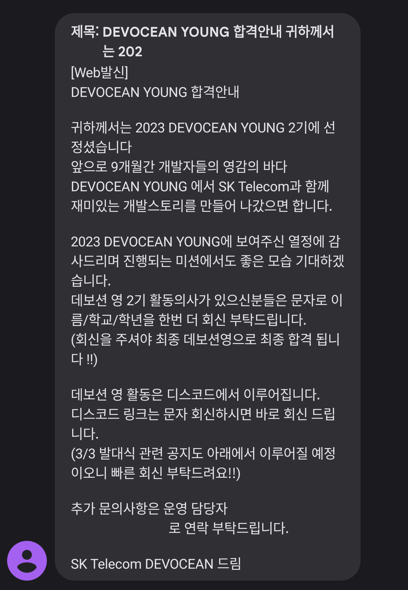
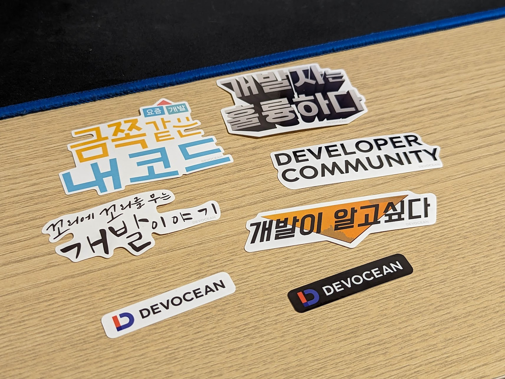

안녕하세요! 
대학생 1인 개발자로 활동중인 LR입니다!

지난 2월, 저희 학교 소프트웨어학부의 오픈채팅에 한가지 모집공고가 올라온 것을 보게 되었습니다.

지난 2022-2학기부터 활동해온 Google DSC 학생개발자 커뮤니티를 통해 IT라는 주제로 여러 사람들과 교류하고 이야기하는 것에 흥미를 갖게 된 저는,
SKT에서 운영하는 개발 블로그인 DevOcean에서 대학생 테크인플루언서로 활동할 수 있는 이 기회를 놓치고싶지 않았습니다.
그렇게 지원서를 작성하게 되었고, 운이 좋게도 2월 27일, 합격했다는 내용의 문자를 받을 수 있었습니다.

그리고 지난 3월 3일, DevOcean Young 2기 활동의 시작을 알리는 발대식이 을지로의 SKT T타워에서 있었는데요,

시간이 조금 촉박했던 탓에, 을지로입구역 지하에서 연결된 통로로 들어간 탓에, 웅장한 T타워의 모습을 기록으로 남기지 못한 점이 조금 아쉽네요..

가장먼저 DevOcean을 담당하는 운영자님, 현재 SKT에서 개발업무를 진행하고 계신 여러 전문가분들이
DevOcean Young 2기의 선발과 활동 시작을 축하하는 말씀을 해주셨고,
이어서 각자가 PPT 1장으로 준비한 자기소개 시간이 있었습니다.

1장이라고 해서 엄청 내용을 많이 넣기 보다는.. 간단하게 하려고 했는데, 다른 Young 분들이 꽉꽉 내용을 구성해오신 것을 보고 조금 당황하기도 했습니다.
또, 오랜만의 발표라 그런지 조금 떨려서 하려고 했던 말을 다 하지 못한 것 같기도 하하....

자기소개를 마치고 난 뒤에는, 9개월간 DevOcean Young 2기 활동을 함께할 조 추첨이 있었는데요,

추첨으로 각 조별로 4명씩 나뉜 뒤에 뒷풀이 장소로 이동해 조별로 모여 이야기를 나누는 시간을 가졌습니다.

지난 1기보다 인원이 많이 선발되기도 했고, 그만큼 많은 사람들과 재미있는 여러 이야기를 할 수 있었던 시간이었던 것 같습니다.
앞으로도 9개월간 이런저런 많은 활동들을 함께하면서, 재미도 있고 의미도 있는 시간들이 되었으면 좋겠습니다.

앞으로도 DevOcean 활동을 진행하며 여러가지 내용을 공유해보도록 하겠습니다.

지금까지, 
LR이었습니다!