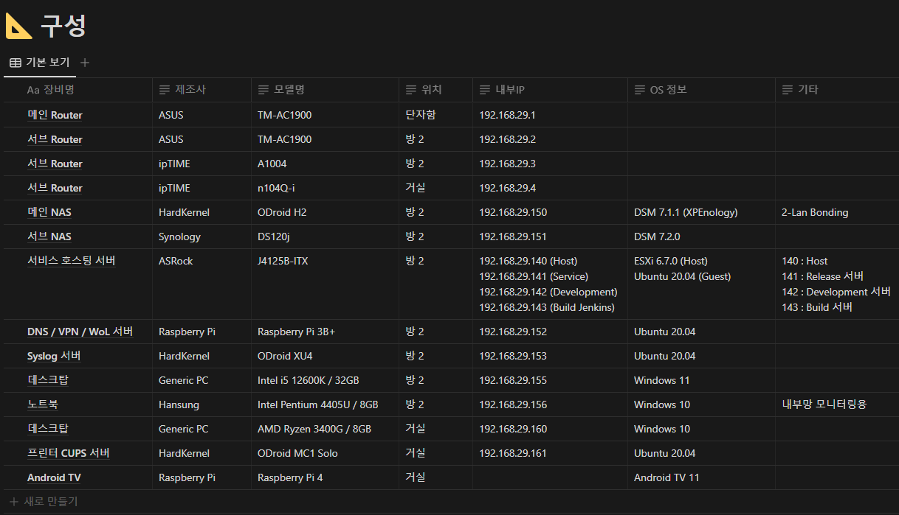
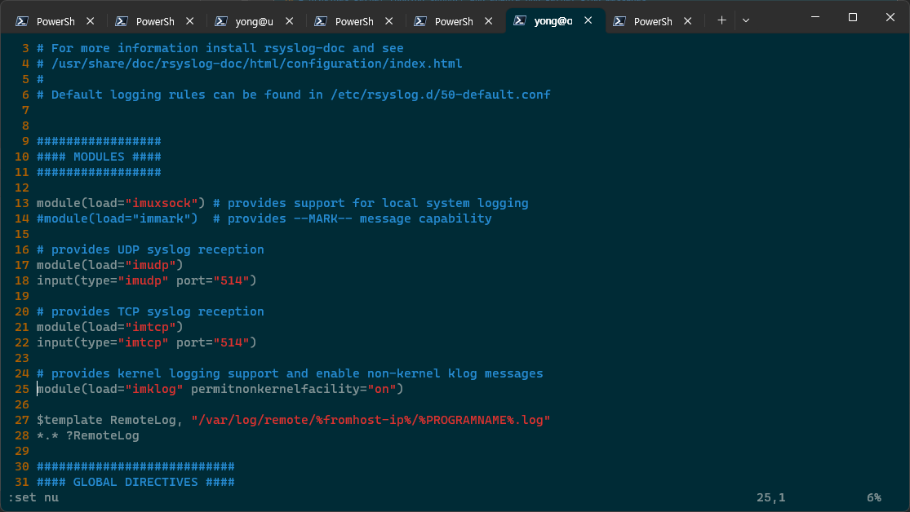

안녕하세요!<br/>
대학생 1인 개발자로 활동중인 LR입니다!

저는 현재 홈네트워크에 개인적으로 사용중인 NAS와<br/>
지금 이 블로그를 포함한 각종 서비스를 호스팅중인 서버,<br/>
그리고 지난번 포스팅에서 다루었던 **Adguard Home**을 구동중인 DNS 서버 등등<br/>
다양한 장비를 구축하고 활용중에 있습니다.

뭔가 자꾸 하나씩 직접 호스팅하고 관리해보자..! 하는 생각을 가지고 구축하다보니<br/>
현재까지의 장비 구성이 이렇게나 많아지게 되었는데요,

<center>

</center>

최근에는 뭔가 새로운 시스템의 구성보다는 현재 운용중인 장비들의 안정화를 목표로 이것저것 만져보고 있습니다.

그러던 중, 문득 든 생각이 아무리 각 시스템에 로그가 쌓여봐야<br/>
그 장비가 죽어버리면 결국 그 로그에는 일반적으로는 접근할 수 없게 된다는 생각이 들었습니다.

그래서 원격 로그서버에 대해 간략히나마 알아보게되었고,<br/>
마침 시험기간도 끝났겠다 밀려있는 과제들에 맞서 싸우기 전에 __한번 통합 로그서버를 구축해보자..!__ 라는 생각을 하게되었습니다.

생각보다 굉장히 간단하게 구축이 가능했는데요,

먼저 저는 로그서버에 사용할 장비로 `ODroid xu4` 장비를 선택했습니다.<br/>
이 장비는 기존에 `Adguard Home`을 설치해 DNS서버 목적으로 사용하고 있었는데요,

로그서버의 특성상 디스크 읽기쓰기가 굉장히 잦을텐데, SD카드를 이용했다가는 수명이 오래가지 못할 것 같다는 생각에<br/>
EMMC를 이용할 수 있는 `ODroid xu4`를 사용하기로 하였습니다.

대신 DNS는 남는 라즈베리파이를 활용해 마이그레이션 해주었죠.

아무튼 다시 본론으로 돌아와 로그서버 구축에 대한 이야기를 해보겠습니다.

먼저, 리눅스 시스템에서 로그의 관리는 `syslod` 데몬이 설정파일에 기반하여 각종 프로세스와 커널에서 발생한 로그를 기록합니다.<br/>
이 데몬은 `rsyslog` 패키지에 포함되어있는데요,

대부분의 리눅스 혹은 유닉스 배포판에 기본탑재가 되어있어, 별도로 설치할 필요는 없습니다.

이 `rsyslog`의 기본 설정에 따르면 각 장비의 `/var/log` 디렉토리에 로그를 마구 쌓으며 저장하게 됩니다.<br/>
이 설정파일을 변경해서 로그서버 장비에서는 특정 디렉토리에 규칙에 따라 아카이브하도록 구성하고,<br/>
클라이언트 장비에서는 로그서버로 전송하도록 구성할 수 있습니다.

이 설정파일은 `/etc/rsyslog.conf`라는 이름으로 존재하고 있는데요,
vi, nano 등 텍스트에디터로 파일을 열어주시면 됩니다.

```bash
yong@odroid:~$ sudo vi /etc/rsyslog.conf
```

먼저 로그서버로 사용할 장비의 설정파일에서는 서버의 포트를 설정하고, 로그를 저장할 디렉토리를 템플릿으로 지정해주어야 합니다.

서버 포트 설정의 경우, 아래 스크린샷에서 16~22번 줄이 해당하는데요,<br/>
위 2줄은 UDP에 관한 설정이고, 아래 2줄은 TCP에 관한 설정입니다.

이부분은 상황에 맞게 구성해주시면 됩니다.

로그 디렉토리 지정은 스크린샷의 27, 28번 줄이 해당합니다.<br/>
RemoteLog 혹은 원하는 이름으로 템플릿 변수를 생성해, 우측과 같이 로그를 저장할 경로를 지정하는 방식인데요,<br/>
여기서 예약어를 이용해서 동적으로 디렉토리명 혹은 파일명을 지정할 수 있습니다.

| 변수명           | 의미                |
|---------------|-------------------|
| %fromhost-ip% | 로그가 발생한 장비의 로컬 IP |
|%hostname%|로그가 발생한 장비의 호스트네임|
| $PROGRAMNAME% | 로그를 발생시킨 프로세스명    |
|%$YEAR%| 로그 발생 날짜 연        |
|%$MONTH%| 로그 발생 날짜 월        |
|%$DAY%| 로그 발생 날짜 일        |

저는 각 장비의 IP로 된 디렉토리 내에 프로세스별로 로그가 따로 저장되도록 지정해주었습니다.

<center>

</center>

이후, 다음 명령을 통해서 `rsyslog` 데몬을 재실행해주시면 서버측 준비는 끝입니다.

```bash
yong@odroid:~$ sudo systemctl restart rsyslog
```

이제, 로그를 전송할 클라이언트 장비를 설정합니다.

저는 각종 리눅스 장비들 이외에도 ESXi나 Synology NAS 장비를 동시에 운용하고 있는데요,<br/>
일반적인 리눅스가 아닌 장비의 경우에는 각 장비의 설정에 맞게 로그서버에 연결해주시면 됩니다.

일반적인 리눅스 장비에서는 마찬가지로 `rsyslog.conf` 파일을 열고 서버를 지정해주시면 됩니다.

```bash
yong@odroid:~$ sudo vi /etc/rsyslog.conf
```

아래 스크린샷을 참고해 27번 줄과 같이 로그서버의 IP와 포트를 지정해주시면 됩니다.<br/>
이때, IP주소 앞의 @를 1개 입력하시는 경우에는 UDP, @@와 같이 2개 입력하시는 경우에는 TCP로 연결하니 참고해 설정해주시면 됩니다.

<center>

</center>

이후, 다음 명령을 통해서 `rsyslog` 데몬을 재실행해주시면 서버측 준비는 끝입니다.

```bash
yong@odroid:~$ sudo systemctl restart rsyslog
```

혹시나 해서 남겨두자면, ESXi의 경우는 다음과 같이 로그서버를 지정할 수 있습니다.
> 호스트 > 관리 > 시스템 > 고급 설정 메뉴 진입 후
> Syslog.global.logHost 항목의 값에 서버 정보를 스크린샷과 같이 입력합니다.

<center>

</center>

Synology NAS의 경우는 로그센터 패키지의 로그 전송 메뉴에서 다음 스크린샷과 같이 지정합니다.

<center>

</center>

이렇게, 그다지 어렵지 않은 과정을 통해 로그서버를 설정하고 클라이언트까지 연동이 완료되었습니다.

저의 경우는 로그서버의 경로를 확인해보니 아래 스크린샷과 같이 잘 기록이 되고 있군요 ㅎㅎ

<center>

</center>

재미있는 점은, 라우터 장비로 ASUS 장비를 사용하고 있는데, 이친구들도 원격 로그서버를 지원하더라구요!<br/>
라우터의 로그를 볼 일은 딱히 없을 것 같긴 하지만 같이 연동해주었습니다 ㅎㅎ

<center>

</center>

이상으로 `rsyslog` 서버 구축 과정 소개 포스팅을 마치도록 하겠습니다!
혹시, 관련해서 문의사항이나 궁금한 점이 있으시면 댓글로 남겨주시기 바랍니다.

[OpenVPN 서버 구축 포스팅](https://dev-lr.com/postview/blog/00026)
[AdGuard DNS서버 구축 포스팅](https://dev-lr.com/postview/blog/00025)

지금까지,<br/>
LR이었습니다!