안녕하세요! 
DEVOCEAN YOUNG 2기 유용민입니다.

이번 7월 DEVOCEAN YOUNG 미션은 조별로 티움투어에 참여하는 것이었는데요,

티움투어란, 을지로에 위치한 T타워에 위치한 미래기술체험관 T.um을 통해 
도슨트 분들의 상세한 안내와 함께 하이퍼루프를 탑승하고 
SKT가 지향하는 2053년의 미래도시 하이랜드에 방문해 
다양한 미래 기술을 직접 체험하고 느껴볼 수 있는 프로그램입니다.

티움투어를 위해 조별로 조율했던 날짜인 지난 7월 14일에 
저희 조인 <자료구조>의 조원분들과 함께 T타워를 방문했습니다.

티움투어에 앞서, DEVOCEAN 매니저님과의 맛있는 식사시간도 있었답니다!

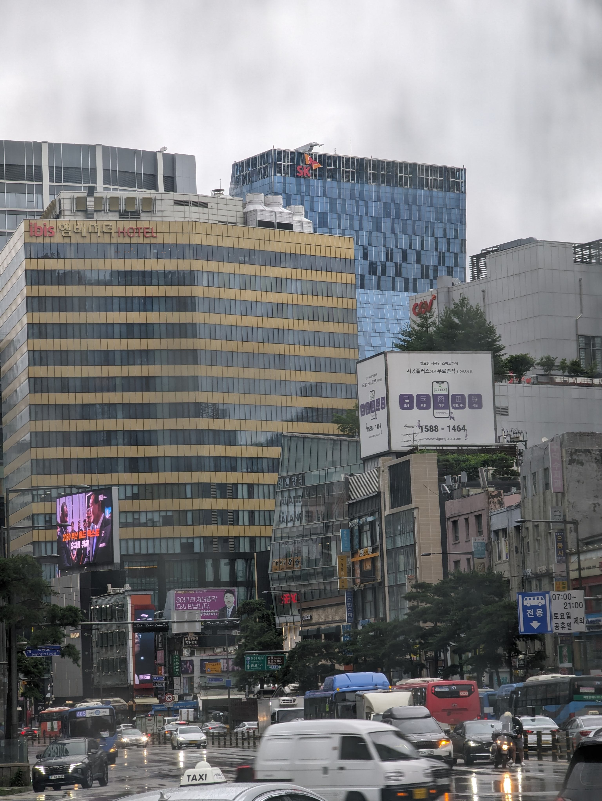
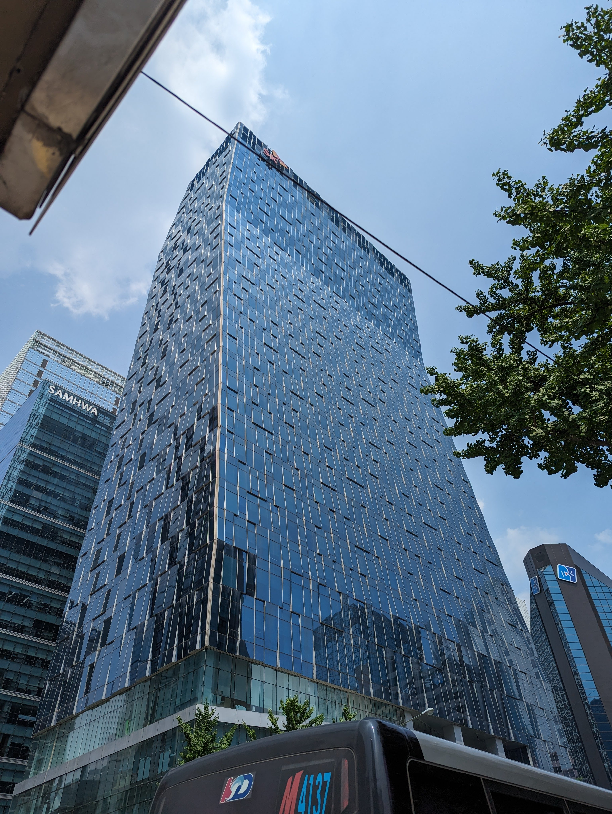
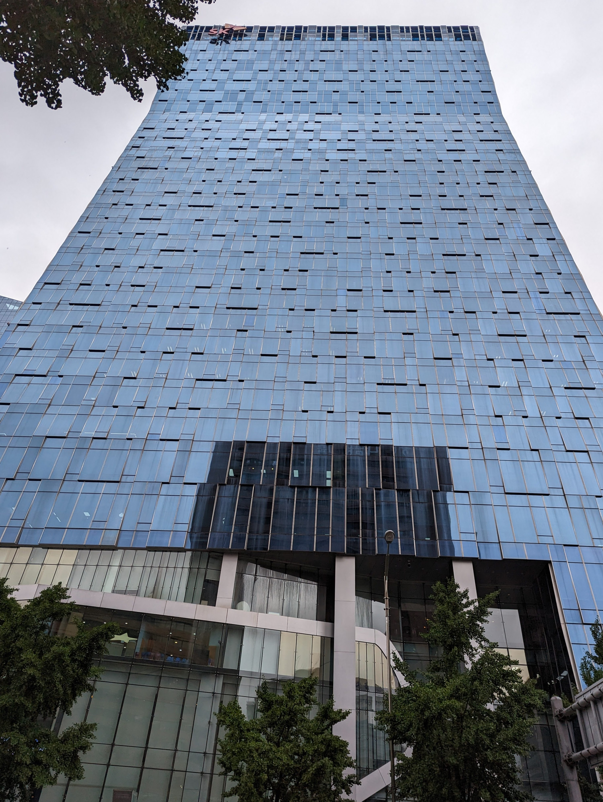
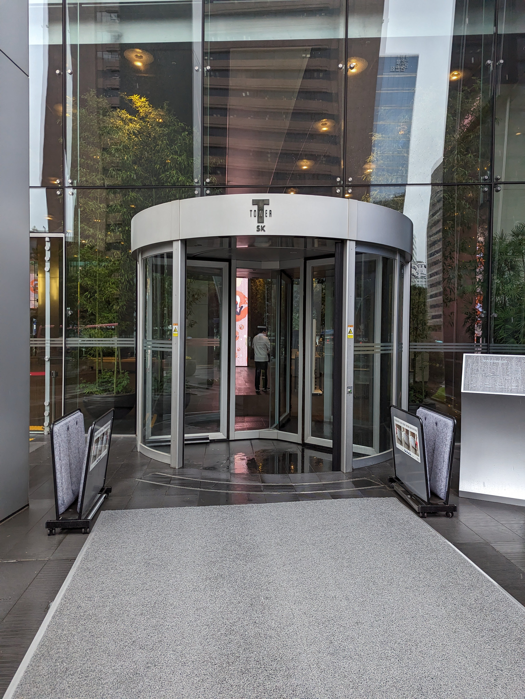

웅장한 T타워.. 멀리서부터 한 눈에 띄고, 가까이서는 한 컷에 담기도 어렵더라구요!

T타워 입구를 통해 건물 내부로 들어서면 1층 바로 안쪽에 티움투어의 입구가 보이는데요,

티움투어의 시작은 도슨트분의 소개와 함께 하이퍼루프를 탑승하기 위한 
인증(?)과 보안장치 해제 과정을 형상화한 퍼포먼스가 이루어집니다! 
두 개의 대화면이 로봇 팔 처럼 움직이는 모니터암을 통해 화려하게 움직이며 영상을 표현하는데요,

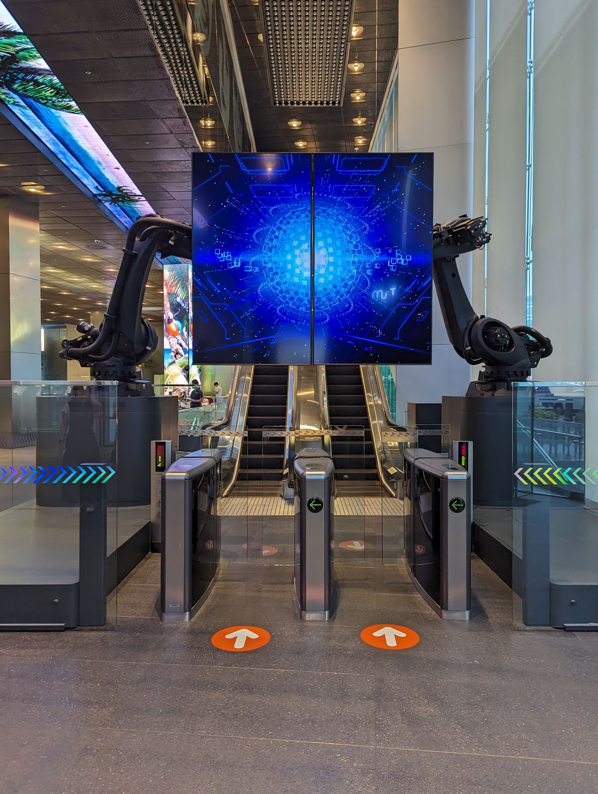
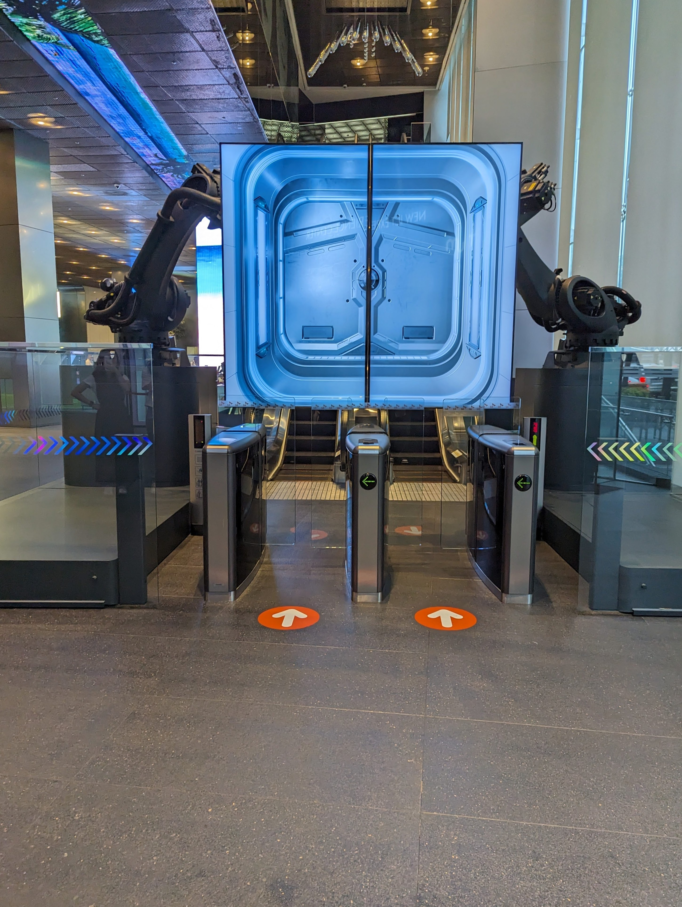

~~와 모니터암 비싸보인다..~~

이후에는 하이퍼루프의 탑승장으로 이동합니다. 
여기서 하이퍼루프란, SKT의 끊임없는 초고속 네트워크에 대한 연구 끝에 개발된
초고속 이동수단으로, 
무려 시속 1300km로 운행할 수 있는 미래 이동수단입니다.

이 하이퍼루프를 타고, 스페이스쉽과 도킹하여 우주관제센터로 떠나는 원정단 여정에 함께하게 되는데요,

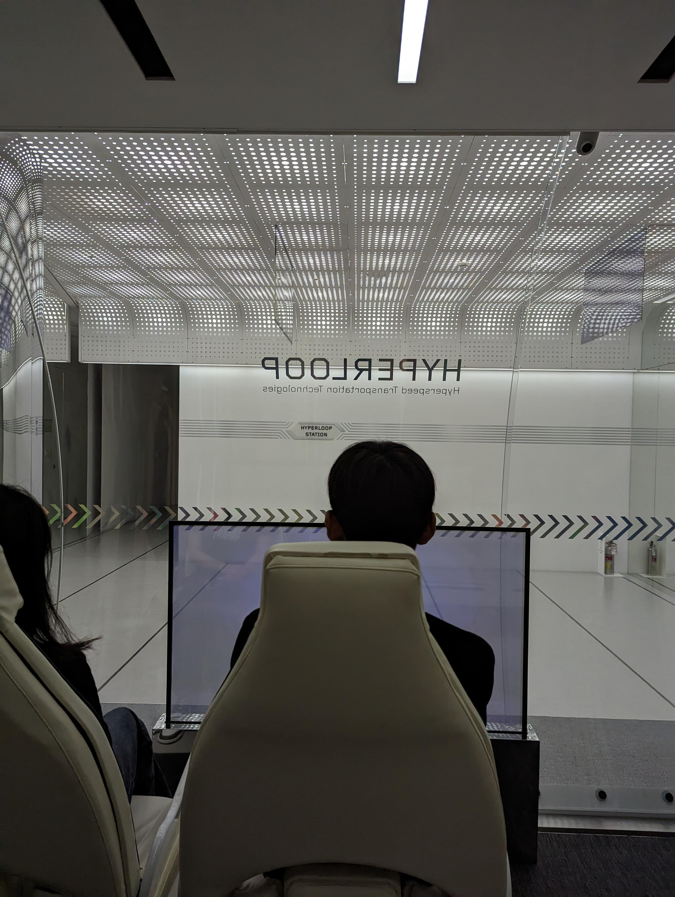

우주관제센터에 도착하면 캡틴이라는 분을 만나 각종 우주 관련 영상자료와 
기상관측 시스템을 체험해볼 수 있습니다.

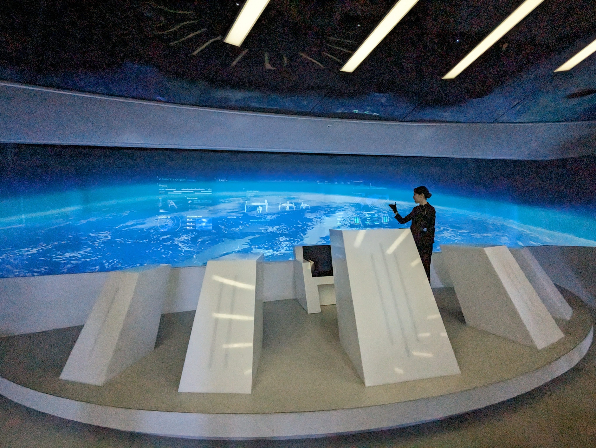
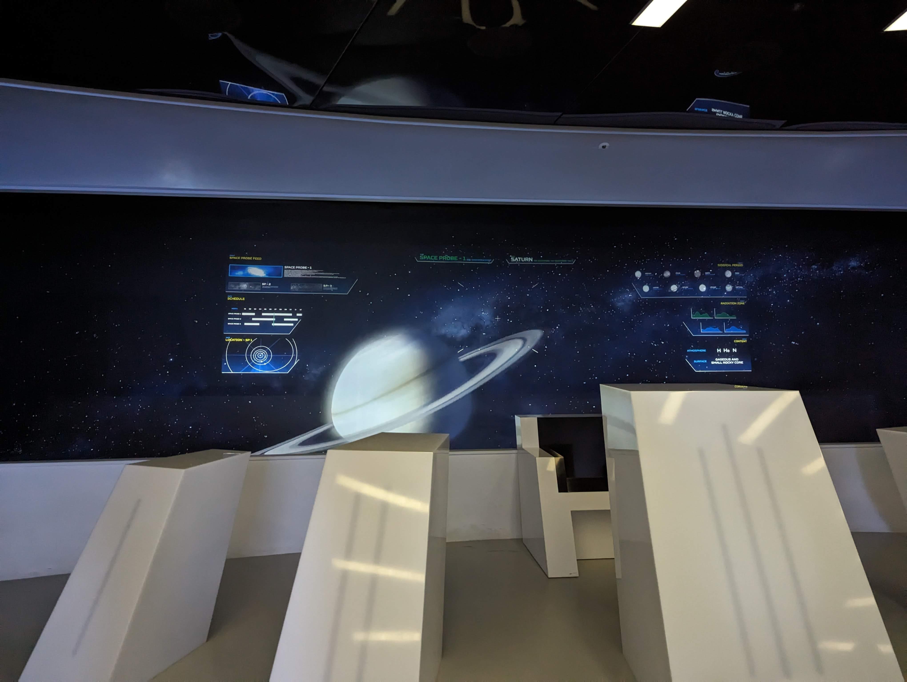
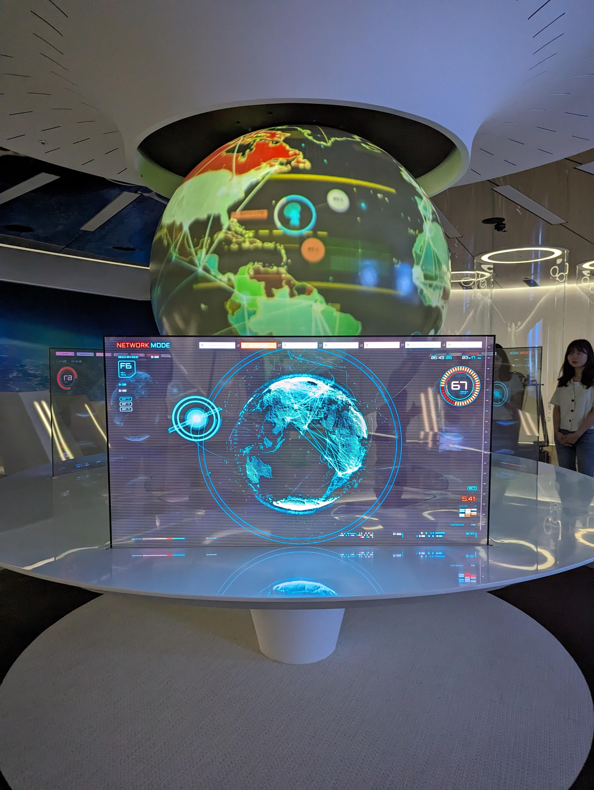

실제로 캡슐에 탑승하고 VR을 착용해 화산이 폭발한 지형으로 이동해 
동물을 구조하고 화재를 진화하는 경험을 해볼 수 있었습니다! 
단순히 VR을 착용하고 보는 것 뿐 아니라, 손잡이의 온도가 실제로 변화하게 되어있어 
감각의 전달까지 이루어져 더 실감나는 체험이 되었던 것 같습니다.

이곳에서 우주 관련 자료의 관측을 통해 지구로 추락중인 소행성이 있다는 소식을 접하게 되는데요, 
저희 원정단이 직접 중력장을 이용해 소행성을 파괴시키는 작업을 하게됩니다. 
이를 위해 또다른 미래 이동수단인 우주셔틀에 탑승해 하이랜드로 이동합니다.

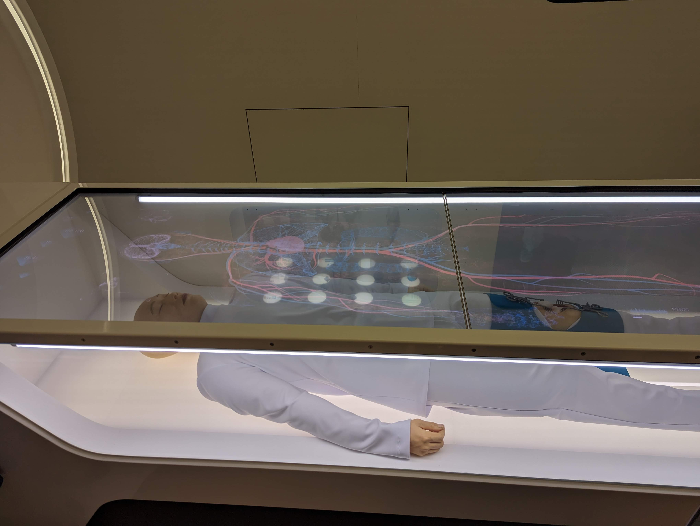

이동 과정에서 조난자의 수술을 AI 의사와 함께 원격으로 진행해볼 수도 있었습니다.

하이랜드에 도착한 원정단은 소행성 문제로 소집된 각 국 대표와의 홀로그램 긴급회의에 참여하고, 
텔레포트룸에서 VR과 원격제어장치를 이용해 달 기지에 위치한 중력장 발생 장치를 가동하여 
소행성을 파괴하는 미션을 수행하게 됩니다.

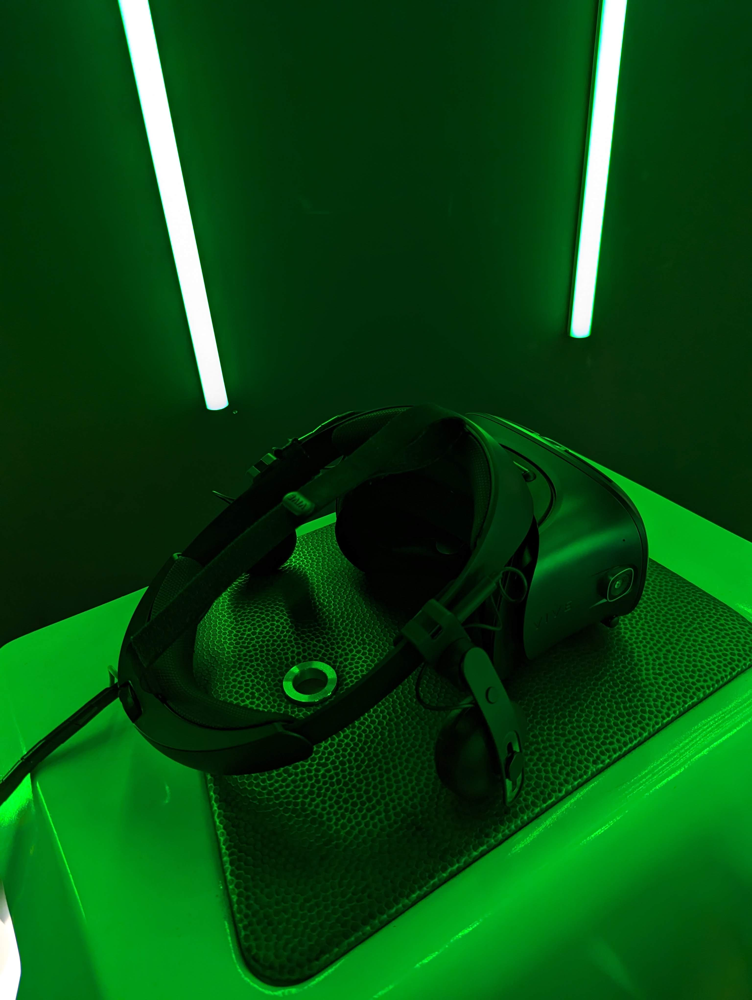

아무래도 VR 체험이다보니, 몇몇 분들은 멀미를 느끼시는 분들도 있었습니다.

이렇게, 소행성을 파괴하고 지구를 구출하는데 성공한 원정단은 
마지막으로 비행셔틀에 탑승해 SKT의 미래 ICT 기술로 새롭게 태어난 미래도시 하이랜드를 
둘러보는 것으로 티움투어를 마치게 됩니다.

사실 티움투어에 참여하기 이전에는 단순히 
초등학교 시절 생각하던 그런 미래 도시를 표현했겠구나 라는 생각 정도에 그쳤는데, 
실제로는 그정도가 아닌, SKT가 진심으로 미래 기술에 집중하고 
끊임없는 발전을 이루고자 노력하고 있다는 것을 알 수 있었던 것 같습니다.

티움투어는 특별한 인원에게만 제공되는 것이 아닌, 
온라인 예약 시스템을 통해 누구나 참여해볼 수 있도록 제공되고 있답니다!

[티움투어 자세히보기](https://tum.sktelecom.com/main.do)

DEVOCEAN YOUNG 들에게 좋은 기회를 만들어주신 SKT와 DEVOCEAN 매니저님께 감사인사를 전하며, 
이만 글 마치도록 하겠습니다.

감사합니다!
