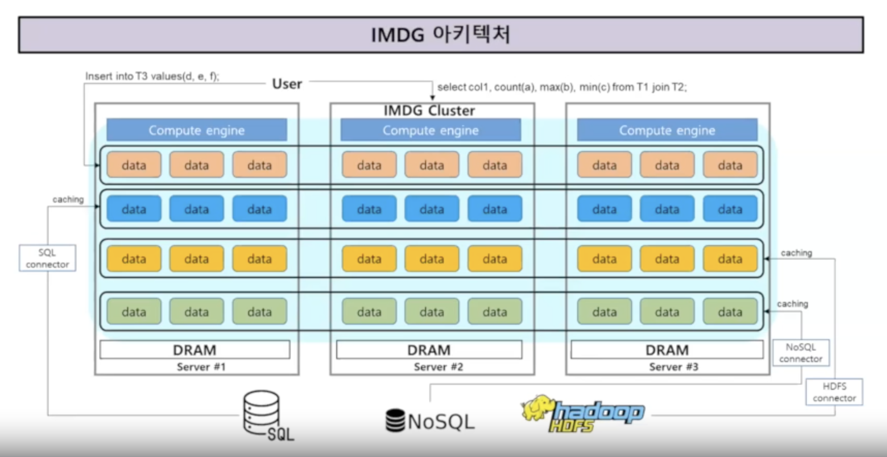
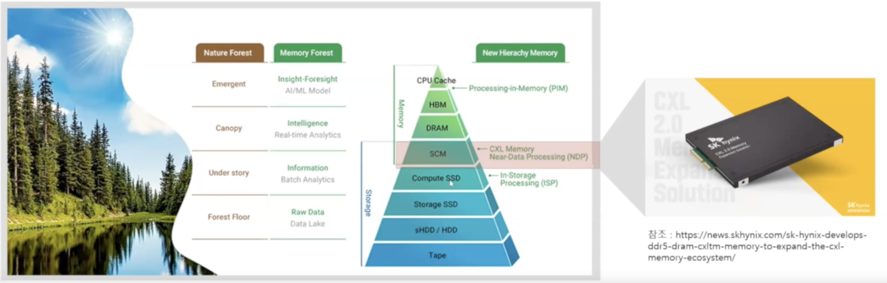

안녕하세요! 
DEVOCEAN YOUNG 2기 유용민입니다.

오늘 포스팅에서는 오랜만에 DEVOCEAN Tech 세미나에 대한 이야기를 다뤄볼까 하는데요, 
바로 지난 9월 21일 진행된 "In-Memory Data Grid 기반 Smart Factory 아키텍처링 연구 사례" Tech 세미나에 대한 후기입니다.

현재 SK Hynix에 재직중이신 두 연사자님들께서 발표를 진행해주셨는데요, 
첫 번째 이야기는 오세진 연사자님의 "IMDG 구조 소개와 Hynix의 CXL Memory 적용 사례"에 대한 이야기였습니다.

IMDG, In-Memory Data Grid란, 다양하고 방대한 데이터를 통합적으로 관리하기 위한 컴퓨팅 엔진이 탑재된 In-Memory Distributed Caching Software 기술이라고 합니다. 
다수의 서버를 연동해 클러스터링으로 구축하게 되면 대용량 Memory Pool이 생성되는데, 이를 활용하기 위해서는 대용량 Memory가 요구됩니다.

이러한 IMDG를 구축하는 플랫폼은 여럿이 있는데, 그 중 Hazelcast에 대해 이야기해주셨습니다. 
각 서버에 Hazelcast Member라는 Java 기반 프로세스를 생성하고, 각각을 클러스터링으로 연동하여 활용한다고 하셨는데요, 
클러스터링의 방식은 Embedded 모드와 Client-Server 모드로 구분할 수 있는데, 
Embedded 모드의 경우는 서버 자체의 프로세스에 Hazelcast Member가 포함되어 실행되는 반면, 
Client-Server 모드에서는 Hazelcast Member가 서버에서 클러스터로 구성되어 구축되고, 하위의 Client들이 별도로 구성되어 요청을 생성하는 구조라고 합니다.

이러한 Hazelcast 기반의 IMDG를 구성하기 위해서는 소프트웨어 뿐 아니라, 하드웨어도 마찬가지로 중요한 구성 요소가 되는데요, 
이 부분에서는 Hynix의 CXL 기술과 함께 설명해주셨습니다. 
CXL은 Compute Express Link의 약자로, 기존의 PCIe 슬롯을 이용해 구축하는 고성능 인터페이스입니다.

Hynix에서는 CXL 2.0 Memory Expansion Solution의 이름으로 상용화하였다고 하네요! 
Hynix CXL의 특징으로는 Local DRAM에 추가적으로 메모리 대역폭과 용량을 동시에 확장할 수 있는 장점이 있다고 합니다. 
또한, 서버를 별도로 추가하지 않고도 메모리를 확장할 수도 있습니다.

두 번째 세션에서는 박재승 연사자님께서 "Data Hub"의 제목으로 발표를 진행해주셨습니다. 
Data Hub는 전사 데이터 연계를 위한 중심부 역할을 수행하며 실시간으로 데이터를 공유하기 위한 플랫폼입니다.

Data Hub의 주요 특징으로는 5가지를 들어 이야기해주셨는데,
- 전사 Data Interface의 단일 Hub 역할 수행
- Source와 Target 간의 실시간 데이터공유 지원
- 실시간 데이터 분석 적합성 제고를 위한 Data Mart 운영
- 다양한 Data Pipeline을 제공하여 사용자 Delivery 지원
- Data Hub 중심 Interface를 구현하기 위한 정책 설계
와 같이 이야기해주셨습니다.

Hynix 내부에서 실제로 Data Hub 시스템을 구축하고, Hazelcast 기반의 IMDG 시스템과 연동하여 빠른 데이터 접근에 대한 성능 검증까지 해보셨다고 하네요.

약 1시간의 시간 동안 두 연사자님들께서 IMDG에 대한 개념과 실제로 구성해본 이야기를 전해주셨는데요, 
사실 학부생의 입장에서는 낯선 주제이기도 하고, 처음 접해보는 분야이다 보니 어려운 내용들이었던 것 같습니다. 
하지만 연사자님들이 발표자료를 깔끔하게 준비해주셨던 탓에 조금이나마 쉽게 키워드로 어느정도 이해할 수 있는 시간이었지 않나 싶네요 ㅎㅎ

깊은 이야기 준비해주신 두 연사자님들께 감사의 말씀을 전하며, 이만 9월 DEVOCEAN Tech 세미나 후기 마쳐보도록 하겠습니다.

감사합니다!
