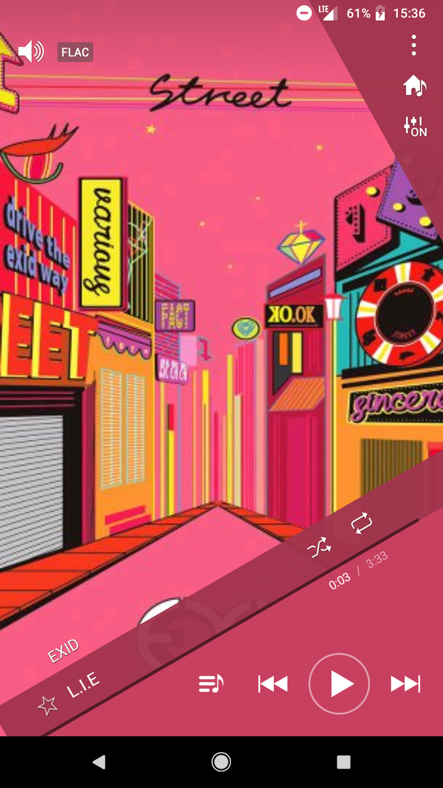
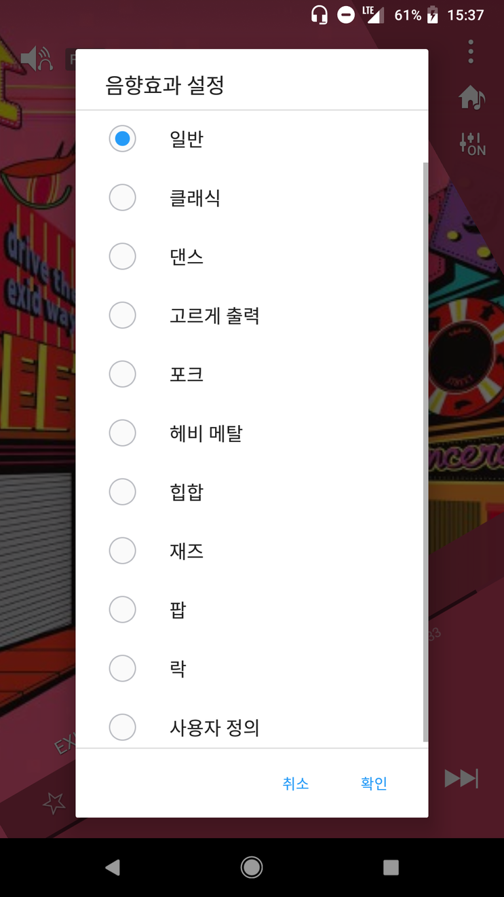
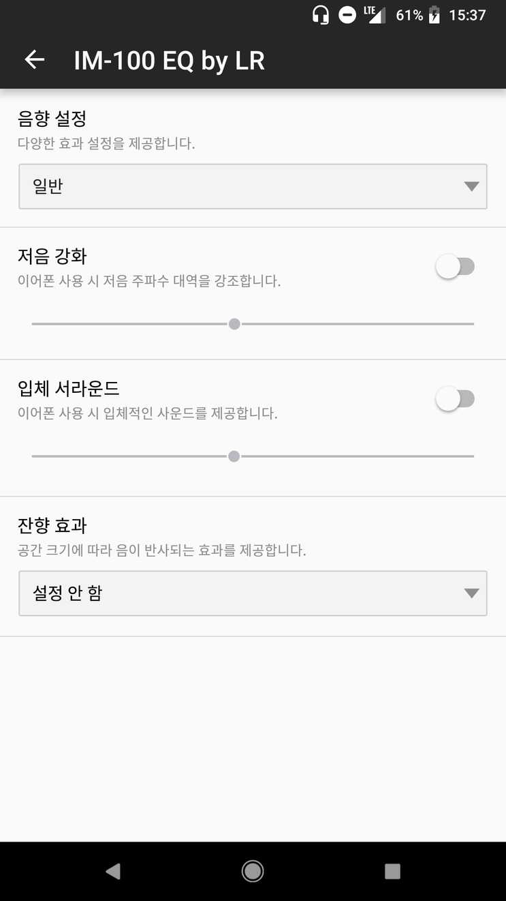

팬택 IM-100 (2016) 기기에 선탑재된 기본 음악 애플리케이션을
Android 6.0 이상의 모든 기기에서 이용할 수 있도록 포팅한 자료입니다.

***

### How To

* [Release 페이지](https://github.com/yymin1022/IM-100_Music/releases) 에서 Latest 태그로 업로드된 3개의 apk를 다운로드한 뒤 기기에 설치합니다.

***

### Known Problems

* 목록 보기 중 '폴더보기'가 동작하지 않습니다.
* 알 수 없는 특정 상황에서 이퀄라이저가 적용되지 않고 오류가 발생합니다.

***

### Links

[Github](https://github.com/yymin1022/IM-100_Music)

***

### History
* 2016\. 07\. 개발 시작
* 2016\. 08\. V1\.0 배포
