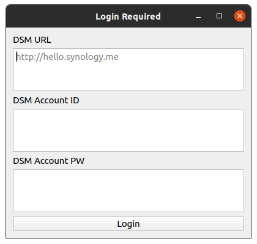
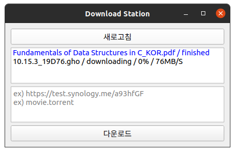
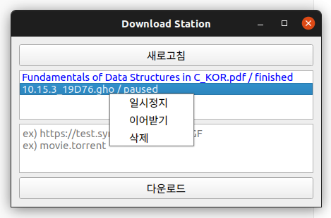



Synology DSM Download Station 패키지의 PC 클라이언트입니다.
작업 추가/삭제/정지 등의 관리가 가능하며,
URL 및 토렌트 파일의 다운로드를 지원합니다.

Python PyQT5 GUI 프레임워크를 이용해 개발되었으며,
Linux, Mac, Windows 등의 플랫폼을 지원합니다.

***

### Links

[Download](https://github.com/yymin1022/Synology_DownloadStation_Client/releases) 
[Github](https://github.com/yymin1022/Synology_DownloadStation_Client)

***

### History
* 2020\. 08\. 개발 시작
* 2020\. 08\. V1\.0 배포
* 2020\. 09\. V1\.1 배포 : Synology OTP 로그인 지원
