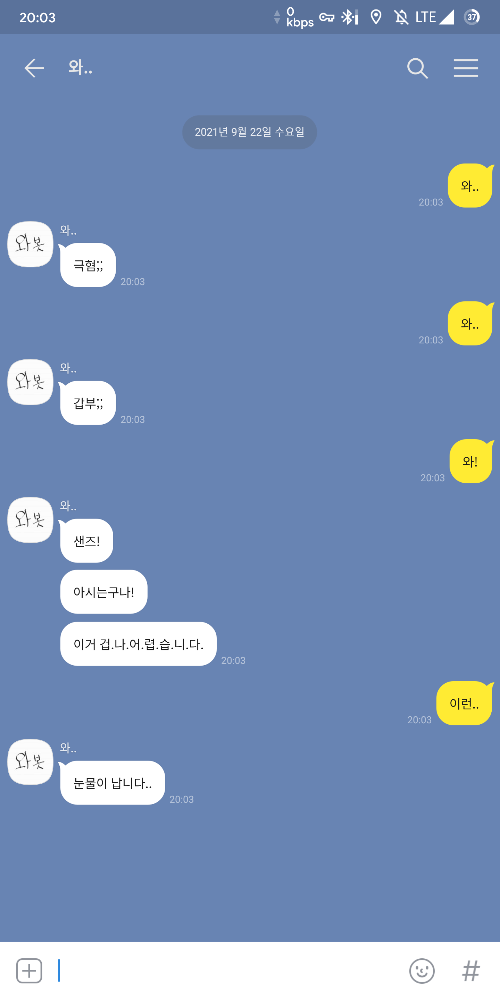
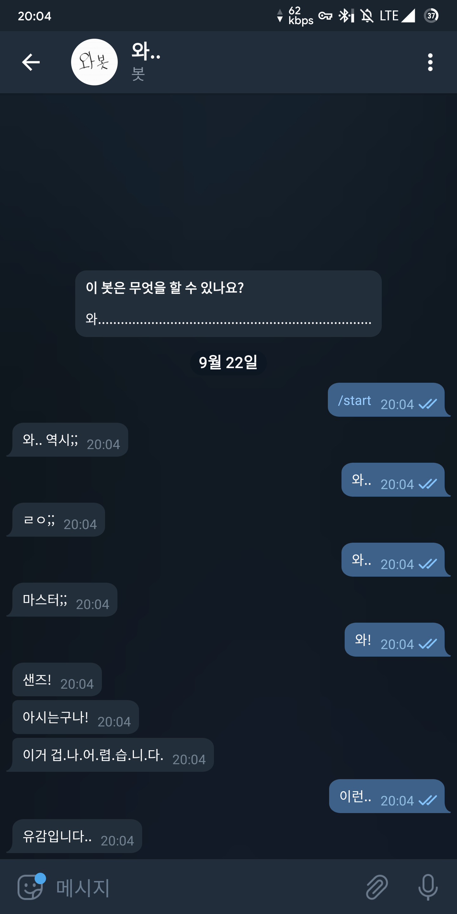

와...하면 대답하는 헛소리 봇입니다. 
하지만 **코로나 몇명** 등의 몇몇 쓸모 있는 정보를 제공하기도 합니다.

Python Flask를 이용해 개발되었으며, 추후 Node.JS 기반으로 개선할 예정입니다.

반응하는 키워드 목록과 API 사용법은 아래 링크에서 확인하실 수 있습니다.

***

### Links

[Github](https://github.com/yymin1022/Wa_API) 
[API Usage Guide(En)](https://github.com/yymin1022/Wa_API/blob/master/Guide_EN.md) 
[API Usage Guide(Ko)](https://github.com/yymin1022/Wa_API/blob/master/Guide_KO.md)

***

### History

* 2020\. 01\. 카카오톡 봇 형태 시작
* 2020\. 03\. 텔레그램 봇 형태 시작
* 2021\. 07\. API서버 개발 시작
* 2021\. 08\. 카카오톡/텔레그램 봇 API서버로 통합 및 서버 배포 시작
* 2022\. 01\. API서버 도커 컨테이너 배포 시작
