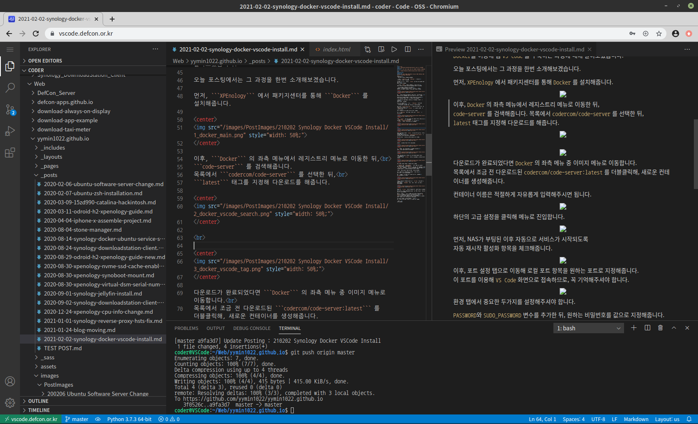

# H1 ASDFQWER

## H2 ASDFQWER
### H3 ASDFQWER
#### H4 ASDFQWER
##### H5 ASDFQWER
###### H6 ASDFQWER

Normal Text ASDFQWER

Bold **ASDFQWER**

Cancellation ~ASDFQWER~

Italic *ASDFQWER*

> ASDFQWER

BlockQuote ```ASDFQWER```

URL https://dev-lr.com/

Text URL [Dev. LR](https://dev-lr.com/)

List

- Hello
- World
- ASDF
- QWER

List with Left Align

<div style="text-align: left;">

- Hello
- World
- ASDF

</div>

Image



```md
ASDFQWER
#H1
##H2
```

```python
print("Hello World")
```

```c
printf("Hello World");
```
